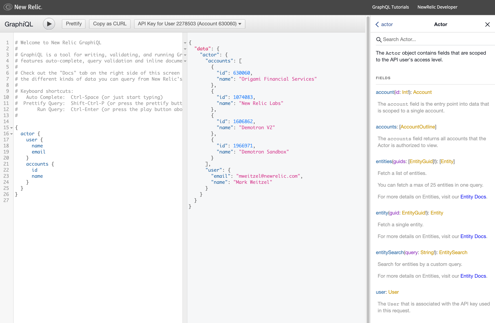

# Understanding the Data Model
---
One of the most powerful aspects of GraphQL is that it is strongly typed. This allows developers to explicitely declare what information is available via queries to the GraphQL service. This declaration is done via a GraphQL schema. Schemas provide more flexibility for developers to express information about the data they return. For example, each field has a description, which can be utilized by the developer to indicate the proper usage of the data. 

Schemas also enable tools to be built that help the developer properly construct queries and guide for proper usage of the returned data. For example, a schema can indicate if a field has been deprecated, enabling tools, like [GraphiQL](https://api.newrelic.com/graphiql) to surface this fact and discourage use of that data. 


> Make sure to generate an API key that you can use with GraphiQL! See [Instructions](INSTRUCTIONS.md) for more information. 

## Exploring with the help of schemas
In the first exercise, we jumped right in and issued a query that returned a user's name and email. Let's use GraphiQL to explore what other information we can discover. 

Using GraphiQL, click the button towards the upper right labled `< Docs`. This will open up a side panel that will help you navigate the fields that are available from New Relic's GraphQL service.


GraphQL has two entry points, `query` and `mutation`. You just issued a query to get information back from New Relic. Mutations, which we will use later, *update* information. 

Select `query` from the list. What's visible in the side nav bar are the top level fields that are the entry points into the GraphQL service. Notice `actor`, which we used in our first query, is one of the fields, and is at the top level of the JSON structure on the left hand side of the tool. 

Click on `actor` to drill into its definition. Notice that among other fields, this contains `user ` and `accounts`. Issue the following query:

```graphql
{
  actor {
    user {
      name
      email
  	}
    accounts {
      id
      name
    }
  }
}
```
Behind the scenes, the fields under `actor` represent different services that are woven together by the GraphQL server and exposed via a unified schema. When the query is issued, the GraphQL server pulls apart the query and invokes a `resolver` for each of the services. When the queries are complete (or time out, or encounter an error), the GraphQL server assembles the result and returns it to the client. In the example above, we get information about the user and all the accounts that they have access to. The result should look similar to below:



In this exercise, we've used GraphiQL, which is powered by the New Relic GraphQL schema, to explore the data model. We added an additional field to our query to return the accounts that the user has access to. 

Comparing this to the existing REST API, this would require, at a minimum, two different API calls. In some of the advanced use cases, this could also require two different *API keys*! In addition, as a client, you get to determine the shape of the returned value. If you don't need the user's email address, then simply omit this from the query and avoid 'over fetching' information. 


# For Consideration / Discussion
Take a few minutes to use the documentation section of GraphiQl to learn what is currently exposed through the GraphQL service. What can you learn? How would you find out the versions of the Node.js agent?


## Advanced Topic: Schema Introspection
Users can introspect GraphQL by issuing queries against the schema. The query below will return the full schema that is supported by New Relic. (Ignore for now the syntax of using `fragment`.) 

Cut and paste this query into GraphiQL and run it. Scrolling to the bottom, you will begin to see New Relic specific information, e.g. `metricsPollingInterval`. It is these values that drive the GraphiQL tool and that can be used programmatically within your applications. 

```graphql
query IntrospectionQuery {
  __schema {
    queryType {
      name
    }
    mutationType {
      name
    }
    subscriptionType {
      name
    }
    types {
      ...FullType
    }
    directives {
      name
      description
      args {
        ...InputValue
      }
      onOperation
      onFragment
      onField
    }
  }
}

fragment FullType on __Type {
  kind
  name
  description
  fields(includeDeprecated: true) {
    name
    description
    args {
      ...InputValue
    }
    type {
      ...TypeRef
    }
    isDeprecated
    deprecationReason
  }
  inputFields {
    ...InputValue
  }
  interfaces {
    ...TypeRef
  }
  enumValues(includeDeprecated: true) {
    name
    description
    isDeprecated
    deprecationReason
  }
  possibleTypes {
    ...TypeRef
  }
}

fragment InputValue on __InputValue {
  name
  description
  type {
    ...TypeRef
  }
  defaultValue
}

fragment TypeRef on __Type {
  kind
  name
  ofType {
    kind
    name
    ofType {
      kind
      name
      ofType {
        kind
        name
      }
    }
  }
}
```