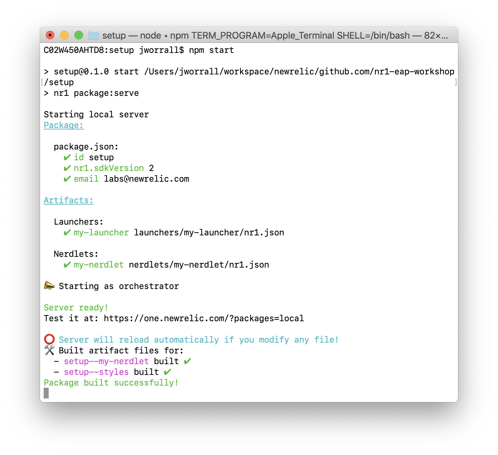
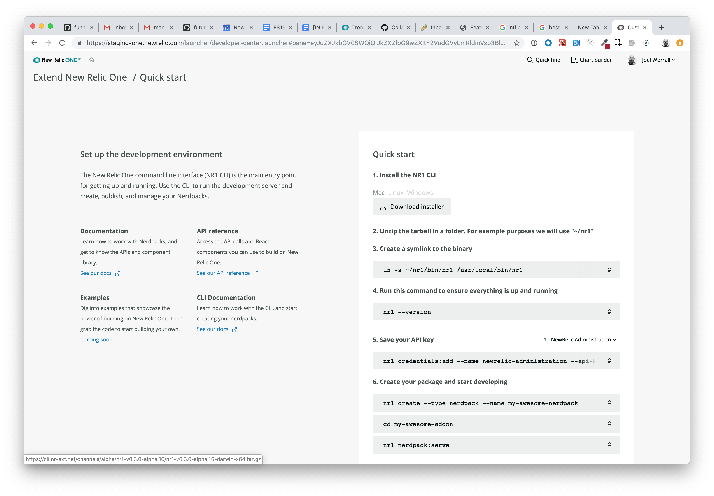

# Welcome!

Getting ready to build on the New Relic One platform is quick and easy. Essentially, what you will be doing in these setup instructions is readying your system to run a local server that seamlessly and securely connects into the New Relic One platform. This connection will makes building visual extension a breeze because you can see your changes in real time. Enjoy!

# Setup Instructions

1. In Google Chrome, navigate to <a href="https://github.com/newrelic/eap-cli/commit/310f68cbf32c01c0be3f4c3dc5f83ec689eee9c7" target="_blank">`This link`</a>, and click on the appropriate release of the NR1 CLI. (ex. `nr1-v0.3.0-alpha.11`)
2. Download the appropriate zipped bundle of the NR1 CLI and **unzip it to your home folder** (ex. for Mac it would be `nr1-v0.3.0-alpha.11-darwin-x64.tar.gz`).
3. Open a Terminal window. From the command line you should the following:

```bash
# To verify that you've unzipped the NR1 CLI, run this command and see similar output
ls ~/nr1
README.md node_modules package-lock.json bin oclif.manifest.json package.json
```

4. From the command line, run the following:

```bash
#Create an alias to the cli
ln -s ~/nr1/bin/nr1 /usr/local/bin/nr1

#Verify that you can execute nr1
nr1 --version

#You should see output to the terminal window
```

5. If you haven't done so yet, generate your personal SSL cert for your development environment.

```bash
cd ~
sudo ./nr1/bin/nr1 certs:generate
#The cert will be saved to a hidden folder
```

6. And if you haven't already cloned the workshop repo, do that now.

```bash
# if you haven't cloned the workshop repo already
git clone git@github.com:newrelic/nr1-eap-workshop.git
```

_Note: Each exercise exists as a folder in this repository. Following the material will involve going into that directory, running `npm install`, standing up the local development server by running `nr1 package:serve`, and following the INSTRUCTIONS.md in the given folder._

7. Now start the `setup` NR1 package.

```bash
# ex. change directory into lab2
cd workshop/setup

npm install
nr1 package:serve
```

Your terminal output should look like the following:


8. Open Google Chrome and navigate to  https://one.newrelic.com?&packages=local, and click on the New Relic One Launcher named `Setup Exercise`. You should see the following.

