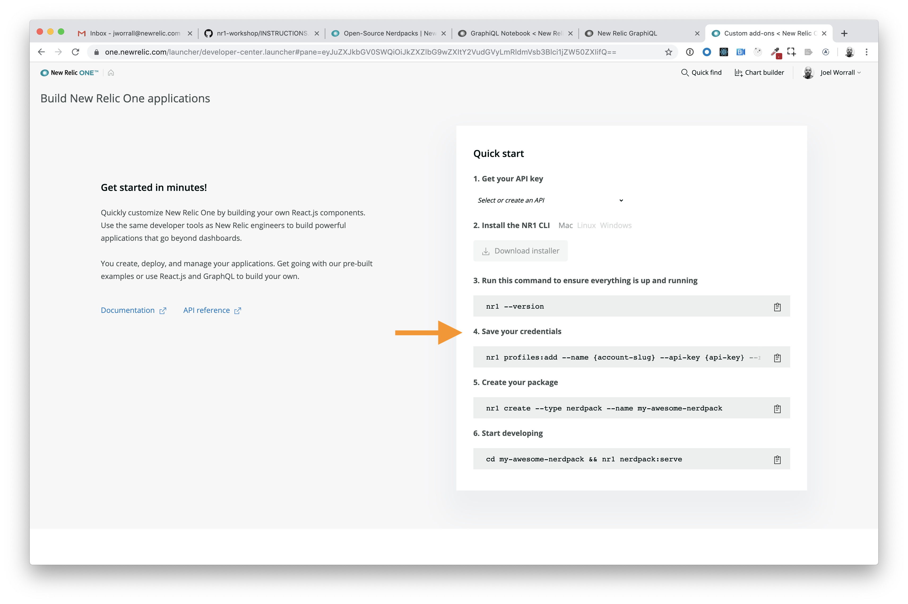
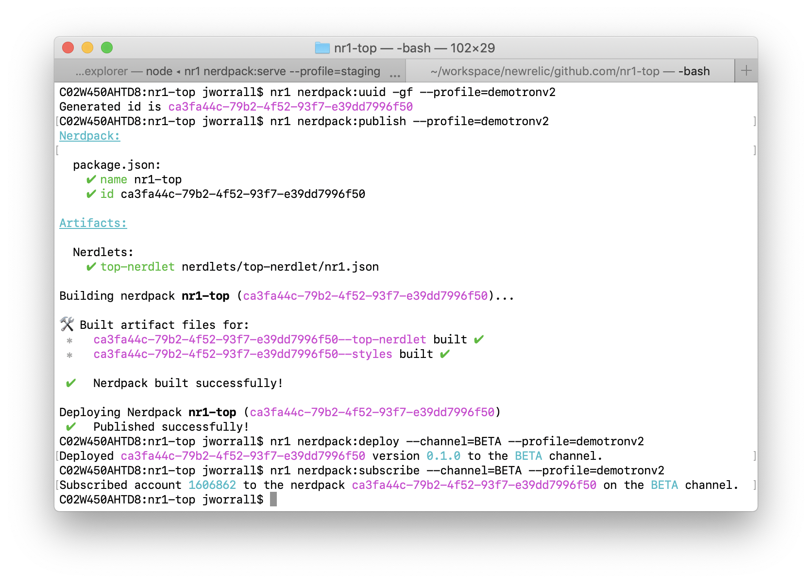

Lab 10: Working with the CLI
============================

The purpose of this lab is exercise the features of the nr1 CLI, specifically the `profiles` and `nerdpack` commands. In [`Lab 0`](../lab0), you used the `create` command to generate a nerdpack, launcher, and nerdlet. After this lab is complete, you'll understand:

* The management of profiles (named APIkeys) in your `nr1` development environment
* Generating profile/APIkey-specific uuid's for a Nerdpack
* Publishing Nerdpacks to New Relic One
* Deploying published Nerdpacks to a channel
* Subscribing a deployed Nerdpack on a channel to an account

# Step 0: Setup and Prerequisites

Load the prerequisites and follow the setup instructions in [Setup](../SETUP.md).

# Step 1: Understand CLI credential storage

Previously, when you setup the NR1 CLI in the [**Build your own application** launcher](https://one.newrelic.com/launcher/developer-center.launcher), you ran a command, `nr1 profiles:add` under the `Save your credentials` heading. Let's take a look at what's going on there.



The credentials for a given user/CLI are stored in a JSON file. On Mac, it's `~/.newrelic/credentials.json`.

1. Run the following command and if you have multiple APIkeys installed you'll see something like this.

```bash
nr1 profiles:list
Name            Region  API Key
account2        us      <hidden>
default         us      <hidden>
my-account      us      <hidden>
```

The names in that list correspond to the `profile` values we can append to any `nr1 nerdpack` command.

*Note: if you happen to be a New Relic customer (and user account) with access to only one New Relic account, the issues surrounding `profiles` are purely academic, but be a good student all the same.*

2. Next, to solidify what we're talking about, run the following command (or one like it in your OS) to interrogate the underlying credential storage file.

```
cat ~/.newrelic/credentials.json
> LOTS OF OUTPUT WRITTEN
> TO THE SCREEN THAT YOU
> SHOULDN'T SHARE WITH OTHERS
```

So the point is that an `nr1 nerdpack` relies on credentials. If the `--profile <some profile name>` value is provided, that APIkey becomes the basis of commands. If no `profile` attribute is specifie, use the `default` profile.

Next, we're going to clone, configure, and deploy an open source Nerdpack.

# IMPORTANT

In order to *successfully* execute the next set of commands, you must have a **Nerdpack Manager** role within the associated New Relic account (and your corresponding `profile/APIkey`).

# Step 1: Setting the UUID for a Nerdpack

Now, it's time to execute the first of four steps in making a Nerdpack accessible to an account (and it's related subaccounts). To demonstrate that, we're going to use the `nr1-top` Nerdpack, though this same principle applies to any valid Nerdpack, whether available in GitHub or created locally by a developer.

```bash
git clone https://github.com/newrelic/nr1-top.git
cd nr1-top
# now ensure that the New Relic-identifier for this repo and under this profile/APIkey be created
nr1 nerdpack:uuid -gf
```

*Note: if you are planning to deploy this Nerdpack to an account that is not tied to your `default` profile, you need to specify the `profile name` to the `--profile ` CLI option. (ex. `nr1 nerdpack:uuid -gf --profile <profile name>`)*

The outcome of this command will be resetting the value of the `package.json`'s `version` attribute to be a uuid value generated by the command.

# Step 2: Publishing a Nerdpack

*Note: New Relic One requires that only one version (following Semantic versioning) of a Nerdpack can be published. Thus, the success of a `nr1 nerdpack:publish` command expects both the correct permissions (the aforementioned `Nerdpack Manager` role as well as a unique version (as specific in the `package.json`'s `version` attribute.*

1. **Learn the command**: Type the following and review the capabilities of the command.

```bash
nr1 nerdpack:publish --help
```

2. Execute a `dry run` of the publish function with the following command.

```bash
nr1 nerdpack:publish --dry-run
```

3. **Execute the command**: Assuming you're in the root directory of a given `Nerdpack` (and have abided by the requirements above), run the following commands to package and upload your Nerdpack.

```bash
nr1 nerdpack:publish
```

# Step 3: Deploy your Nerdpack

We have three channels available with which to deploy a published version: `DEV|BETA|STABLE`. Each channel can contain a different version or all channels can contain the same version. The `Channel` provides layer of abstraction in the deployment process, allowing `Nerdpack Managers` to quickly promote and rollback deployments based on feedback (including monitoring data :)).

1. **Learn the command**: Type the following and review the capabilities of the command.

```bash
nr1 nerdpack:deploy --help
```

2. **Execute the command**: Assuming you're in the root directory of a given `Nerdpack` (and have abided by the requirements above), run the following commands to package and upload your Nerdpack.

```bash
# choosing BETA as the channel to emphasize the channel deployment
nr1 nerdpack:deploy --channel=BETA
```

# Step 4: Subscribe to a Channel

As mentioned previously, the use of `Channels` allows `Nerdpack Managers` to quickly manage the deployment of `Nerdpacks`.

1. **Learn the command**: Type the following and review the capabilities of the command.

```bash
nr1 nerdpack:subscribe --help
```

2. **Execute the command**: Assuming you're in the root directory of a given `Nerdpack` (and have abided by the requirements above), run the following commands to package and upload your Nerdpack.

```bash
# choosing BETA as the channel to emphasize the channel deployment
nr1 nerdpack:subscribe --channel=BETA
```

3. Now, open `https://one.newrelic.com` and find the deployed Nerdpack.

*Note: if that Nerdpack is `nr1-top`, navigation to `Entities > Hosts > <Select a Host> > Top`.*

Finally, let's imagine that there's a problem with the `Nerdpack` and we need to rollback or remove access from our `Nerdpack`.

For reference, here's what your console output could look like.



# Step 5: Unsubscribe from a Channel

1. **Learn the command**: Type the following and review the capabilities of the command.

```bash
nr1 nerdpack:unsubscribe --help
```

2. **Execute the command**: Assuming you're in the root directory of a given `Nerdpack` (and have abided by the requirements above), run the following commands to package and upload your Nerdpack.

```bash
# choosing BETA as the channel to emphasize the channel deployment
nr1 nerdpack:unsubscribe --channel=BETA
```

3. Now, open `https://one.newrelic.com` and discover that you can no longer find the deployed `Nerdpack`.

*Note: if that Nerdpack is `nr1-top`, navigation to `Entities > Hosts > <Select a Host> > Top`.*

# Extra Credit

Explore the following commands.

* `nr1 nerdpack:info`
* `nr1 nerdpack:validate`
* `nr1 nerdpack:undeploy`
* `nr1 nerdpack:build`
