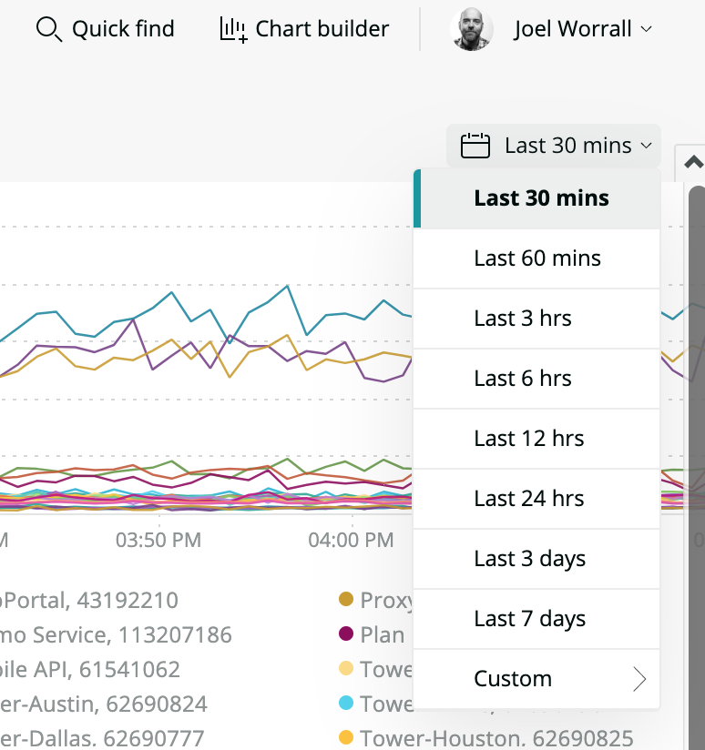
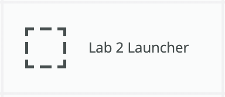
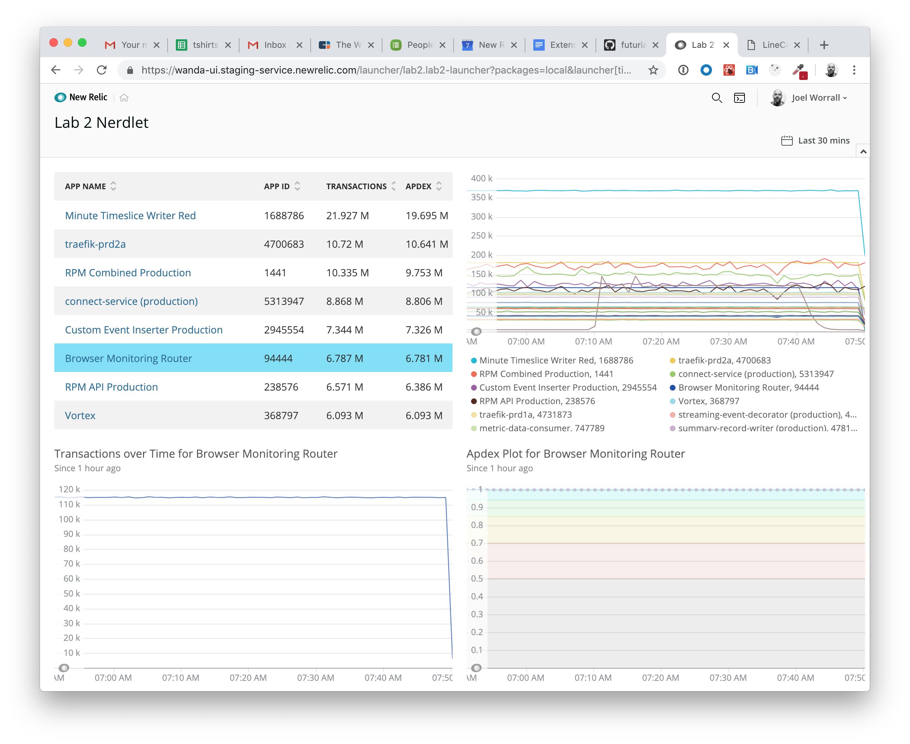
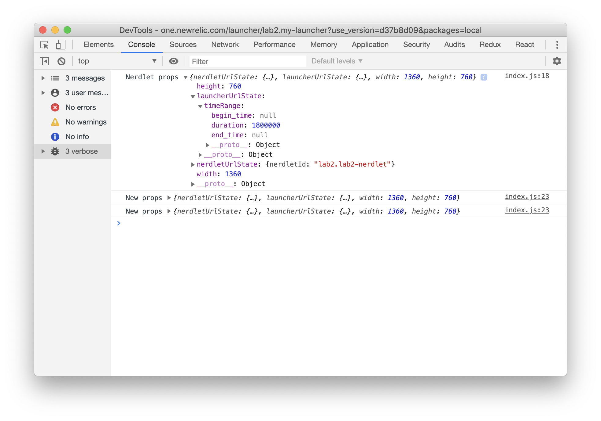
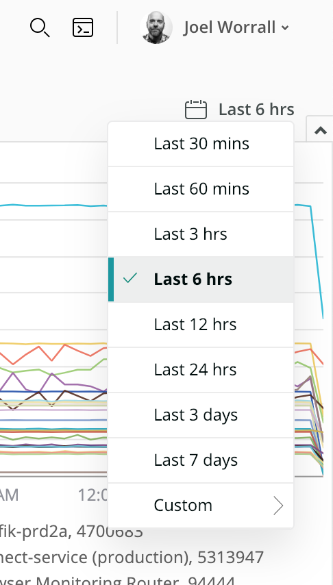
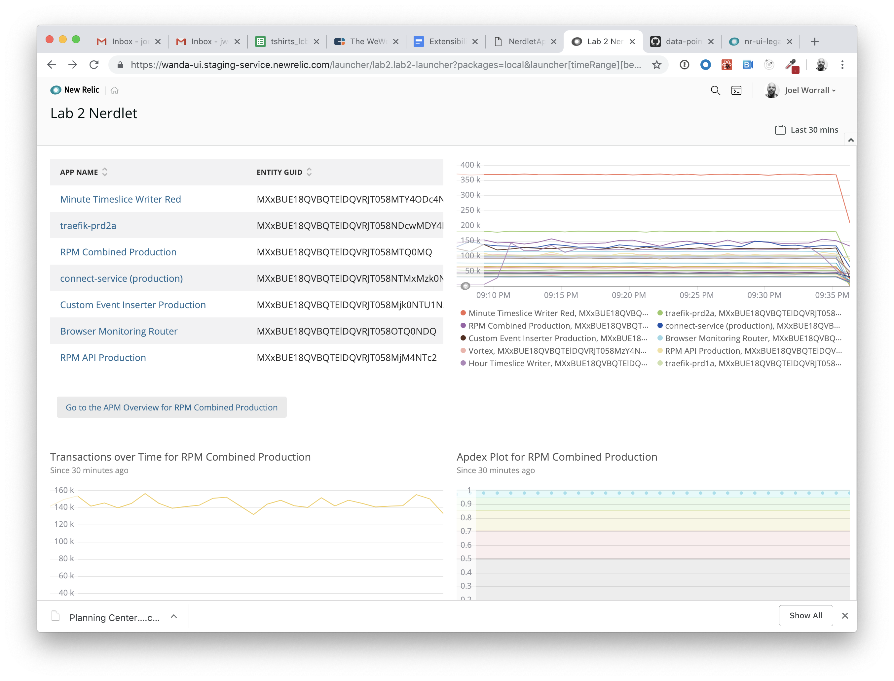
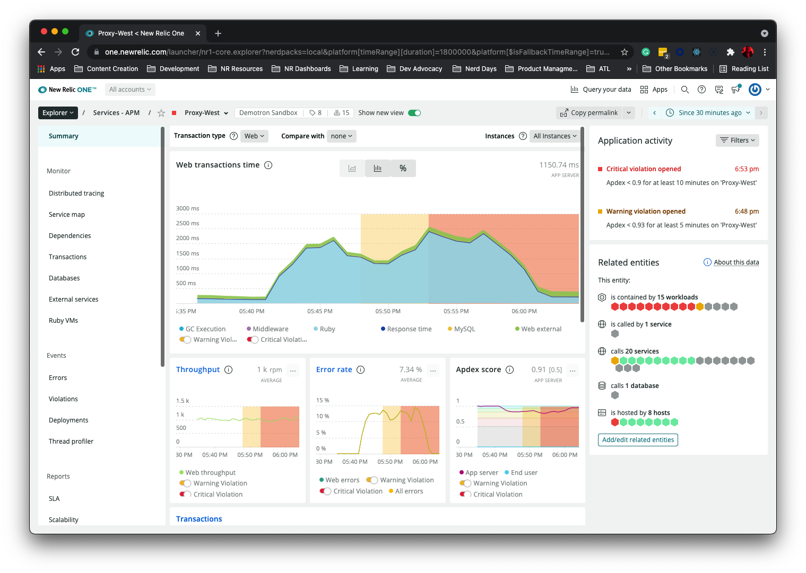

Lab 2: navigation and timeRange
===========================================================

The purpose of this lab is explore more of the built-in capabilities of the `props` passed into a Nerdlet as well as the `navigation` class in the `nr1` library.

After completing this lab you should:

* Have a grasp on the navigation paradigms in New Relic One and how the NR1 SDK exposes them.
* Be able to incorporate the `timeRange` fields that are set by the New Relic One time picker into your Nerdlets.



## Step 0: Setup and Prerequisites

Load the prequisites and follow the setup instructions in [Setup](../SETUP.md).

**Reminder**: Make sure that you're ready to go with your `lab2` by ensuring you've run the following commands:

```bash
# from the nr1-eap-workshop directory
cd lab2
npm install
```

## Step 1: Verifying our Nerdlet and reviewing the [New Relic One SDK docs](http://nr3.nr-assets.net.s3.amazonaws.com/docs/index.html)



1. If you'd like, open the `lab2/nerdlets/my-nerdlet/index.js` and change the value in the constructor of `this.accountId` to an account you want to review.

_Note: we're going to cover how to **not** hardcode the accountIds for NRQL queries later._

2. Open a browser and check out the `Lab 2 Nerdlet` by going to the homepage and clicking on `Lab 2 Launcher`. Click around and verify that it's working. You should see something like this:


2. Open the Devtools in your browser (Ctrl+Click > `Inspect` menu item > Opens the DevTools window, select `Console` tab > `Debug` in left hand nav), and look at the props from the Nerdlet that we wrote into the Nerdlet's `constructor`.


3. Note the prop `launcherUrlState` that contains a `timeRange` object that itself contains three attributes: `begin_time`, `end_time`, and `duration`. This will be the basis of our next step.

## Step 2: Implementing the time picker

1. Change the value of the Time Window in the top right corner of the UI. 

Notice that the time windows and charts in the Nerdlet do not refresh and do not respond to changes in the time window. (_Hint: That's because we haven't told them to use the selected time range yet!_) Let's do something about that.

2. Open the `lab2/nerdlets/my-nerdlet/index.js` file and find the `render` method. Somewhere near the top on the method, add the following code. We're going to read the properties of the NR1 `timeRange` from the `this.props.launcherUrlState`.

```javascript
const { duration } = this.props.launcherUrlState.timeRange;
const since = ` SINCE ${duration/1000/60} MINUTES AGO `;
```

3. Now, we're going to make `duration` part of each of the four query objects.
* `TableComponent`: `query={nrql+since}`
* upper `LineChart`: `query={trxOverT+since}`
* lower `LineChart`: `query={tCountNrql+since}`
* `ScatterChart`: `query={apdexNrql+since}`

4. Save the file and reload. Now try to change the time window again. You should see your charts reading and re-rendering based on the `timeRange`.

## Step 3: Load and display an Entity

In this step we're going to call another Nerdlet, specifically the overview experience for an APM Service, using the `navigation` object to open a predefined portion of NR1. We're also going to utilize the `Button` component.

We need to start by adding a `Button` to the screen.

1. Notice that we _already_ imported the `Button` component near the top of the `lab2/nerdlets/my-nerdlet/index.js` file.

```javascript
//look with your eyes at the Button
import { TableChart, Stack, StackItem, ChartGroup, LineChart, ScatterChart, Button, navigation, nerdlet } from 'nr1';
```

2. Adjust the following code in the `render` method to include the new `StackItem` and `Button` components. In between the first and second "rows" of content within the `render` `return` statement, add the following:

```javascript
{appName && <StackItem>
    <Button onClick={this.openEntity}>Open {appName}</Button>
</StackItem>}
```

3. And then add the following method to the nerdlet in `lab2/nerdlets/my-nerdlet/index.js`. Note that we're using the `navigation` object's `openEntity`.

```javascript
    openEntity() {
        const { entityGuid, appName } = this.state;
        navigation.openEntity({
            guid: entityGuid,
            type: 'APPLICATION',
            domain: 'APM'
        });
    }
```

4. Add the following line to the nerdlet's `constructor` method.

```javascript
    this.openEntity = this.openEntity.bind(this);
```

5. Save the file and reload. Click on an `App Name` in the first table. You should see something like the following:


6. Click on the button titled `Open <<App Name>>`. You should see a card open containing the APM Overview screen.


_Note: Alternatively, you can call the `navigation.openStackedEntity` **thusly**, which will open a card UI vs. replace the entire Nerdlet context:_

```javascript
    openEntity() {
        const { entityGuid, appName } = this.state;
        navigation.openStackedEntity({
            guid: entityGuid,
            type: 'APPLICATION',
            domain: 'APM'
        });
    }
```

## Step 4: Save the Nerdlet state

We have one remaining issue with the navigation flow of this example. After you click on the Button that takes you to the APM Overview nerdlet, a click on your browser back arrow takes you (correctly) to the Lab 2 Nerdlet; however (incorrectly) back to an empty state (i.e. not displaying the 2nd row). Let's fix that.

1. Let's make a call to the `nerdlet.setUrlState` to save the `entityGuid` and `appName` before navigating away. To do this, let's change the `openEntity` method and add a call to `nerdlet.setUrlState`.

```javascript
    openEntity() {
        const { entityGuid, appName } = this.state;
        nerdlet.setUrlState({ entityGuid, appName });
        navigation.openEntity({
            guid: entityGuid,
            type: 'APPLICATION',
            domain: 'APM'
        });
    }
```

2. Add nerdletUrlState to the propTypes, and modify the component's ` constructor` to read from the Nerdlet state when instantiating by modifying the constructor thusly.

```javascript
    constructor(props) {
        super(props);
        this.accountId = 1606862; //New Relic Demotron.
        this.state = {
            entityGuid: this.props.nerdletUrlState.entityGuid,
            appName: this.props.nerdletUrlState.appName
        };
        console.debug("Nerdlet props", this.props); //eslint-disable-line
        this.openEntity = this.openEntity.bind(this);
    }
```

3. Save the file and reload. Click on an `Application` in the `Lab 2 Nerdlet` table, click the `Button` (navigating away), and click back. You should see your context maintained in `Lab 2 Nerdlet`

## Summary

In the end, your `index.js` should look like this.

```javascript
import React from 'react';
import PropTypes from 'prop-types';
import { TableChart, Stack, StackItem, ChartGroup, LineChart, ScatterChart, Button, navigation, nerdlet } from 'nr1';

export default class MyNerdlet extends React.Component {
    static propTypes = {
        width: PropTypes.number,
        height: PropTypes.number,
        launcherUrlState: PropTypes.object,
        nerdletUrlState: PropTypes.object
    };

    constructor(props) {
        super(props);
        this.accountId = 1606862; //New Relic Demotron.
        this.state = {
            entityGuid: this.props.nerdletUrlState.entityGuid,
            appName: this.props.nerdletUrlState.appName
        };
        console.debug("Nerdlet props", this.props); //eslint-disable-line
        this.openEntity = this.openEntity.bind(this);
    }

    setApplication(entityGuid, appName) {
        this.setState({ entityGuid, appName })
    }

    openEntity() {
        const { entityGuid, appName } = this.state;
        nerdlet.setUrlState({ appName, entityGuid }, { replaceHistory: true });
        navigation.openEntity({
            guid: entityGuid,
            type: 'APPLICATION',
            domain: 'APM'
        });
    }

    render(){
        const { duration } = this.props.launcherUrlState.timeRange;
        const since = ` SINCE ${duration/1000/60} MINUTES AGO `;
        const { entityGuid, appName } = this.state;
        const nrql = `SELECT count(*) as 'transactions', apdex(duration) as 'apdex', percentile(duration, 99, 90, 70) FROM Transaction facet appName, entityGuid limit 25`;
        const tCountNrql = `SELECT count(*) FROM Transaction WHERE entityGuid = '${entityGuid}' TIMESERIES`;
        const apdexNrql = `SELECT apdex(duration) FROM Transaction WHERE entityGuid = '${entityGuid}' TIMESERIES`;
        const trxOverTime = `SELECT count(*) as 'transactions' FROM Transaction facet appName, entityGuid limit 25 TIMESERIES`;
        //return the JSX we're rendering
        return (
            <ChartGroup>
                <Stack
                    alignmentType={Stack.ALIGNMENT_TYPE.FILL}
                    directionType={Stack.DIRECTION_TYPE.VERTICAL}
                    distributionType={Stack.DISTRIBUTION_TYPE.FILL_EVENLY}
                    gapType={Stack.GAP_TYPE.TIGHT}>
                    <StackItem>
                        <h1>Reviewing Transactions in account {this.accountId}</h1>
                    </StackItem>
                    <StackItem>
                        <Stack
                            alignmentType={Stack.ALIGNMENT_TYPE.FILL}
                            directionType={Stack.DIRECTION_TYPE.HORIZONTAL}
                            distributionType={Stack.DISTRIBUTION_TYPE.FILL_EVENLY}
                            gapType={Stack.GAP_TYPE.TIGHT}>
                            <StackItem>
                                <TableChart query={nrql+since} accountId={this.accountId} className="chart" onClickTable={(dataEl, row, chart) => {
                                    //for learning purposes, we'll write to the console.
                                    console.debug([dataEl, row, chart]) //eslint-disable-line
                                    this.setApplication(row.entityGuid, row.appName)
                                }}/>
                            </StackItem>
                            <StackItem>
                                <LineChart
                                    query={trxOverTime+since}
                                    className="chart"
                                    accountId={this.accountId}
                                    onClickLine={(line) => {
                                        //more console logging for learning purposes
                                        console.debug(line); //eslint-disable=line
                                        const params = line.metadata.label.split(",");
                                        this.setApplication(params[1], params[0]);
                                    }}
                                />
                            </StackItem>
                        </Stack>
                    </StackItem>
                    {entityGuid && <StackItem>
                        <Button onClick={this.openEntity}>Open {appName}</Button>
                    </StackItem>}
                    {entityGuid && <StackItem>
                        <Stack
                            alignmentType={Stack.ALIGNMENT_TYPE.FILL}
                            directionType={Stack.DIRECTION_TYPE.HORIZONTAL}
                            distributionType={Stack.DISTRIBUTION_TYPE.FILL_EVENLY}
                            gapType={Stack.GAP_TYPE.EXTRA_LOOSE}>
                            <StackItem>
                                <h2>Transaction counts for {appName}</h2>
                                <LineChart accountId={this.accountId} query={tCountNrql+since} className="chart"/>
                            </StackItem>
                            <StackItem>
                                <h2>Apdex for {appName}</h2>
                                <ScatterChart accountId={this.accountId} query={apdexNrql+since} className="chart"/>
                            </StackItem>
                        </Stack>
                    </StackItem>}
                </Stack>
            </ChartGroup>
        )
    }
}
```

# For Consideration / Discussion

* Why would we want to "hand craft" the usage of the time picker? Can you think of a scenario where you'd want the control over how the time elements of a custom experience would be implemented?
* Have you drawn the connection between what we're building with these React tools and the fact that a currated experience in the product, like the APM Overview screen, is made of the exact same stuff? What are the benefits of that type of approach to programmability?
