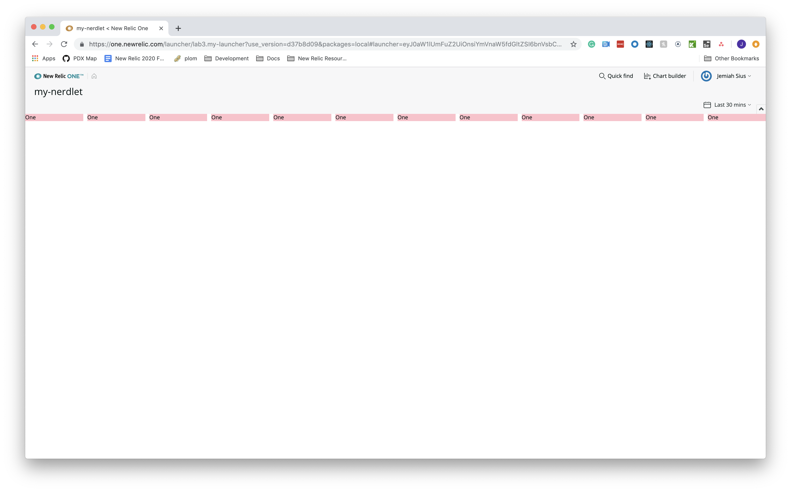
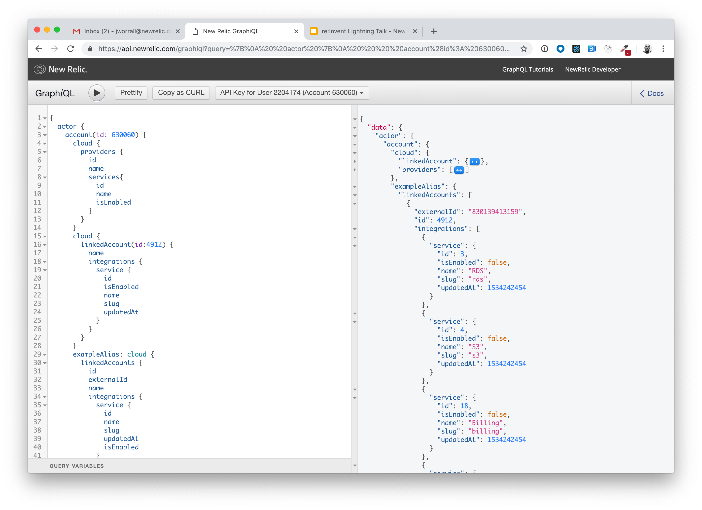
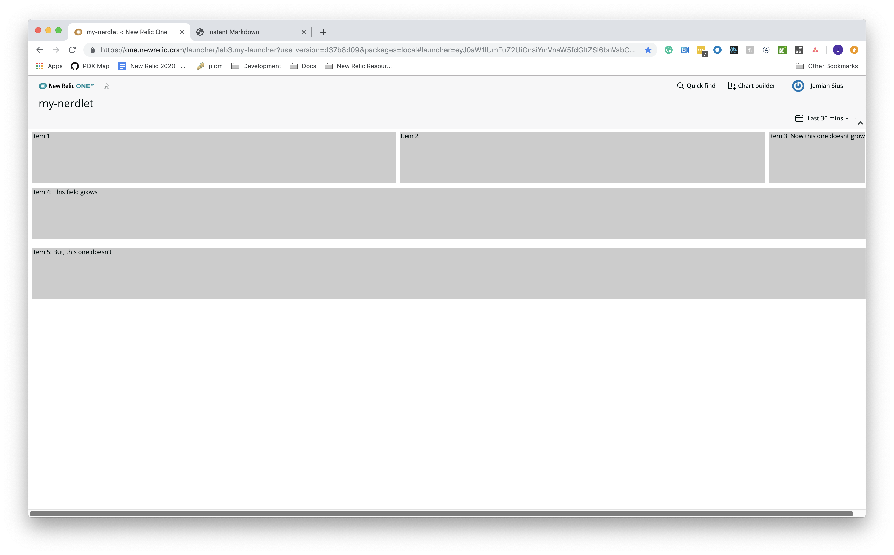
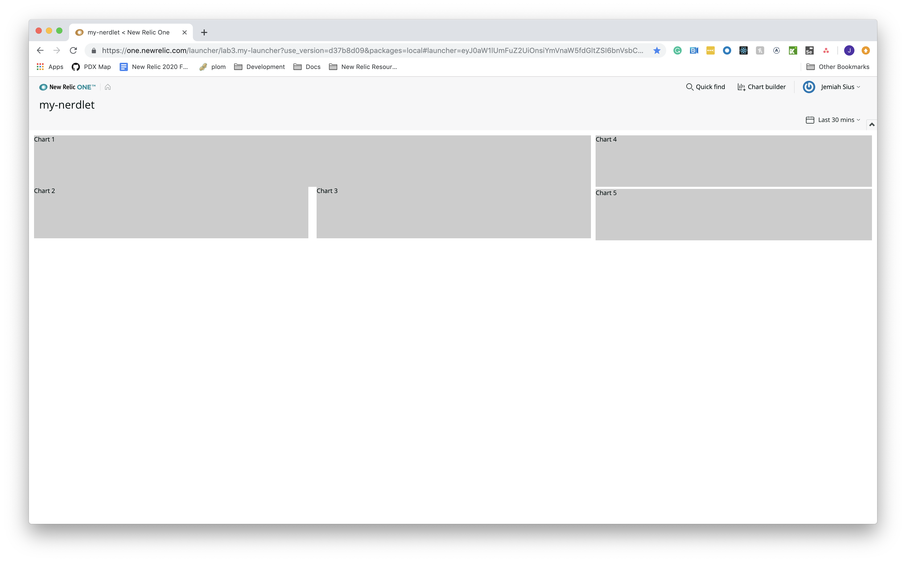
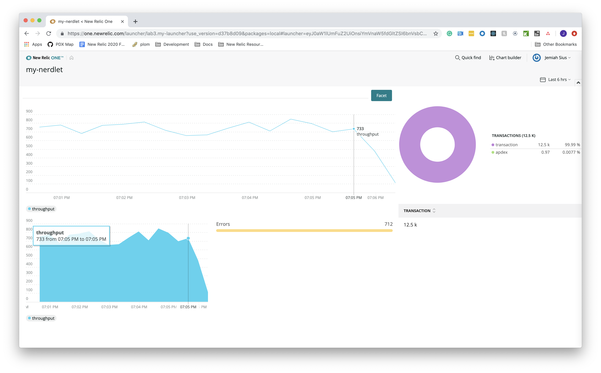
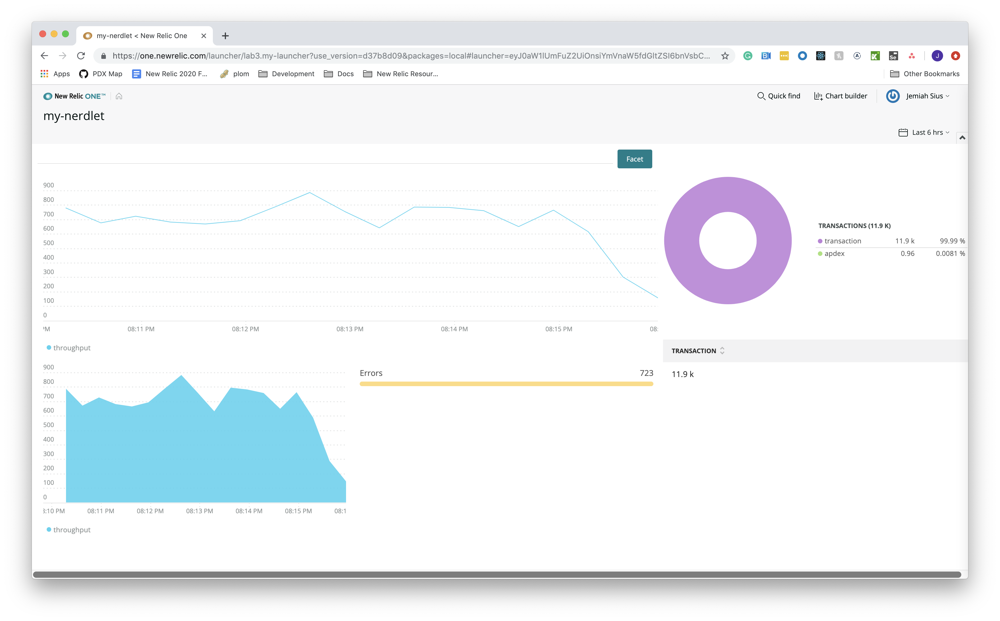
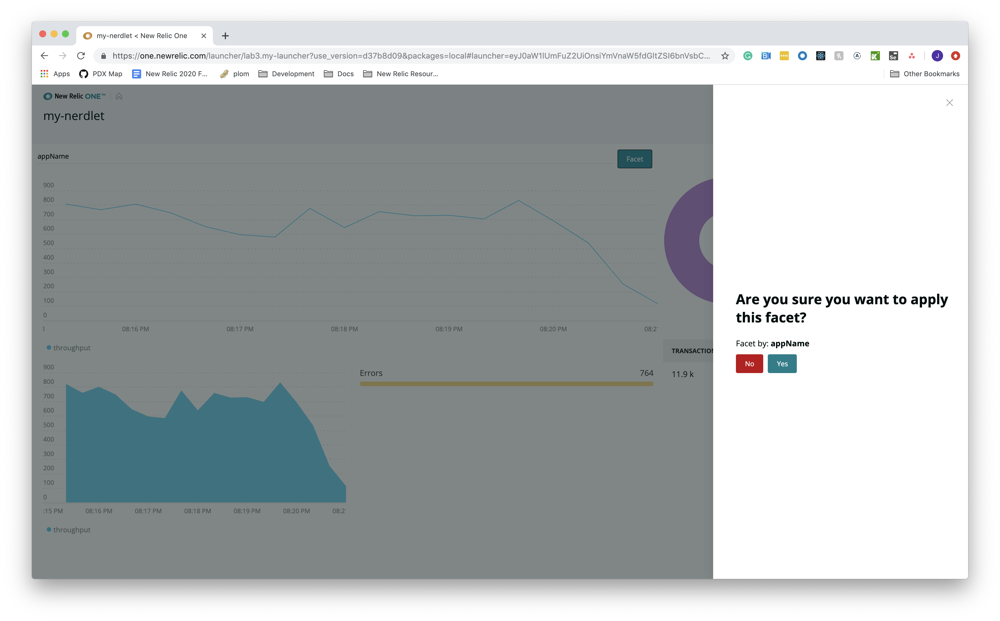
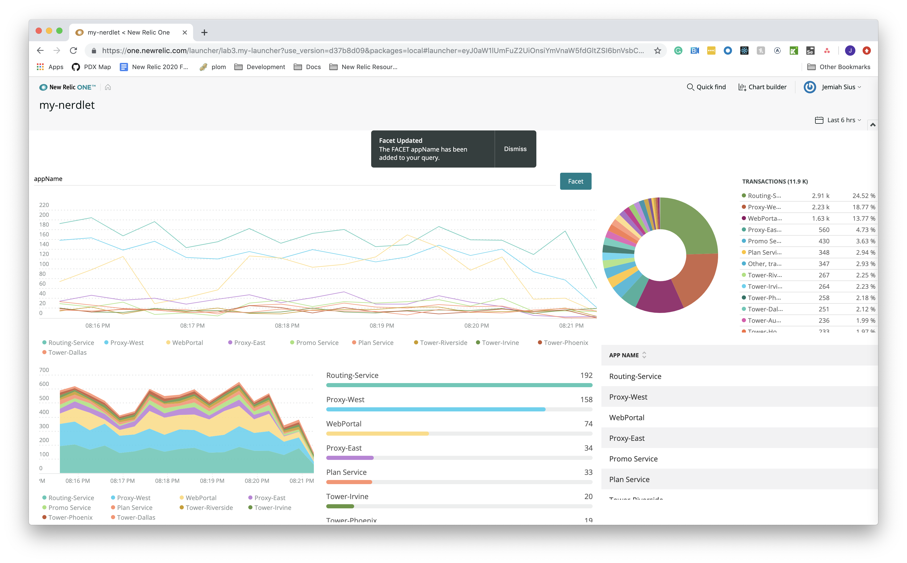

Lab 3: Grids, Stacks, and UI components
===========================================================

The purpose of this lab is learn how to create advanced layouts in your Nerdlet as well as the `navigation` class in the `nr1` library.

After completing this lab you should:
* Understand how to work with the `Stack` and `Grid` components
* Become familiar with how to interact with the `navigation` object

## Step 0: Setup and Prerequisites

Load the prerequisites and follow the setup instructions in [Setup](../SETUP.md).

**Reminder**: Make sure that you're ready to go with your `lab3` by ensuring you've run the following commands:

```bash
# from the nr1-workshop directory
cd lab3
nr1 nerdpack:uuid -gf
npm install
npm start
```

## Step 1: Using the Grid and Grid Items Components

The `<Grid>` UI component is a layout component that only accepts `GridItem` components and works as standard 12-column grid system. Each `<GridItem>` within a `<Grid>` can have a column span of 1-12 that determines it's width and a can not exceed 12 columns without wrapping.

1. Import the `<Grid>` and `<GridItem>` from the `nr1` library.

Open the `lab3/nerdlets/my-nerdlet/main.js` and the import statment below.

```javascript
import {Grid, GridItem} from 'nr1';
```

2. Replace the render method within `lab3/nerdlets/my-nerdlet/main.js`

```javascript
    render() {
        const gridItems = [];
        for(let i=0; i<12; i++){
            gridItems.push(<GridItem
                key={i}
                columnSpan={1}
                style={{backgroundColor: "pink"}}
            >
                One
            </GridItem>)
        }

        return <Grid>
            {gridItems}
        </Grid>
    }
```

3. Save your `main.js` file and in Google Chrome, navigate to the following URL `https://one.newrelic.com?nerdpacks=local` and click my launcher.

Your browsers should show a `Grid` with `GridItems` that looks something similar to below:



4. Changing the `<Grid>` to something more useful.

Replace the render method within `lab3/nerdlets/my-nerdlet/main.js` file and take another look at the Nerdlet in your Chrome browser.

```javascript
    render() {
        return <Grid>
            <GridItem
                columnSpan={6}
                style={{backgroundColor: "#FF0000"}}
            >
                Six Column Grid Item
            </GridItem>
            <GridItem
                columnSpan={4}
                style={{backgroundColor: "#00FF00"}}
            >
                Four Column Grid Item
            </GridItem>
        </Grid>
    }
```

Your browser should show a `Grid` with `GridItems` that looks something similar to below:



_Note: For more documentation on the `Grid` and `GridItem`and their props view the `nr1` [object documentation](http://nr3.nr-assets.net.s3.amazonaws.com/docs/index.html#components/Grid)

## Step 2: Using Stack and StackItems Components

The `<Stack>` is another layout componnet in the New Relic One UI library. A `<Stack>` only accepts `<StackItem>` components and is a simplified verison of flexbox. The `<Stack>` and `<StackItem>` are very powerful, enables the majority of layouts.

1. Importing the `<Stack>` and `<StackItem>`

Inside the `lab3/nerdlets/my-nerdlet/main.js` update the import statement with the one below.

```javascript
import {Grid, GridItem, Stack, StackItem} from 'nr1';
```

2. Creating a simple layout using the `<Stack>` and `<Stack>` components

Replace the render method within `lab3/nerdlets/my-nerdlet/main.js` file and take another look at the Nerdlet in your Chrome browser.

```javascript
render() {
    return <Stack
            fullWidth
            horizontalType={Stack.HORIZONTAL_TYPE.FILL}
            directionType={Stack.DIRECTION_TYPE.VERTICAL}>
            <StackItem>
                <Stack
                    fullWidth
                    horizontalType={Stack.HORIZONTAL_TYPE.FILL}
                    directionType={Stack.DIRECTION_TYPE.HORIZONTAL}
                    gapType={Stack.GAP_TYPE.NORMAL}>
                    <StackItem>
                        <div className="gry-div">Item 1</div>
                    </StackItem>
                    <StackItem>
                        <div className="gry-div">Item 2</div>
                    </StackItem>
                    <StackItem>
                        <div className="gry-div">Item 3</div>
                    </StackItem>
                </Stack>
            </StackItem>
            <StackItem>
                <Stack
                    fullWidth
                    horizontalType={Stack.HORIZONTAL_TYPE.FILL}
                    directionType={Stack.DIRECTION_TYPE.HORIZONTAL}>
                    <StackItem grow={true}>
                        <div className="gry-div">Item 4: This field grows</div>
                    </StackItem>
                    <StackItem>
                        <div className="gry-div">Item 5: But, this one doesn't</div> FIXME: what does "grow", and why would this identical stack item not "grow"
                    </StackItem>
                </Stack>
            </StackItem>
        </Stack>
    }
```

The power in using `<Stack>` and `<StackItem>` components is being able to use their props and easily create a layout that is best for your nerdpack. Let's update props of the code we added before and see what happens to our layout.

Change the render method within your `lab3/nerdlets/my-nerdlet/main.js` with the code below and look at the difference in your browser.

```javascript
render() {
    return <Stack
        fullWidth
        horizontalType={Stack.HORIZONTAL_TYPE.FILL}
        directionType={Stack.DIRECTION_TYPE.VERTICAL}>
        <StackItem>
            <Stack
                fullWidth
                directionType={Stack.DIRECTION_TYPE.HORIZONTAL}
                gapType={Stack.GAP_TYPE.NORMAL}>
                <StackItem grow={true}>
                    <div className="gry-div">Item 1: grows</div>
                </StackItem>
                <StackItem grow={true}>
                    <div className="gry-div">Item 2: grows</div>
                </StackItem>
                <StackItem>
                    <div className="gry-div">Item 3: Now this one doesn't grow</div>
                </StackItem>
            </Stack>
        </StackItem>
        <StackItem style={{backgroundColor: 'blue'}}>
            <div className="gry">Item 4: here too</div>
        </StackItem>
    </Stack>
    }
```

Your browser should now look similar to the snapshot below:



_Note: For more documentation on the `Stack` and `StackItem` and their props view the `nr1` object documentation at: http://nr3.nr-assets.net.s3.amazonaws.com/docs/index.html


## Step 3: Building an Nerdpack with UI Components

1. Creating your layout using `<Grid>`, `<GridItem>`, `<Stack>`, and `<StackItem>` compnents

Update the import statement with your code people:

```javascript
import { Grid, GridItem, Stack, StackItem, ChartGroup, AreaChart, BarChart, LineChart, TableChart, PieChart, Button, TextField, Modal, Toast } from 'nr1';
```

Using the Grid and Stack components you can easily create any layout you wish within your nerdpack. Replace the render method within your `lab3/nerdlets/my-nerdlet/main.js` with the code below:

```javascript
    render() {
        return <ChartGroup>
            <Grid>
                <GridItem
                    columnSpan={8}>
                    <Stack
                        fullWidth
                        directionType={Stack.DIRECTION_TYPE.HORIZONTAL}
                        gapType={Stack.GAP_TYPE.LOOSE}>
                        <StackItem>
                            <div className="gry-div">Chart 1</div>
                        </StackItem>
                    </Stack>
                    <Stack
                        fullWidth
                        gapType={Stack.GAP_TYPE.LOOSE}>
                        <StackItem>
                            <div className="gry-div">Chart 2</div>
                        </StackItem>
                        <StackItem>
                            <div className="gry-div">Chart 3</div>
                        </StackItem>
                    </Stack>
                </GridItem>
                <GridItem
                    columnSpan={4}>
                    <Stack
                        fullWidth
                        gapType={Stack.GAP_TYPE.TIGHT}
                        directionType={Stack.DIRECTION_TYPE.VERTICAL}>
                        <StackItem>
                            <div className="gry-div">Chart 4</div>
                        </StackItem>
                        <StackItem>
                            <div className="gry-div">Chart 5</div>
                        </StackItem>
                    </Stack>
                </GridItem>
            </Grid>
        </ChartGroup>;
    }
```

Your Nerdlet should look similar to below:



2. Adding Chart Components to you `<Grid>` and `<Stack>`

Now that you have your layout done, let's add a some chart components. Replace the render method within your `lab3/nerdlets/my-nerdlet/main.js` with the code below:

```javascript
    render() {
        return <ChartGroup>
            <Grid className="grid">
                <GridItem
                    columnSpan={8}>
                    <Stack
                        fullWidth
                        gapType={Stack.GAP_TYPE.LOOSE}>
                        <StackItem grow>
                            <LineChart
                                query={throughput+since}
                                accountId={this.accountId}
                                className="chart"
                                onClickLine={(line) => {
                                    console.debug(line); //eslint-disable-line
                                }}
                            />
                        </StackItem>
                    </Stack>
                    <Stack
                        fullWidth
                        directionType={Stack.DIRECTION_TYPE.HORIZONTAL}
                        gapType={Stack.GAP_TYPE.LOOSE}>
                        <StackItem>
                            <AreaChart
                                query={throughput+since}
                                accountId={this.accountId}
                                className="two-col-chart"
                                onClickLine={(line) => {
                                    console.debug(line); //eslint-disable-line
                                }}
                            />
                        </StackItem>
                        <StackItem>
                            <BarChart className="two-col-chart" query={errors+since} accountId={this.accountId} />
                        </StackItem>
                    </Stack>
                </GridItem>
                <GridItem
                    columnSpan={4}>
                    <Stack
                        fullWidth
                        className="side-col"
                        gapType={Stack.GAP_TYPE.TIGHT}
                        directionType={Stack.DIRECTION_TYPE.VERTICAL}>
                        <StackItem>
                            <PieChart
                                className="chart"
                                query={transaction_apdex_by_appname+since}
                                accountId={this.accountId}
                            />
                        </StackItem>
                        <StackItem>
                            <TableChart className="chart" query={transaction_apdex_by_appname+since} accountId={this.accountId}/>
                        </StackItem>
                    </Stack>
                </GridItem>
            </Grid>
        </ChartGroup>
    }
```

Add the following code to your `main.js` file. ABOVE the `render` method.

```javascript
    constructor(props) {
        super(props);
        this.accountId =  <REPLACE_WITH_YOUR_ACCOUNT_ID>;
        console.debug("Nerdlet props", this.props); //eslint-disable-line
    }
```

Add the following code to your `main.js` file. IN the `render` method before the `return`

```javascript
    const { duration } = this.props.launcherUrlState.timeRange;
    const since = ` SINCE ${duration/1000/60} MINUTES AGO `;
    const errors = `SELECT count(error) FROM Transaction TIMESERIES`;
    const throughput = `SELECT count(*) as 'throughput' FROM Transaction TIMESERIES`;
    const transaction_apdex_by_appname = `SELECT count(*) as 'transaction', apdex(duration) as 'apdex' FROM Transaction limit 25`;
```

Your Nerdlet should look similar to below:



## Interacting with the New Relic One UI

The NR1 library also exposes components that allow you to interact with the New Relic One UI.

In the next few steps we'll add some UI components that updates the UI and add more detail to our charts.

Add the following methods to your code above your render method. These will come in handy later to help us interact with the UI.

```javascript
    handleChange(e){
        this.setState({value: e.target.value})
    }

    onSubmit(e){
        e.preventDefault();
        this.setState({hideModal: false})
    }

    confirmFacet(e){
        e.preventDefault();
        this.popToast('normal', 'Facet Updated', `The FACET ${this.state.value} has been added to your query.`)
        this.setState({facet: 'FACET '+this.state.value, hideModal: true});
    }

    rejectFacet(e){
        e.preventDefault();
        this.popToast('critical', 'Facet Rejected', `The FACET ${this.state.value} has been rejected.`)
        this.setState({facet: '', value: '', hideModal: true});
    }

    popToast(toastType, toastTitle, toastDisplay){
        this.setState({showToast: true, toastType, toastTitle, toastDisplay});
    }
```

Update your constructor method with the code below. This will come in handy as well a little later.

```javascript
    constructor(props) {
        super(props);
        this.accountId =  <REPLACE_WITH_YOUR_ACCOUNT_ID>;
        this.state = {
            value: '',
            facet: '',
            hideModal: true,
            showToast: false,
            toastType: 'normal',
            toastTitle: '',
            toastDisplay: ''
        }
        console.debug("Nerdlet props", this.props); //eslint-disable-line

        this.handleChange = this.handleChange.bind(this);
        this.onSubmit = this.onSubmit.bind(this);
        this.confirmFacet = this.confirmFacet.bind(this);
        this.rejectFacet = this.rejectFacet.bind(this);
        this.popToast = this.popToast.bind(this);
    }
```

1. Using the `<TextField>`, `<Button>`, and `<Modal>` component to get and confirm user input

We want to be able to FACET the chart in our Nerdlet to get better more detail from our instrumentation. To do this we will use the `<TextField>` and `<Button>` components to submit the FACET by and verify the input using a `<Modal>` component.

Update the render method with the code below:

```javascript
    render() {
        const { duration } = this.props.launcherUrlState.timeRange;
        const since = ` SINCE ${duration/1000/60} MINUTES AGO `;
        const errors = `SELECT count(error) FROM Transaction TIMESERIES`;
        const throughput = `SELECT count(*) as 'throughput' FROM Transaction TIMESERIES`;
        const transaction_apdex_by_appname = `SELECT count(*) as 'transaction', apdex(duration) as 'apdex' FROM Transaction limit 25`;
        return <React.Fragment>
            <ChartGroup>
            <Grid className="grid">
                <GridItem
                    columnSpan={8}>
                    <form onSubmit={this.onSubmit}>
                        <Stack>
                            <StackItem grow={true}>
                                <TextField
                                    value={this.state.value}
                                    onChange={this.handleChange}
                                />
                            </StackItem>
                            <StackItem>
                                <Button type={Button.TYPE.PRIMARY}>Facet</Button>
                            </StackItem>
                        </Stack>
                        <Modal
                            hidden={this.state.hideModal}
                            onClose={() => {this.setState({facet: '', value: '', hideModal: true})}}
                        >
                            <Stack>
                                <StackItem>
                                    <h1 className="Modal-headline">Are you sure you want to apply this facet?</h1>
                                    <p className="facet-value">Facet by: <strong>{this.state.value}</strong></p>
                                    <Stack>
                                        <StackItem>
                                            <Button
                                                onClick={this.rejectFacet}
                                            >No</Button>
                                        </StackItem>
                                        <StackItem>
                                            <Button
                                                onClick={this.confirmFacet}
                                            >Yes</Button>
                                        </StackItem>
                                    </Stack>
                                </StackItem>
                            </Stack>
                        </Modal>
                    </form>

                    <Stack
                        fullWidth
                        gapType={Stack.GAP_TYPE.LOOSE}>
                        <StackItem grow>
                            <LineChart
                                    query={throughput+since+this.state.facet}
                                    accountId={this.accountId}
                                    className="chart"
                                    onClickLine={(line) => {
                                        console.debug(line); //eslint-disable-line
                                }}
                            />
                        </StackItem>
                    </Stack>
                    <Stack
                        fullWidth
                        gapType={Stack.GAP_TYPE.LOOSE}>
                        <StackItem>
                            <AreaChart
                                    query={throughput+since+this.state.facet}
                                    accountId={this.accountId}
                                    className="two-col-chart"
                                    onClickLine={(line) => {
                                        console.debug(line); //eslint-disable-line
                                }}
                            />
                        </StackItem>
                        <StackItem>
                            <BarChart className="two-col-chart" query={errors+since+this.state.facet} accountId={this.accountId} />
                        </StackItem>
                    </Stack>
                </GridItem>
                <GridItem
                    columnSpan={4}>
                    <Stack
                        fullWidth
                        className="side-col"
                        gapType={Stack.GAP_TYPE.TIGHT}
                        directionType={Stack.DIRECTION_TYPE.VERTICAL}>
                        <StackItem>
                            <PieChart
                                className="chart"
                                query={transaction_apdex_by_appname+since+this.state.facet}
                                accountId={this.accountId}
                            />
                        </StackItem>
                        <StackItem>
                            <TableChart className="chart" query={transaction_apdex_by_appname+since+this.state.facet} accountId={this.accountId} />
                        </StackItem>
                    </Stack>
                </GridItem>
            </Grid>
        </ChartGroup>
    </React.Fragment>
    }
```

Your browser should look similar to below:



Enter the  FACET `appName` in the `<TextField>` and click the FACET button. And, you see the `<Modal>` similar to below:



2. Adding the `<Toast>` component for user notifications after UI has been updated.

Add the code below to your `main.js` file between the `<React.Fragment>` and `<ChartGroup>` components

```javascript
{ this.state.showToast &&
    <Toast
    type={this.state.toastType}
    title={this.state.toastTitle}
    description={this.state.toastDisplay}
    onHideEnd={()=>{this.setState({showToast: false})}}
    />
}
```

Refresh your browser and FACET your charts by `host`. Your browser should look similar to below.



## Summary

In the end, your `main.js` should look like this.

```javascript
import React from 'react';
import PropTypes from 'prop-types';
import { Grid, GridItem, Stack, StackItem, ChartGroup, AreaChart, BarChart, LineChart, TableChart, PieChart, Button, TextField, Modal, Toast } from 'nr1';

export default class MyNerdlet extends React.Component {
    static propTypes = {
        launcherUrlState: PropTypes.object,
        width: PropTypes.number,
        height: PropTypes.number,
    };

    constructor(props) {
        super(props);
        this.accountId =  <REPLACE_WITH_YOUR_ACCOUNT_ID>;
        this.state = {
            value: '',
            facet: '',
            hideModal: true,
            showToast: false,
            toastType: 'normal',
            toastTitle: '',
            toastDisplay: ''
        }
        console.debug("Nerdlet props", this.props); //eslint-disable-line

        this.handleChange = this.handleChange.bind(this);
        this.onSubmit = this.onSubmit.bind(this);
        this.confirmFacet = this.confirmFacet.bind(this);
        this.rejectFacet = this.rejectFacet.bind(this);
        this.popToast = this.popToast.bind(this);
    }

    handleChange(e){
        this.setState({value: e.target.value})
    }

    onSubmit(e){
        e.preventDefault();
        this.setState({hideModal: false})
    }

    confirmFacet(e){
        e.preventDefault();
        this.popToast('normal', 'Facet Updated', `The FACET ${this.state.value} has been added to your query.`)
        this.setState({facet: 'FACET '+this.state.value, hideModal: true});
    }

    rejectFacet(e){
        e.preventDefault();
        this.popToast('critical', 'Facet Rejected', `The FACET ${this.state.value} has been rejected.`)
        this.setState({facet: '', value: '', hideModal: true});
    }

    popToast(toastType, toastTitle, toastDisplay){
        this.setState({showToast: true, toastType, toastTitle, toastDisplay});
    }

    render() {
        const { duration } = this.props.launcherUrlState.timeRange;
        const since = ` SINCE ${duration/1000/60} SECONDS AGO `;
        const errors = `SELECT count(error) FROM Transaction TIMESERIES`;
        const throughput = `SELECT count(*) as 'throughput' FROM Transaction TIMESERIES`;
        const transaction_apdex_by_appname = `SELECT count(*) as 'transaction', apdex(duration) as 'apdex' FROM Transaction limit 25`;
        return <React.Fragment>
            { this.state.showToast &&
                <Toast
                type={this.state.toastType}
                title={this.state.toastTitle}
                description={this.state.toastDisplay}
                onHideEnd={()=>{this.setState({showToast: false})}}
                />
            }
            <ChartGroup>
                <Grid className="grid">
                    <GridItem
                        columnSpan={8}>
                        <form onSubmit={this.onSubmit}>
                            <Stack>
                                <StackItem grow={true}>
                                    <TextField
                                        value={this.state.value}
                                        onChange={this.handleChange}
                                    />
                                </StackItem>
                                <StackItem>
                                    <Button type={Button.TYPE.PRIMARY}>Facet</Button>
                                </StackItem>
                            </Stack>
                            <Modal
                                hidden={this.state.hideModal}
                                onClose={() => {this.setState({facet: '', value: '', hideModal: true})}}
                            >
                                <Stack>
                                    <StackItem>
                                        <h1 className="Modal-headline">Are you sure you want to apply this facet?</h1>
                                        <p className="facet-value">Facet by: <strong>{this.state.value}</strong></p>
                                        <Stack>
                                            <StackItem>
                                                <Button
                                                    onClick={this.rejectFacet}
                                                >No</Button>
                                            </StackItem>
                                            <StackItem>
                                                <Button
                                                    onClick={this.confirmFacet}
                                                >Yes</Button>
                                            </StackItem>
                                        </Stack>
                                    </StackItem>
                                </Stack>
                            </Modal>
                        </form>
                        <Stack
                            fullWidth
                            gapType={Stack.GAP_TYPE.LOOSE}>
                            <StackItem grow>
                                <LineChart
                                        query={throughput+since+this.state.facet}
                                        accountId={this.accountId}
                                        className="chart"
                                        onClickLine={(line) => {
                                            console.debug(line); //eslint-disable-line
                                    }}
                                />
                            </StackItem>
                        </Stack>
                        <Stack
                            fullWidth
                            gapType={Stack.GAP_TYPE.LOOSE}>
                            <StackItem>
                                <AreaChart
                                        query={throughput+since+this.state.facet}
                                        accountId={this.accountId}
                                        className="two-col-chart"
                                        onClickLine={(line) => {
                                            console.debug(line); //eslint-disable-line
                                    }}
                                />
                            </StackItem>
                            <StackItem>
                                <BarChart className="two-col-chart" query={errors+since+this.state.facet} accountId={this.accountId} />
                            </StackItem>
                        </Stack>
                    </GridItem>
                    <GridItem
                        columnSpan={4}>
                        <Stack
                            fullWidth
                            className="side-col"
                            gapType={Stack.GAP_TYPE.TIGHT}
                            directionType={Stack.DIRECTION_TYPE.VERTICAL}>
                            <StackItem>
                                <PieChart
                                    className="chart"
                                    query={transaction_apdex_by_appname+since+this.state.facet}
                                    accountId={this.accountId}
                                />
                            </StackItem>
                            <StackItem>
                                <TableChart className="chart" query={transaction_apdex_by_appname+since+this.state.facet} accountId={this.accountId} />
                            </StackItem>
                        </Stack>
                    </GridItem>
                </Grid>
        </ChartGroup>
    </React.Fragment>
    }
}
```