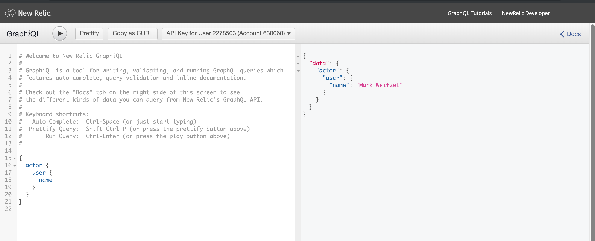
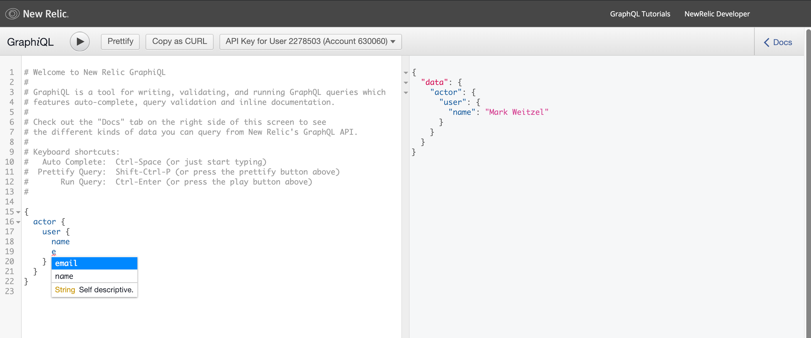
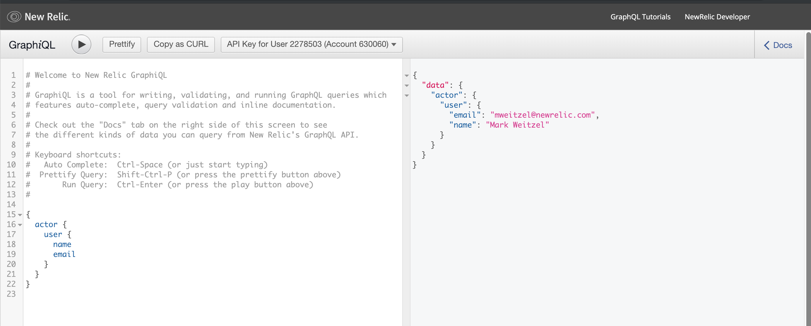

# Your First Query
In this exercise, we'll make sure you can use the [GraphiQL](https://api.newrelic.com/graphiql) tool that to start getting information from New Relic. Note, if you are not signed in, you will be prompted to login to New Relic.

>Make sure to generate an API key that you can use with GraphiQL! See [Instructions](INSTRUCTIONS.md) for more information.

# Basic Query
When you first open up GraphiQL, you are presented with a simple query to help you get started. Go ahead and click the `Play` button to execute the query. You should see something like the following:


In the introduction, we noted that GraphQL empowers the client to determine what information is returned from a query. To illustrate this, let's return the user's email address as well. In the query section on the left hand side, hit enter after the `name` field and a type `email` on the new line. Note that as you type, GraphiQL provides type ahead help. This is based on the GraphQL schema, which we will learn about in the next section.


Press the `Play` button after you add the email. Your final result should look similar to the screen shot below:


That's it! You've successfully used GraphQL to query information from New Relic.


# For Consideration / Discussion
What other information are you able to retrieve about a user? What other information is available through GraphQL?

## Full Query
```graphql
{
  actor {
    user {
      name
      email
    }
  }
}
```