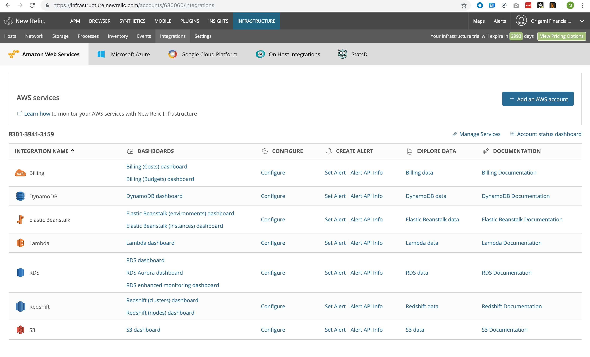

# Querying Infrastructure
In this exercise, we are going to query various aspects of information contained within New Relic Infrastructure. Information in this section will be used to update certains settings in the next exercise. 

> Make sure to generate an API key that you can use with GraphiQL! See [Instructions](INSTRUCTIONS.md) for more information. 

## Browsing Infrastructure
Let's start by looking at what infrastructure integrations you have available in New Relic. In the instance below, you can see that for AWS, we have Billing, DyanmoDB, and other services. 
> Take a moment to explore what is available in your instance. Click into the `Configure` link to see what options are presented and the current settings. 




## Querying Infrastructure
Now, let's retrieve information about infrastructure via GraphQL. In [GraphiQL](https://api.newrelic.com/graphiql?query=%7B%0A%20%20actor%20%7B%0A%20%20%20%20account%28id%3A%20630060%29%20%7B%0A%20%20%20%20%20%20cloud%20%7B%0A%20%20%20%20%20%20%20%20linkedAccounts%20%7B%0A%20%20%20%20%20%20%20%20%20%20id%0A%20%20%20%20%20%20%20%20%20%20externalId%0A%20%20%20%20%20%20%20%20%20%20name%0A%20%20%20%20%20%20%20%20%20%20provider%20%7B%0A%20%20%20%20%20%20%20%20%20%20%20%20id%0A%20%20%20%20%20%20%20%20%20%20%20%20name%0A%20%20%20%20%20%20%20%20%20%20%20%20slug%0A%20%20%20%20%20%20%20%20%20%20%7D%0A%20%20%20%20%20%20%20%20%20%20authLabel%0A%20%20%20%20%20%20%20%20%20%20integrations%20%7B%0A%20%20%20%20%20%20%20%20%20%20%20%20id%0A%20%20%20%20%20%20%20%20%20%20%20%20name%0A%20%20%20%20%20%20%20%20%20%20%20%20service%20%7B%0A%20%20%20%20%20%20%20%20%20%20%20%20%20%20id%0A%20%20%20%20%20%20%20%20%20%20%20%20%20%20slug%0A%20%20%20%20%20%20%20%20%20%20%20%20%20%20name%0A%20%20%20%20%20%20%20%20%20%20%20%20%20%20createdAt%0A%20%20%20%20%20%20%20%20%20%20%20%20%20%20updatedAt%0A%20%20%20%20%20%20%20%20%20%20%20%20%20%20provider%20%7B%0A%20%20%20%20%20%20%20%20%20%20%20%20%20%20%20%20name%0A%20%20%20%20%20%20%20%20%20%20%20%20%20%20%20%20id%0A%20%20%20%20%20%20%20%20%20%20%20%20%20%20%7D%0A%20%20%20%20%20%20%20%20%20%20%20%20%7D%0A%20%20%20%20%20%20%20%20%20%20%7D%0A%20%20%20%20%20%20%20%20%7D%0A%20%20%20%20%20%20%7D%0A%20%20%20%20%7D%0A%20%20%7D%0A%7D%0A), paste the following query into the left hand side and hit the `play` button.
> NOTE: You will need to paste in your account id in this query. You can find it in the URL of your New Relic instance. For example, in the following URL **630060** is the account number.  https://infrastructure.newrelic.com/accounts/630060/integrations 

*Make sure to substitute in your account number after the `(id:`
```graphql
{
  actor {
    account(id: 630060) {
      cloud {
        linkedAccounts {
          id
          externalId
          name
          authLabel
          provider {
            id
            name
            slug
          }
          integrations {
            id
            name
            service {
              id
              slug
              name
              createdAt
              updatedAt
              provider {
                name
                id
              }
            }
          }
        }
      }
    }
  }
}
```
In the query above, we pass in the `id`  of the account we want to query. This is the `account(id: 630060)` part of the query. (For complete query syntax, see the [GraphQL queries](https://graphql.org/learn/queries/) documentation) What we are asking for is the set of providers that are linked to our account. And for each of provider, the set of services that is offered.

>Note: Notice that we are 'nesting' requests, that is, we are getting information about both the parent, a cloud provider, AND the services that it offers. Normally, this would require multiple REST calls. The ability to retrieve information in this manner is one of the strong points of GraphQL. 

```graphql
{
  "data": {
    "actor": {
      "account": {
        "cloud": {
          "linkedAccounts": [
            {
              "authLabel": "arn:aws:iam::830139413159:role/NewRelicInfrastructure-Integrations-Origami",
              "externalId": "830139413159",
              "id": 4912,
              "integrations": [
                {
                  "id": 77310,
                  "name": "RDS",
                  "service": {
                    "createdAt": 1470991744,
                    "id": 3,
                    "name": "RDS",
                    "provider": {
                      "id": 1,
                      "name": "Amazon Web Services"
                    },
                    "slug": "rds",
                    "updatedAt": 1534242454
                  }
                },
                {
                  "id": 177183,
                  "name": "S3",
                  "service": {
                    "createdAt": 1470991745,
                    "id": 4,
                    "name": "S3",
                    "provider": {
                      "id": 1,
                      "name": "Amazon Web Services"
                    },
                    "slug": "s3",
                    "updatedAt": 1534242454
                  }
                },
                {
                  "id": 152170,
                  "name": "Billing",
                  "service": {
                    "createdAt": 1491900437,
                    "id": 18,
                    "name": "Billing",
                    "provider": {
                      "id": 1,
                      "name": "Amazon Web Services"
                    },
                    "slug": "billing",
                    "updatedAt": 1534242454
                  }
                },
                {
                  "id": 177193,
                  "name": "Lambda",
                  "service": {
                    "createdAt": 1477910055,
                    "id": 14,
                    "name": "Lambda",
                    "provider": {
                      "id": 1,
                      "name": "Amazon Web Services"
                    },
                    "slug": "lambda",
                    "updatedAt": 1534242454
                  }
                },
                {
                  "id": 177195,
                  "name": "Redshift",
                  "service": {
                    "createdAt": 1497364366,
                    "id": 21,
                    "name": "Redshift",
                    "provider": {
                      "id": 1,
                      "name": "Amazon Web Services"
                    },
                    "slug": "redshift",
                    "updatedAt": 1534242454
                  }
                },
                {
                  "id": 177184,
                  "name": "DynamoDB",
                  "service": {
                    "createdAt": 1470991758,
                    "id": 13,
                    "name": "DynamoDB",
                    "provider": {
                      "id": 1,
                      "name": "Amazon Web Services"
                    },
                    "slug": "dynamodb",
                    "updatedAt": 1534242454
                  }
                },
                {
                  "id": 177194,
                  "name": "Elastic Beanstalk",
                  "service": {
                    "createdAt": 1505232438,
                    "id": 30,
                    "name": "Elastic Beanstalk",
                    "provider": {
                      "id": 1,
                      "name": "Amazon Web Services"
                    },
                    "slug": "elasticbeanstalk",
                    "updatedAt": 1534242454
                  }
                }
              ],
              "name": "8301-3941-3159",
              "provider": {
                "id": 1,
                "name": "Amazon Web Services",
                "slug": "aws"
              }
            }
          ]
        }
      }
    }
  }
}
```

## Cloud Configuration Details
Now, let's get more information about a particular service. Specifically, we'll look at tag and the metrics polling interval, both of which we will set via a `mutation` in the next exercize. 

To do this, we'll need to use one of the more nuanced features of GraphQL, `interfaces`. When you query returns multiple different types of data--in the case above we are asking for ALL types of cloud integration configurations--you can also use interfaces to get information that is specific to **each** kind of type. In the query below, note the two new clauses we've added:
```
... on CloudDynamodbIntegration{
  metricsPollingInterval
  tagKey
  tagValue
  updatedAt
}
... on CloudRedshiftIntegration{
  metricsPollingInterval
  tagKey
  tagValue
  updatedAt
}          
```
Think of the `... on <interfaceName>` as a kind of **switch** statement for your data. If your query hits a result that is of type CloudDynamodbIntegration, OR CloudReshiftIntegration, then also return the fields `metricsPollingInterval`, `takKey`, tagValue` and `updatedAt`. Here's what your query should look like now. Add this to GraphiQL and hit the play button. 

```graphql
{
  actor {
    account(id: 630060) {
      cloud {
        linkedAccounts {
          id
          externalId
          name
          authLabel
          provider {
            id
            name
            slug
          }
          integrations {
            id
            name
            service {
              id
              slug
              name
              createdAt
              updatedAt
              provider {
                name
                id
              }
            }
            ... on CloudDynamodbIntegration{
              metricsPollingInterval
              tagKey
              tagValue
              updatedAt
            }
            ... on CloudRedshiftIntegration{
              metricsPollingInterval
              tagKey
              tagValue
              updatedAt
            }
          }
        }
      }
    }
  }
}
```
> Note: Sometimes, GraphiQL tool does not make it particularly easy to discover interfaces. To determine if there are any interfaces available is to look at the documentation. Also, you can simply type `... on` and then use `ctrl + space bar` to get the type ahead menu. 

Looking at the result, notice the `DynamoDb` and `Redshift` configuration information contain the extra fields that we specified in the query using their interfaces. 
```json
   {
                  "id": 177195,
                  "metricsPollingInterval": 900,
                  "name": "Redshift",
                  "service": {
                    "createdAt": 1497364366,
                    "id": 21,
                    "name": "Redshift",
                    "provider": {
                      "id": 1,
                      "name": "Amazon Web Services"
                    },
                    "slug": "redshift",
                    "updatedAt": 1534242454
                  },
                  "tagKey": "mdw-test",
                  "tagValue": null,
                  "updatedAt": 1544435410
                },
                {
                  "id": 177184,
                  "metricsPollingInterval": 900,
                  "name": "DynamoDB",
                  "service": {
                    "createdAt": 1470991758,
                    "id": 13,
                    "name": "DynamoDB",
                    "provider": {
                      "id": 1,
                      "name": "Amazon Web Services"
                    },
                    "slug": "dynamodb",
                    "updatedAt": 1534242454
                  },
                  "tagKey": "mdw-test",
                  "tagValue": null,
                  "updatedAt": 1549499902
                },
```


That's it! You've successfully queried information contained in New Relic's Infrastructure offering. And, you used an interface to get additional information about a specific type of cloud infrastructure. In the next exercise, we'll update the polling intervals of some of the services. We'll need the `id` of the linked account, so make sure to note that number. 