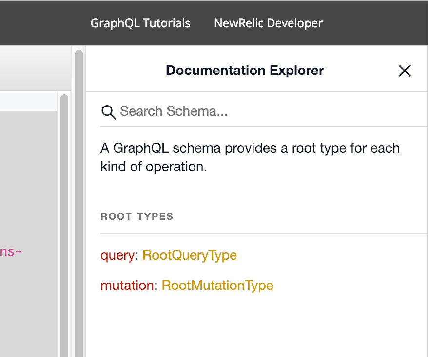
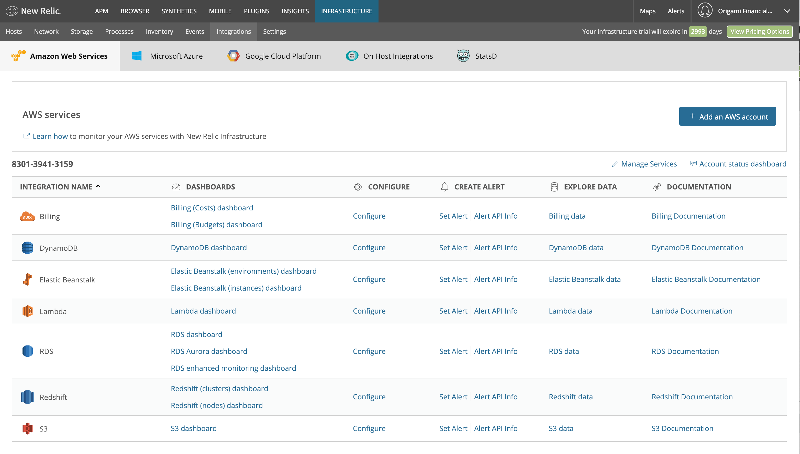
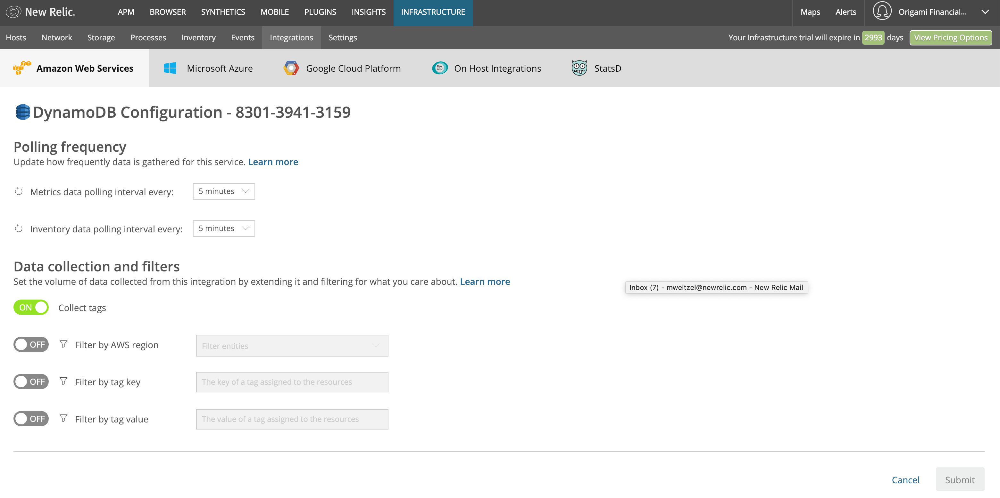

# Updating Values with GraphQL
In GraphQL, when you update or modify data, this is called a mutation. It's represented as a top level item in the request. 

>Exercise: In your browser, goto [GraphiQL](https://api.newrelic.com/graphiql) and open up the Documentation Explorer using `< Docs` link in the upper left. 
>Click on `mutation: RootMutationType` and explore what's possible to update via GraphQL. Find `metricPollingInterval`. What objects can be updated  



## GraphQL Mutation
Now let's build the mutation that will update the data. First, let's make sure the existing polling intervals are set so that we'll notice them change. 

Go into New Relic Infrastructure --> Integrations and select the `Amazon Web Services` tab. 


Select `Configure` on the `DynamoDB` entry. If you don't have DynamoDB, that's OK. Select one of the other configurations. You should be able to substitute in the proper value--you'll just have to explore a bit more!

Set the `Metrics data polling interval every` and the `Inventory data polling interval every` to `5 minutes`. Yous should also have the `Collect tags` switch `ON`. Once you make these changes, click the `Submit` button to save your changes. 



Awesome! Now lets build the mutation query!!

First, we'll start with the keyword `mutation`, and like any other GraphQL request, enclose what we want in `{}`. 
>Note: If you submit a request starting with `{` the `query` keyworkd is implied.

Next, you can use the type ahead feature to select what you want to update. In this case type or select `cloudConfigureIntegration`. The `cloudConfigureIntegration` takes two arguments. The firs is `accountId`, which is the same account id that you used in the previous exercise to get information about the infrastructure linked accounts.

The second argument is the integrations that you want to update. These integrations are specified by the named set of cloud providers. In this case, we want `aws`. Up to this point, your mutation should look like:
```graphql
mutation{
  cloudConfigureIntegration(
    accountId:630060
    integrations:{aws
```

Next, we'll need to specify that we are updating the `dynamodb` configurataion. To do this, you'll pass in an object with `dynamodb` as the key and an array that contains an object with the values you'd like to set. In our mutation, let's update the `metricsPllingInterval` and just for fun, add a `tagKey`. So far, your mutation will look like the snip below. Notice that we used the `linkedAccountId` from the previous exercise as one of the arguments in the object of the `dynamodb` array. 
```graphql
mutation{
  cloudConfigureIntegration(
    accountId:630060
    integrations:{aws:{
      dynamodb:[
        { linkedAccountId:4912
          metricsPollingInterval:1800
          tagKey:"mdw-test"
        }]
      }
    }
  )
```

The last part of the mutation is making sure we request a set of fields on the successful execution of our request, and also capture any errors. Here's what the full query should look like the one below. Notice that in the mutation, we've asked for the value of the `metricsPollingInterval` to be returned using the interface technique from the previous example. This way, if there are no errors, we can confirm that the value was set. 
> Note: The polling interval is in seconds. The valid values are 300, 900, 1800, and 3600. 

```graphql
mutation{
  cloudConfigureIntegration(
    accountId:630060
    integrations:{aws:{
      dynamodb:[
        { linkedAccountId:4912
          metricsPollingInterval:1800
          tagKey:"mdw-test"
        }]
      }
    }
  )
  {
    integrations{
      id
      name
      updatedAt
      ... on CloudDynamodbIntegration{
            metricsPollingInterval
            tagKey
            tagValue
            updatedAt
            }
    }
    errors{
      linkedAccountId
      message
      integrationSlug
    }
  }
}
```
Enter that in the left hand side of the GraphiQL tool and hit the `play` button. Your result should be something similar to the following:
```graphql
{
  "data": {
    "cloudConfigureIntegration": {
      "errors": [],
      "integrations": [
        {
          "id": 177184,
          "metricsPollingInterval": 1800,
          "name": "DynamoDB",
          "tagKey": "mdw-test",
          "tagValue": null,
          "updatedAt": 1551139957
        }
      ]
    }
  }
}
```

> Just for fun, go to [Epoch Conver](https://www.epochconverter.com/) and enter the value in the `updatedAt` field. You should see the date and time of just a few seconds ago!

Now, go back into New Relic Infrastructure and refresh the DynamoDB configuration page. You should notice a change in the metric polling interval and a `Filter by tag` switch should be enabled with the value of `mdw-test` or whatever you substituted in.


That's it! You've successfully updated the New Relic infrastructure information using GraphQL. Now, let's throw some NRQL in the mix!
