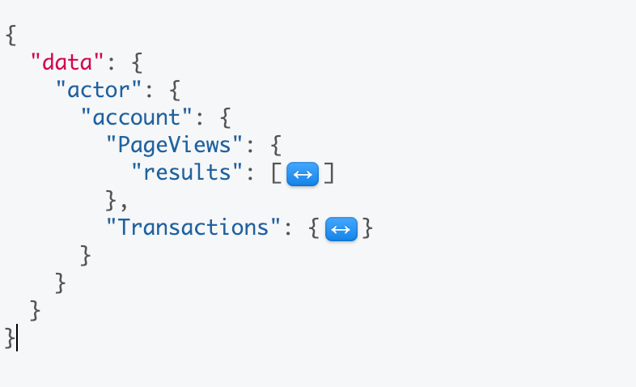
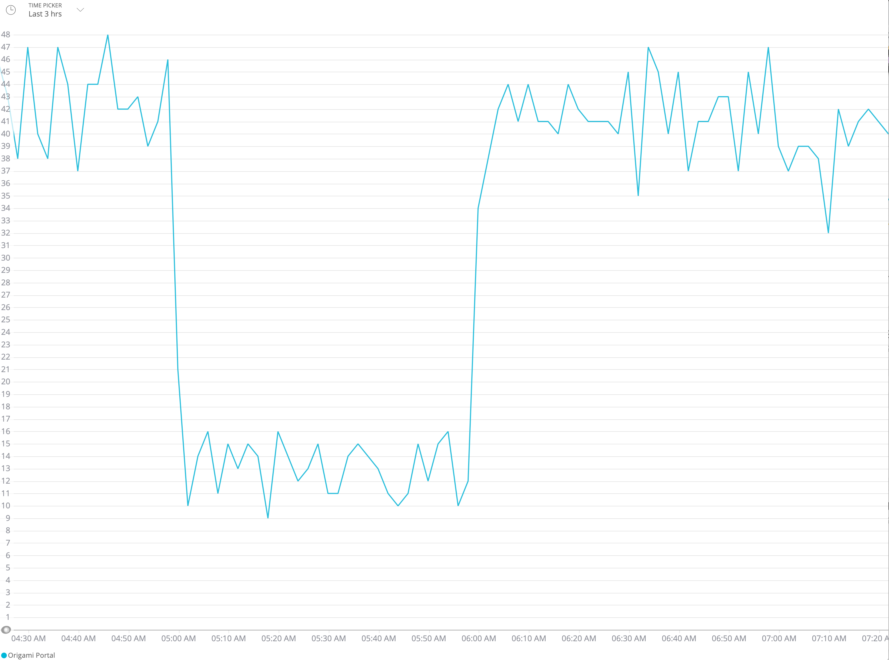

# NRQL While You WorkQL
This next exercise will incorporate a NRQL query into GraphQL and also show you a technique for adding an alias to your request. Aliases are particularly useful when you have several of the same kinds of requests contained within a query, e.g. NRQL commands. Let's dig in!
> Remember: Make sure to generate an API key that you can use with GraphiQL! See [Instructions](INSTRUCTIONS.md) for more information. 

By now you should be familiar with creating a GraphQL request that takes an argument. In this exercise, we will issue several NRQL requests to get information from a specific account. 

## Basic GraphQL Query with NRQL
```graphql
{
   actor {
    account(id: 630060) {
      nrql(query: "SELECT count(*) FROM PageView FACET appName SINCE 1 day ago TIMESERIES AUTO") {
        results
      }
    }
  }
}
```
Your results should look similar to the following: 
```
{
  "data": {
    "actor": {
      "account": {
        "nrql": {
          "results": [
            {
              "beginTimeSeconds": 1548946238,
              "endTimeSeconds": 1548948038,
              "facet": "Origami Portal",
              "appName": "Origami Portal",
              "count": 601
            },
            {
              "beginTimeSeconds": 1548948038,
              "endTimeSeconds": 1548949838,
              "facet": "Origami Portal",
              "appName": "Origami Portal",
              "count": 595
            },
```
<details>
  <summary>Click to see full results.</summary>

  ```json
  {
  "data": {
    "actor": {
      "account": {
        "nrql": {
          "results": [
            {
              "beginTimeSeconds": 1548946238,
              "endTimeSeconds": 1548948038,
              "facet": "Origami Portal",
              "appName": "Origami Portal",
              "count": 601
            },
            {
              "beginTimeSeconds": 1548948038,
              "endTimeSeconds": 1548949838,
              "facet": "Origami Portal",
              "appName": "Origami Portal",
              "count": 595
            },
            {
              "beginTimeSeconds": 1548949838,
              "endTimeSeconds": 1548951638,
              "facet": "Origami Portal",
              "appName": "Origami Portal",
              "count": 550
            },
            {
              "beginTimeSeconds": 1548951638,
              "endTimeSeconds": 1548953438,
              "facet": "Origami Portal",
              "appName": "Origami Portal",
              "count": 367
            },
            {
              "beginTimeSeconds": 1548953438,
              "endTimeSeconds": 1548955238,
              "facet": "Origami Portal",
              "appName": "Origami Portal",
              "count": 250
            },
            {
              "beginTimeSeconds": 1548955238,
              "endTimeSeconds": 1548957038,
              "facet": "Origami Portal",
              "appName": "Origami Portal",
              "count": 255
            },
            {
              "beginTimeSeconds": 1548957038,
              "endTimeSeconds": 1548958838,
              "facet": "Origami Portal",
              "appName": "Origami Portal",
              "count": 219
            },
            {
              "beginTimeSeconds": 1548958838,
              "endTimeSeconds": 1548960638,
              "facet": "Origami Portal",
              "appName": "Origami Portal",
              "count": 194
            },
            {
              "beginTimeSeconds": 1548960638,
              "endTimeSeconds": 1548962438,
              "facet": "Origami Portal",
              "appName": "Origami Portal",
              "count": 193
            },
            {
              "beginTimeSeconds": 1548962438,
              "endTimeSeconds": 1548964238,
              "facet": "Origami Portal",
              "appName": "Origami Portal",
              "count": 189
            },
            {
              "beginTimeSeconds": 1548964238,
              "endTimeSeconds": 1548966038,
              "facet": "Origami Portal",
              "appName": "Origami Portal",
              "count": 177
            },
            {
              "beginTimeSeconds": 1548966038,
              "endTimeSeconds": 1548967838,
              "facet": "Origami Portal",
              "appName": "Origami Portal",
              "count": 168
            },
            {
              "beginTimeSeconds": 1548967838,
              "endTimeSeconds": 1548969638,
              "facet": "Origami Portal",
              "appName": "Origami Portal",
              "count": 138
            },
            {
              "beginTimeSeconds": 1548969638,
              "endTimeSeconds": 1548971438,
              "facet": "Origami Portal",
              "appName": "Origami Portal",
              "count": 123
            },
            {
              "beginTimeSeconds": 1548971438,
              "endTimeSeconds": 1548973238,
              "facet": "Origami Portal",
              "appName": "Origami Portal",
              "count": 69
            },
            {
              "beginTimeSeconds": 1548973238,
              "endTimeSeconds": 1548975038,
              "facet": "Origami Portal",
              "appName": "Origami Portal",
              "count": 45
            },
            {
              "beginTimeSeconds": 1548975038,
              "endTimeSeconds": 1548976838,
              "facet": "Origami Portal",
              "appName": "Origami Portal",
              "count": 47
            },
            {
              "beginTimeSeconds": 1548976838,
              "endTimeSeconds": 1548978638,
              "facet": "Origami Portal",
              "appName": "Origami Portal",
              "count": 43
            },
            {
              "beginTimeSeconds": 1548978638,
              "endTimeSeconds": 1548980438,
              "facet": "Origami Portal",
              "appName": "Origami Portal",
              "count": 40
            },
            {
              "beginTimeSeconds": 1548980438,
              "endTimeSeconds": 1548982238,
              "facet": "Origami Portal",
              "appName": "Origami Portal",
              "count": 36
            },
            {
              "beginTimeSeconds": 1548982238,
              "endTimeSeconds": 1548984038,
              "facet": "Origami Portal",
              "appName": "Origami Portal",
              "count": 37
            },
            {
              "beginTimeSeconds": 1548984038,
              "endTimeSeconds": 1548985838,
              "facet": "Origami Portal",
              "appName": "Origami Portal",
              "count": 37
            },
            {
              "beginTimeSeconds": 1548985838,
              "endTimeSeconds": 1548987638,
              "facet": "Origami Portal",
              "appName": "Origami Portal",
              "count": 37
            },
            {
              "beginTimeSeconds": 1548987638,
              "endTimeSeconds": 1548989438,
              "facet": "Origami Portal",
              "appName": "Origami Portal",
              "count": 36
            },
            {
              "beginTimeSeconds": 1548989438,
              "endTimeSeconds": 1548991238,
              "facet": "Origami Portal",
              "appName": "Origami Portal",
              "count": 38
            },
            {
              "beginTimeSeconds": 1548991238,
              "endTimeSeconds": 1548993038,
              "facet": "Origami Portal",
              "appName": "Origami Portal",
              "count": 36
            },
            {
              "beginTimeSeconds": 1548993038,
              "endTimeSeconds": 1548994838,
              "facet": "Origami Portal",
              "appName": "Origami Portal",
              "count": 37
            },
            {
              "beginTimeSeconds": 1548994838,
              "endTimeSeconds": 1548996638,
              "facet": "Origami Portal",
              "appName": "Origami Portal",
              "count": 38
            },
            {
              "beginTimeSeconds": 1548996638,
              "endTimeSeconds": 1548998438,
              "facet": "Origami Portal",
              "appName": "Origami Portal",
              "count": 37
            },
            {
              "beginTimeSeconds": 1548998438,
              "endTimeSeconds": 1549000238,
              "facet": "Origami Portal",
              "appName": "Origami Portal",
              "count": 38
            },
            {
              "beginTimeSeconds": 1549000238,
              "endTimeSeconds": 1549002038,
              "facet": "Origami Portal",
              "appName": "Origami Portal",
              "count": 38
            },
            {
              "beginTimeSeconds": 1549002038,
              "endTimeSeconds": 1549003838,
              "facet": "Origami Portal",
              "appName": "Origami Portal",
              "count": 37
            },
            {
              "beginTimeSeconds": 1549003838,
              "endTimeSeconds": 1549005638,
              "facet": "Origami Portal",
              "appName": "Origami Portal",
              "count": 37
            },
            {
              "beginTimeSeconds": 1549005638,
              "endTimeSeconds": 1549007438,
              "facet": "Origami Portal",
              "appName": "Origami Portal",
              "count": 37
            },
            {
              "beginTimeSeconds": 1549007438,
              "endTimeSeconds": 1549009238,
              "facet": "Origami Portal",
              "appName": "Origami Portal",
              "count": 35
            },
            {
              "beginTimeSeconds": 1549009238,
              "endTimeSeconds": 1549011038,
              "facet": "Origami Portal",
              "appName": "Origami Portal",
              "count": 34
            },
            {
              "beginTimeSeconds": 1549011038,
              "endTimeSeconds": 1549012838,
              "facet": "Origami Portal",
              "appName": "Origami Portal",
              "count": 39
            },
            {
              "beginTimeSeconds": 1549012838,
              "endTimeSeconds": 1549014638,
              "facet": "Origami Portal",
              "appName": "Origami Portal",
              "count": 785
            },
            {
              "beginTimeSeconds": 1549014638,
              "endTimeSeconds": 1549016438,
              "facet": "Origami Portal",
              "appName": "Origami Portal",
              "count": 801
            },
            {
              "beginTimeSeconds": 1549016438,
              "endTimeSeconds": 1549018238,
              "facet": "Origami Portal",
              "appName": "Origami Portal",
              "count": 615
            },
            {
              "beginTimeSeconds": 1549018238,
              "endTimeSeconds": 1549020038,
              "facet": "Origami Portal",
              "appName": "Origami Portal",
              "count": 607
            },
            {
              "beginTimeSeconds": 1549020038,
              "endTimeSeconds": 1549021838,
              "facet": "Origami Portal",
              "appName": "Origami Portal",
              "count": 588
            },
            {
              "beginTimeSeconds": 1549021838,
              "endTimeSeconds": 1549023638,
              "facet": "Origami Portal",
              "appName": "Origami Portal",
              "count": 622
            },
            {
              "beginTimeSeconds": 1549023638,
              "endTimeSeconds": 1549025438,
              "facet": "Origami Portal",
              "appName": "Origami Portal",
              "count": 646
            },
            {
              "beginTimeSeconds": 1549025438,
              "endTimeSeconds": 1549027238,
              "facet": "Origami Portal",
              "appName": "Origami Portal",
              "count": 337
            },
            {
              "beginTimeSeconds": 1549027238,
              "endTimeSeconds": 1549029038,
              "facet": "Origami Portal",
              "appName": "Origami Portal",
              "count": 197
            },
            {
              "beginTimeSeconds": 1549029038,
              "endTimeSeconds": 1549030838,
              "facet": "Origami Portal",
              "appName": "Origami Portal",
              "count": 481
            },
            {
              "beginTimeSeconds": 1549030838,
              "endTimeSeconds": 1549032638,
              "facet": "Origami Portal",
              "appName": "Origami Portal",
              "count": 627
            }
          ]
        }
      }
    }
  }
}
  ```
</details>

Great! Now we have some deailed information from NRDB! Remember, one of the more powerful aspects of GraphQL is being able to issue multiple requests. Let's add another query to our request.

Try this:
```graphql
{
   actor {
    account(id: 630060) {
      nrql(query: "SELECT count(*) FROM PageView FACET appName SINCE 1 day ago TIMESERIES AUTO") {
        results
      }
     nrql(query: "SELECT count(*) FROM Transaction SINCE 12 hours ago COMPARE WITH 12 hours ago TIMESERIES AUTO") {
        results
      }
    }
  }
}
```

What do you see when you execute this request? Even though both statements are executed on the server, only the results get returned as `results` object. (To see this, you can switch the order of the `nrql:` statements and issue the request again.)

Aliases solve this problem. They allow you to name the result from a particular section of a query. This is another example of how GraphQL empowers the client to make decisions on how it needs to see the data. Let's rerun the query above, this time, adding an alias for each `nrql` query.

Note the addition of the alias `PageViews` and `Transactions` in front of each nrql statement. 
```graphql
{
  actor {
    account(id: 630060) {
      PageViews: nrql(query: "SELECT count(*) FROM PageView FACET appName SINCE 1 day ago TIMESERIES AUTO") {
        results
      }
      Transactions: nrql(query: "SELECT count(*) FROM Transaction SINCE 12 hours ago COMPARE WITH 12 hours ago TIMESERIES AUTO") {
        results
      }
    }
  }
}
```
Now, your results should look something like the following (note the data sections are collapsed):



## More fun with NRQL
What other information can we get back as part of a  `nrql` query? 
>Remember, you can use the type ahead feature to see all the values possible to each `nrql` statement. 

Exercise: How would you produce this chart?



Exercise: What are the other facets can be used with this query? 


<details>
  <summary>Click to see full query.</summary>

```graphql
{
  actor {
    account(id: 630060) {
      PageViews: nrql(query: "SELECT count(*) FROM PageView FACET appName SINCE 1 day ago TIMESERIES AUTO") {
        results
        embeddedChartUrl
        nrql
        otherResult
        totalResult
        suggestedFacets {
          nrql
        }
      }
      Transactions: nrql(query: "SELECT count(*) FROM Transaction SINCE 12 hours ago COMPARE WITH 12 hours ago TIMESERIES AUTO") {
        results
        embeddedChartUrl
        nrql
        otherResult
        totalResult
        suggestedFacets {
          nrql
        }
      }
    }
  }
}
```
</details>


