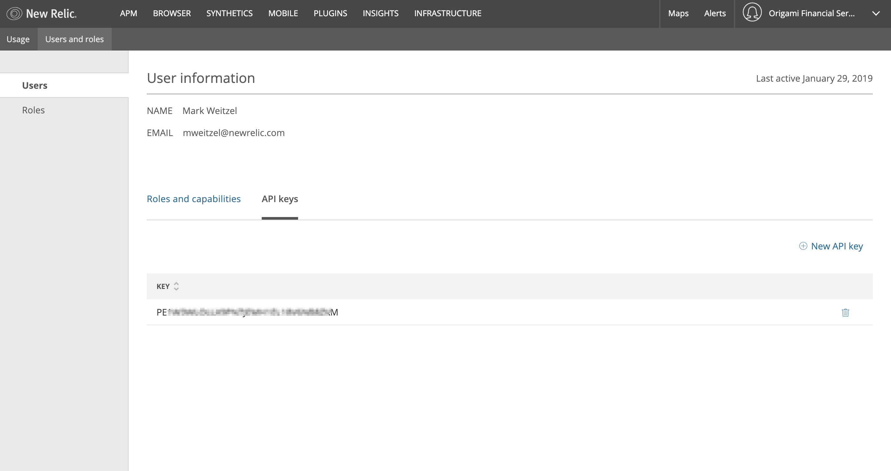

# Prerequisite - Understanding GraphQL
The purpose of this section is to orient you to GraphQL, a "query language" for New Relic's API. Naturally, this section is very "New Relic focused." There are links provided at that bottom of this page for more general GraphQL information.

GraphQL has some key differences when compared to REST. For example, it's the client, not the server, that determines what data will be returned. Also, it becomes easy to collect data from multiple sources. In the case of New Relic, we'll see you can get account information, data about infrastructure, and issue a NRQL request, **all in one GraphQL query**.

## Getting an API Key
To use the [GraphiQL](https://api.newrelic.com/graphiql) in the following exercises, you will need to have the proper API key. You will need Admin permissions to issue this key.
* From the Account Settings Menu, select Users & Roles.
* Click on the specific user to see their detail information.
* Click on the `API Keys` link.
* On the right hand side, click the `New API key` link.

## Exercises

The exercises in this section that will give you some hands on experience using "GraphiQL" a web based tool that will issue queries to New Relic's GraphQL service. These are designed to be walked through in order, as the concepts in the lessons build on each other. Start now with Schema Introspection and work your way through to being able to issue a GraphQL query that pulls data from multiple sources, including NRQL!
* [Exercise 0 - Your first query](0-BasicQuery.md) 
* [Exercise 1 - Learning about Schemas](1-SchemaIntrospection.md)
* [Exercise 2 - Retrieving Infrastructure Information](2-InfrastructureServices.md)
* [Exercise 3 - Using Mutations to Update Data](3-Mutation-InfrastructureServices.md)
* [Exercise 4 - Using NRQL with GraphQL](4-QueryWithNRQL.md)

## For Further Reading
This lab touched only the surface of what's possible with GraphQL. If you would like to continue learning about GraphQL, there are some excellent resources available on the web. Here are a few for you to check out.
* [New Relic GraphQL Overview](https://developer.newrelic.com/technology/graphql)
* [New Relic GraphQL Tutorial](https://docs.newrelic.com/docs/apis/graphql-api/tutorials/query-nrql-through-new-relic-graphql-api)
* [Understanding GraphQL (finally)](https://medium.com/@erinfoox/understanding-graphql-finally-a75986d8df0a)
* [So what's this GraphQL thing I keep hearing about?](https://medium.freecodecamp.org/so-whats-this-graphql-thing-i-keep-hearing-about-baf4d36c20cf)
* [Introduction to GraphQL](https://graphql.org/learn/)
* [The Fullstack Tutorial for GraphQL](https://www.howtographql.com/)
* [GitHub's GraphQL Explorer](https://developer.github.com/v4/explorer/)

Note: Some of these can be very opinionated regarding REST vs. GraphQL. From our perspective, both REST and GraphQL are, and will remain important technologies and tools in our portfolio. 
