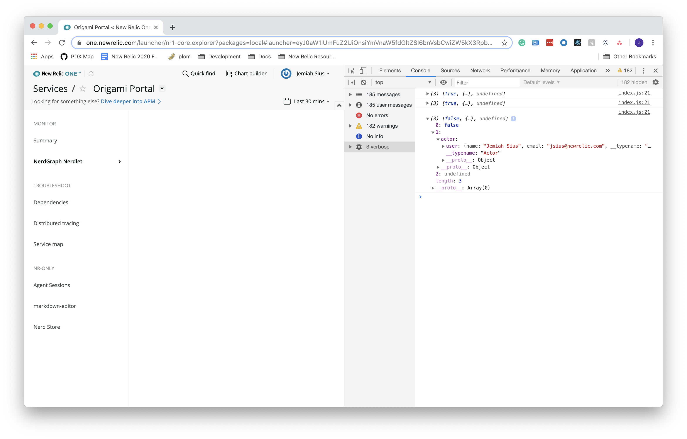
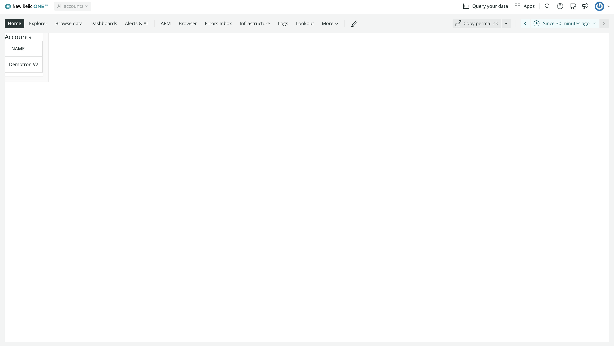
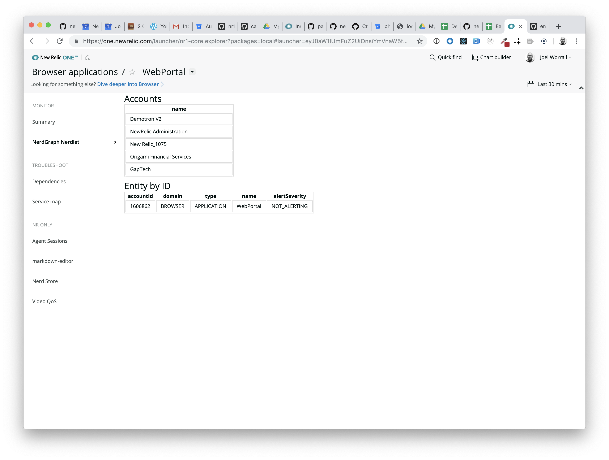
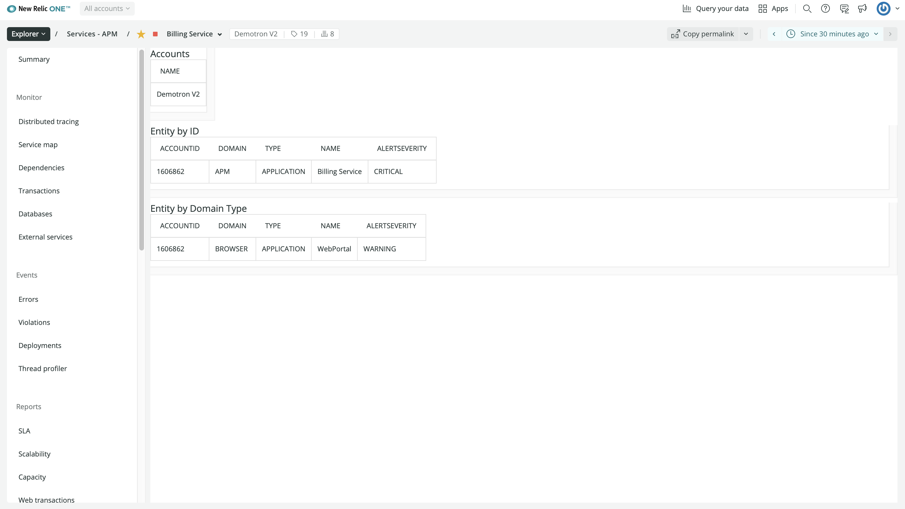
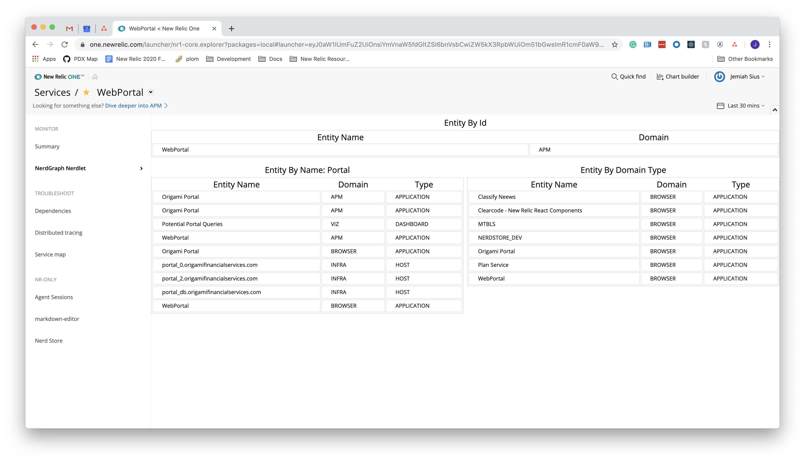
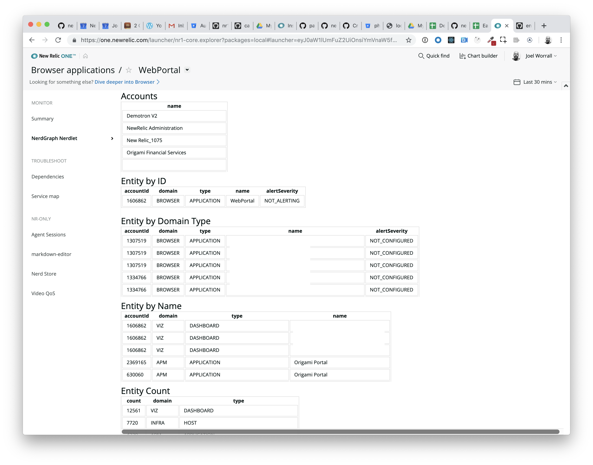

Lab 5: Using  NR1 NerdGraph components
==============================================================================================

The purpose of this lab is to build on the concepts we've already explored, using `NerdGraph` and exploring the `NerdGrpah` components to access New Relic's `NerdGraph` API within your Nerdlets.

After completing this lab you should:

* Be more confident in your ability to incorporate `NerdGraph`.
* Gain more practical experience with nerdGraph
* Have access to the `NerdGraph` API from your Nerdlets

## Step 0: Setup and Prerequisites

Load the prequisites and follow the setup instructions in [Setup and Prequisites](../SETUP.md).

**Reminder**: Make sure that you're ready to go with your `lab5` by ensuring you've run the following commands:

```bash
# if we're not in the lab5 directory get there
cd ../lab5
npm install
npm start
```

Open https://one.newrelic.com?nerdpacks=local and click on the `Lab 5 Launcher`.

## Step 1: Using the NerdGraph API within your Nerdlet

1. We need to import the appropriate libraries into our Nerdlet. Open `lab5/nerdlets/lab5-nerdlet/index.js` and add the following near the top of the file.

```javascript
import { NerdGraphQuery, Stack, StackItem, HeaderText} from 'nr1';
import gql from 'graphql-tag';
```

2. The `NerdGraphQuery` component is going to allow us to access the New Relic NerdGraph API and have access to the power of GraphQL inside of your Nerdlet.

Let's update our render method in the `index.js` to use the `NerdGraphQuery` component and make our first NerdGraph query.

```javascript
render() {
    return (
        <NerdGraphQuery query={gql `{actor {user {name email}}}`}>
            {({loading, error, data}) => {
                console.debug([loading, data, error]); //eslint-disable-line
                return null
            }}
        </NerdGraphQuery>
    )
}
```

3. Save `index.js` and watch the `NerdGraph Nerdlet` reload in your Browser.
4. Ctrl+click (or right click) on the web browser screen displaying our Nerdlet and choose the menu item `Inspect`.
5. In the DevTools window now open, click on the `Console` tab at the top.
6. In the `Console` tab, choose the `verbose` option on the left hand side. (It's in the drop-down next to the 'Filter' bar.)
7. Go back to the browser window and reload the current page, and then go back to the DevTools window. You should be looking at a screen like the following:



In your console, you should see an output matched the basic query you made using [GraphiQL](https://api.newrelic.com/graphiql) in `lab4`

## Step 2: Using the NerdGrpahQuery components

The `NerdGraphQuery` component returns set of data when making a query. The `loading`, `error`, and `data` objects that are all accessible from a child function within the `NerdGraphQuery`. Next we'll make some updated to our `index.js` file to output our account list on the screen

1. Update your import statement in the `index.js` files with the code below to add the `Spinner` and `BlockText` from the `nr1` library:

```javascript
import { NerdGraphQuery, Spinner, HeadingText, BlockText, Grid, GridItem } from 'nr1';
```

2. Above your render method, add the render helper fuctions from the code below:

```javascript
    _renderTable(data) {
        console.debug(JSON.stringify(data));
        const headings = Object.keys(data[0]).filter(k => k != '__typename' && k != 'id' && k != 'tags' && k != 'reporting');
        return <table className="table">
            <tbody>
                <tr>
                    {headings.map((name, i) => <th key={i}>{name}</th>)}
                </tr>
                {data.length > 1 ? data.map((item, i) => {
                    return <tr key={i}>
                        {headings.map((name, j) => <td key={j} className="table-data">{item[name]}</td>)}
                    </tr>
                }) : <tr>
                        {headings.map((name, j) => <td key={j} className="table-data">{data[0][name]}</td>)}
                    </tr>
                }
            </tbody>
        </table>
    }
```

3. Update your render method in the `index.js` files with the code below:

```javascript
    render() {
        return (<Stack directionType={Stack.DIRECTION_TYPE.VERTICAL}>
            <StackItem>
                <div className="container">
                    <NerdGraphQuery query={gql `{actor {accounts {id name}}}`}>
                        {({loading, error, data}) => {
                            console.debug([loading, data, error]); //eslint-disable-line
                            if (loading) {
                                return <Spinner fillContainer />;
                            }
                            if (error) {
                                return <BlockText>{error.message}</BlockText>;
                            }

                            return <Fragment>
                                    <HeadingText>Accounts</HeadingText>
                                    {this._renderTable(data.actor.accounts)}
                            </Fragment>
                        }}
                    </NerdGraphQuery>
                </div>
            </StackItem>
        </Stack>)
    }
```

 Go back to the browser window and reload the current page, you should see a list with names and ids for all of the accounts your user has access to. You should be looking at a screen like the following:



## Step 3: Using the Pre-Defined Entity Query Components

Using the `NerdGraphQuery` allows you to access data from using any type of query to `NerdGraph`, but for convenience, additional components are provided, with pre-defined Entity Queries

1. We need to import the pre-defined entity queries from the nr1 library. Update the import statement in your `index.js` file with the code below:

```javascript
import { NerdGraphQuery, EntityByGuidQuery, EntitiesByNameQuery, EntitiesByDomainTypeQuery, EntityCountQuery, Spinner, Stack, StackItem, HeadingText } from 'nr1';
```

2. To query data about the `entity` that we have currently selected we will use the `EntityByGuidQuery`. Add a second `StackItem` just below the first in the `render` method:

FIXME: There is no entity to select in this UI and entityGuid is undefined

```javascript
    <StackItem className="container">
        <EntityByGuidQuery entityGuid={this.props.nerdletUrlState.entityGuid}>
            {({loading, error, data}) => {
                console.debug([loading, data, error]); //eslint-disable-line
                if (loading) {
                    return <Spinner fillContainer />;
                }
                if (error) {
                    return <HeadingText>{error.message}</HeadingText>;
                }
                return <Fragment className="fragment">
                        <HeadingText>Entity by ID</HeadingText>
                        {this._renderTable(data.actor.entities)}
                </Fragment>
            }}
        </EntityByGuidQuery>
    </StackItem>
```



Your browser should show a small table that displays the name and domain of your current `entity` as a part of the data object that is returned from the `EntityByGuidQuery`.

3. To quickly search through your account entities by domain and type we will use the `EntitiesByDomainTypeQuery`, add the code below to your `render` method under the last `StackItem`:

```javascript
    <StackItem className="container">
        <EntitiesByDomainTypeQuery entityDomain="BROWSER" entityType="APPLICATION">
        {({loading, error, data}) => {
            console.debug([loading, data, error]); //eslint-disable-line
            if (loading) {
                return <Spinner fillContainer />;
            }
            if (error) {
                return <BlockText>{JSON.stringify(error)}</BlockText>;
            }
            return <Fragment>
                <HeadingText>Entity by Domain Type</HeadingText>
                {this._renderTable(data.actor.entitySearch.results.entities)}
            </Fragment>
        }}
        </EntitiesByDomainTypeQuery>
    </StackItem>
```

 4. Save and go back to the browser window and reload the current page, you should another table that displays the name, domain, and type of the entities we've queried by domain

 Your screen will look like the following:



5. For a quick way to search for `entities` by name we will use the `EntitiesByNameQuery` and pass the `name` prop equal to "portal'. Add the code below to your `index.js` file in the `render` method under the last `StackItem` component.


```javascript
    <StackItem className="container">
        <EntitiesByNameQuery name={this.state.entityName}>
            {({loading, error, data}) => {
                console.debug([loading, data, error]); //eslint-disable-line
                if (loading) {
                    return <Spinner fillContainer />;
                }
                if (error) {
                    return <BlockText>{JSON.stringify(error)}</BlockText>;
                }
                return <Fragment>
                    <HeadingText>Entity by Name</HeadingText>
                    {this._renderTable(data.actor.entitySearch.results.entities)}
                </Fragment>
            }}
        </EntitiesByNameQuery>
    </StackItem>
```

6. Save and go back to the browser window and reload the current page, you should see another table with all of the entities that match name you queried. You should be looking at a screen like the following:




7. Finally, using the `EntityCountQuey` you can quickly query the number of entities available for each entityDomain and entityType. Update your `index.js` file, adding the code below to your `render` method under the last `StackItem`.

```javascript
    <StackItem className="container">
        <EntityCountQuery>
            {({loading, error, data}) => {
                console.debug([loading, data, error]); //eslint-disable-line
                if (loading) {
                    return <Spinner fillContainer />;
                }
                if (error) {
                    return <BlockText>{JSON.stringify(error)}</BlockText>;
                }
                return <Fragment>
                    <HeadingText>Entity Count</HeadingText>
                    {this._renderTable(data.actor.entitySearch.types)}
                </Fragment>

            }}
        </EntityCountQuery>
    </StackItem>
```

8. Save and go back to the browser window and reload the current page, under the table for `EntityByNameQuery` you will see one more table. This new table should be displaying the data object from the `EntityCountQuery` showing the number of entities available for each entityDomain and entityType.

You should be looking at a screen like the following:



## Summary

In the end, your `index.js` should look like this.

```javascript
import React, {Fragment} from 'react';
import PropTypes from 'prop-types';
import { NerdGraphQuery, EntityByGuidQuery, EntitiesByNameQuery, EntitiesByDomainTypeQuery, EntityCountQuery, Spinner, Stack, StackItem, HeadingText, BlockText } from 'nr1';
import gql from 'graphql-tag';

export default class MyNerdlet extends React.Component {
    static propTypes = {
        nerdletUrlState: PropTypes.object.isRequired
    };

    constructor(props){
        super(props);
        console.debug(props); //eslint-disable-line
        this.state = {
            entityName: "Portal"
        };
    }

    _renderTable(data) {
        console.debug(JSON.stringify(data));
        const headings = Object.keys(data[0]).filter(k => k != '__typename' && k != 'id' && k != 'tags' && k != 'reporting');
        return <table className="table">
            <tbody>
                <tr>
                    {headings.map((name, i) => <th key={i}>{name}</th>)}
                </tr>
                {data.length > 1 ? data.map((item, i) => {
                    return <tr key={i}>
                        {headings.map((name, j) => <td key={j} className="table-data">{item[name]}</td>)}
                    </tr>
                }) : <tr>
                        {headings.map((name, j) => <td key={j} className="table-data">{data[0][name]}</td>)}
                    </tr>
                }
            </tbody>
        </table>
    }

    render() {
        return (<Stack directionType={Stack.DIRECTION_TYPE.VERTICAL}>
            <StackItem className="container">
                <NerdGraphQuery query={gql `{actor {accounts {id name}}}`}>
                    {({loading, error, data}) => {
                        console.debug([loading, data, error]); //eslint-disable-line
                        if (loading) {
                            return <Spinner fillContainer />;
                        }
                        if (error) {
                            return <BlockText>{JSON.stringify(error)}</BlockText>;
                        }

                        return <Fragment>
                                <HeadingText>Accounts</HeadingText>
                                {this._renderTable(data.actor.accounts)}
                        </Fragment>
                    }}
                </NerdGraphQuery>
            </StackItem>
            <StackItem className="container">
                <EntityByGuidQuery entityGuid={this.props.nerdletUrlState.entityGuid}>
                    {({loading, error, data}) => {
                        console.debug([loading, data, error]); //eslint-disable-line
                        if (loading) {
                            return <Spinner fillContainer />;
                        }
                        if (error) {
                            return <BlockText>{JSON.stringify(error)}</BlockText>;
                        }
                        return <Fragment>
                                <HeadingText>Entity by ID</HeadingText>
                                {this._renderTable(data.actor.entities)}
                        </Fragment>
                    }}
                </EntityByGuidQuery>
            </StackItem>
            <StackItem className="container">
                <EntitiesByDomainTypeQuery entityDomain="BROWSER" entityType="APPLICATION">
                {({loading, error, data}) => {
                    console.debug([loading, data, error]); //eslint-disable-line
                    if (loading) {
                        return <Spinner fillContainer />;
                    }
                    if (error) {
                        return <BlockText>{JSON.stringify(error)}</BlockText>;
                    }
                    return <Fragment>
                        <HeadingText>Entity by Domain Type</HeadingText>
                        {this._renderTable(data.actor.entitySearch.results.entities)}
                    </Fragment>
                }}
                </EntitiesByDomainTypeQuery>
            </StackItem>
            <StackItem className="container">
                <EntitiesByNameQuery name={this.state.entityName}>
                    {({loading, error, data}) => {
                        console.debug([loading, data, error]); //eslint-disable-line
                        if (loading) {
                            return <Spinner fillContainer />;
                        }
                        if (error) {
                            return <BlockText>{JSON.stringify(error)}</BlockText>;
                        }
                        return <Fragment>
                            <HeadingText>Entity by Name</HeadingText>
                            {this._renderTable(data.actor.entitySearch.results.entities)}
                        </Fragment>
                    }}
                </EntitiesByNameQuery>
            </StackItem>
            <StackItem className="container">
                <EntityCountQuery>
                    {({loading, error, data}) => {
                        console.debug([loading, data, error]); //eslint-disable-line
                        if (loading) {
                            return <Spinner fillContainer />;
                        }
                        if (error) {
                            return <BlockText>{JSON.stringify(error)}</BlockText>;
                        }
                        return <Fragment>
                            <HeadingText>Entity Count</HeadingText>
                            {this._renderTable(data.actor.entitySearch.types)}
                        </Fragment>

                    }}
                </EntityCountQuery>
            </StackItem>
        </Stack>);
    }
}
```