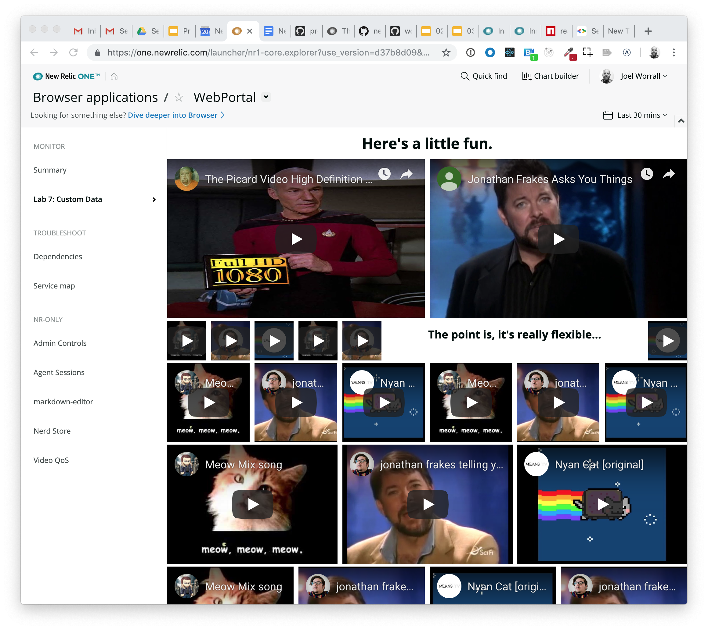
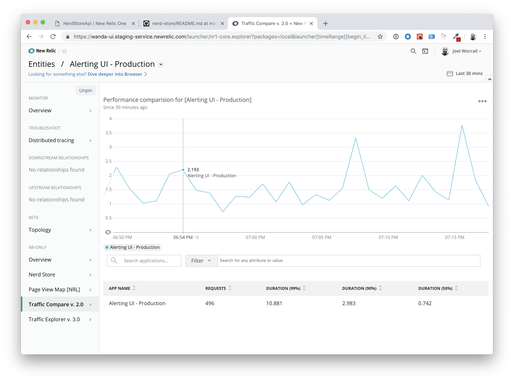
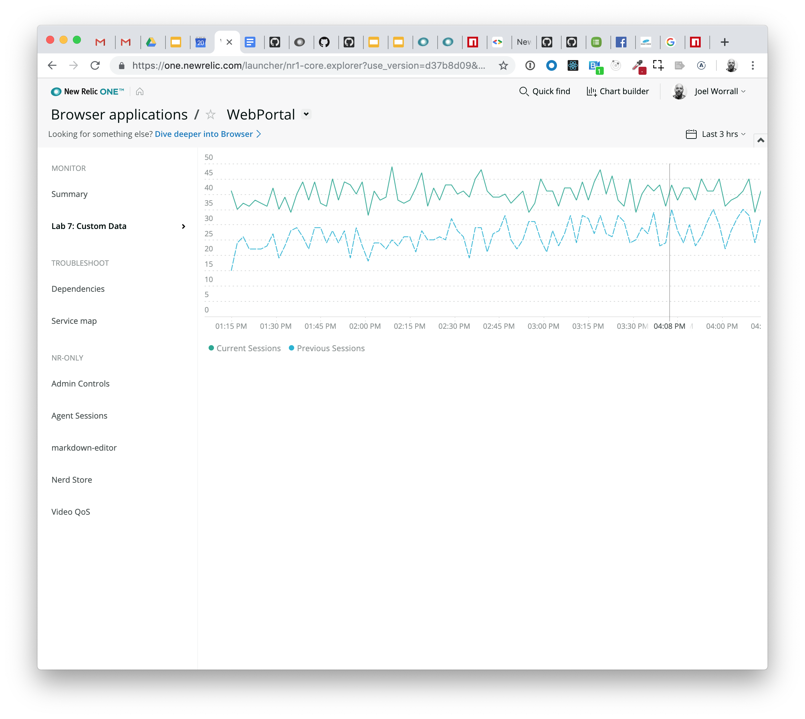
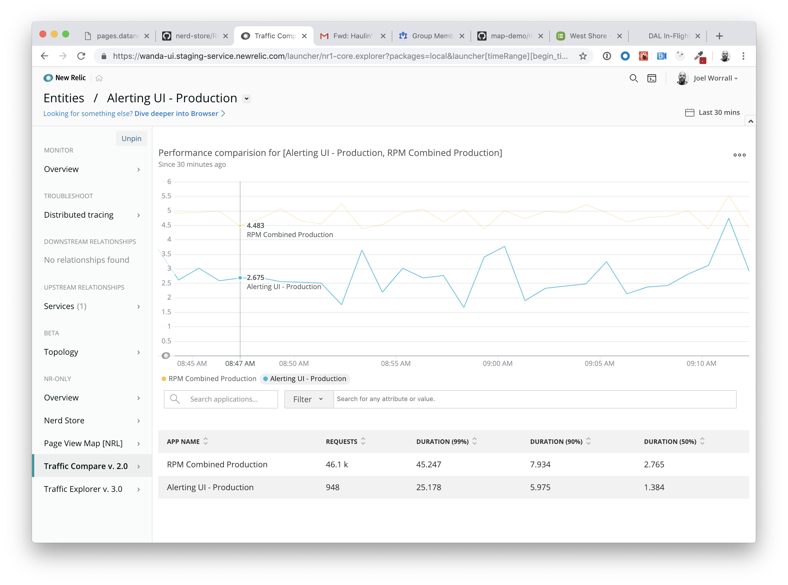

Lab 7: Passing custom data to a Chart component
===========================================================

The purpose of this lab is to demonstrate how to incorporate 3rd party data into a standard visualization in NR1. To do that, we're going to *simulate* a set of forecasting data and incorporate that data into a `LineChart` that is displaying a timeseries of `PageViews`.

After completing this lab you should understand:

* How to generate a data series that can be processed by an NR1 Chart component.

## Step 0: Setup and Prerequisites

Load the prequisites and follow the setup instructions in [Setup](../SETUP.md).

**Reminder**: Make sure that you're ready to go with your `lab7` by ensuring you've run the following commands:

```bash
# from the nr1-workshop directory
cd lab7
nr1 nerdpack:uuid -gf
npm install
```

## Step 1: Accessing the Nerdlet

You'll notice that this `Nerdlet` doesn't have a corresponding `Launcher`, so we're going to need to find it.

1. Open the file `lab7/nerdlets/my-nerdlet/nr1.json` and check out the contents. They look like the following. There are two attributes we want to pay attention to: `entities` and `actionCategory`.

```json
{
    "schemaType": "NERDLET",
    "id": "my-nerdlet",
    "description": "Describe me",
    "displayName": "Lab 7: Custom Data",
    "entities": [{"domain": "BROWSER", "type": "APPLICATION"}],
    "actionCategory": "monitor"
}
```

2. Open a web browser to `https://one.newrelic.com?nerdpacks=local` c
3. Click on the `Entity Explorer`
4. Click on `Browswer Applications` category in the left-hand navigation
5. Click on any browser application from the list
6. You should **now** see a menu option in the left-hand navigation called `Lab 7: Custom Data`
7. Click on `Lab 7: Custom Data`

You should come to screen that looks like the following:



_Note: before you become concerned, cats and Star Trek have nothing to do with this exercise. Consider it a fun way to demonstrate what you can do with a `Grid` layout in NR1._

Our objective is going to be displaying a `LineChart` of `PageView` events that contrasts the current selected time window, the previous time window, and a made up set of **forecasted** data. In order to do that, we're going to need to do several things:

1. Get access to the `platformUrlState.timeRange`
2. Get access to the `nerdletUrlState.entityGuid`
3. Retrieve the entity assigned to that `entityGuid` by means of `EntityByGuidQuery`
4. Use the `accountId` associated with that entity to run a `NrqlQuery`
5. then manipulate the results, adding in our forecasting data using the helper function we've provided in the `utils.js` file called `generateForecastData`

Let's start with our Contexts.

## Step 2: Dealing with our Context

1. Add the following import statements to the top of your `lab7/nerdlets/my-nerdlet/index.js`

```javascript
import { NrqlQuery, Spinner, LineChart, BlockText, PlatformStateContext, NerdletStateContext, EntityByGuidQuery } from 'nr1';
import { generateForecastData } from './utils';
```

2. Next replace the render method with the following:

```javascript
    render() {
        return <PlatformStateContext.Consumer>
            {(platformUrlState) => (
              <NerdletStateContext.Consumer>
                {(nerdletUrlState) => (
                    <EntityByGuidQuery entityGuid={nerdletUrlState.entityGuid}>
                        {({data, loading, error}) => {
                            console.debug("EntityByGuidQuery", [loading, data, error]); //eslint-disable-line
                            if (loading) {
                                return <Spinner fillContainer />;
                            }
                            if (error) {
                                return <BlockText>{error.message}</BlockText>
                            }
                            const entity = data.entities[0];
                            const { accountId } = entity;
                            const { duration } = platformUrlState.timeRange;
                            const durationInMinutes =  duration/1000/60;

                            //we're going to replace this soon
                            console.debug("We're ready for our NrqlQuery", [entity, accountId, duration, durationInMinutes]);
                            return null;
                        }}
                    </EntityByGuidQuery>
                )}
              </NerdletStateContext.Consumer>
            )}
        </PlatformStateContext.Consumer>;
    }
```

3. Save `lab7/nerdlets/my-nerdlet/index.js` and watch the reload. Open the browser's `Console` and read messages in the `Debug` tab. You should see something like the following:



4. Take a few minutes to review the code you just added to the `render` method. Does it make sense to you? We're using the `PlatformStateContext` and `NerdletStateContext` to retrieve contexts we need in order to request the entity using the `EntityByGuidQuery`. If that doesn't all make sense, ask for some help.

## Step 3: Charting a timeseries of `PageView` events

We're going to use the `NrqlQuery` component to populate a `LineChart` using its `data` attribute.

_If you're thinking, "based on what I've already learned, a `LineChart` doesn't need a custom data set. It can process a NRQL query on its own." You're correct. However, we're going to eventually add an additional series of data to the result we get back from our `NrqlQuery` **before** the data is passed to the `LineChart`, so keep tracking._

1. Replace the `return null;` statement in your `render` method with the following component definition:

```javascript
    return <NrqlQuery accountId={accountId} query={`SELECT uniqueCount(session) FROM PageView WHERE appName = '${entity.name.replace("'", "\\'")}' TIMESERIES SINCE ${durationInMinutes} MINUTES AGO COMPARE WITH ${durationInMinutes*2} MINUTES AGO`}>
        {({ loading, data, error })  => {
            console.debug("NrqlQuery", [loading, data, error]); //eslint-disable-line
            if (loading) {
                return <Spinner fillContainer />;
            }
            if (error) {
                return <BlockText>{error.message}</BlockText>;
            }
            return <LineChart data={data} className="chart"/>;
        }}
    </NrqlQuery>
```

Study that code and ensure you've got a solid handle on what's going on there. If you don't, ask questions. Now... Seriously... Do it.

2. Save `lab7/nerdlets/my-nerdlet/index.js` and watch the reload. You should see a result like the folllowing:



You should see a current and yesterday, but no Forecast data. Let's make some.

## Step 4: Adding a series of data to feed into a Chart

We're only one line of code away from our preferred outcome thanks to the `generateForecastData` function we imported earlier. If you haven't looked over the 20+ lines of code, please do so now. I'll give you an appropriate picture of what's needed to generate a chart data series.

1. Add the following line to the `render` method of the `lab7/nerdlets/my-nerdlet/index.js`, just above the `return <LineChart...` line.

```javascript
    ...
    data.push(generateForecastData(data[0]));
    return <LineChart data={data} className="chart"/>;
    ...
```

2. Save the file and reload. You should see something like this.


The final code in `lab7/nerdlets/my-nerdlet/index.js` should look something like this:

```javascript
import React from 'react';
import { Grid, GridItem, AutoSizer } from 'nr1';
import { NrqlQuery, Spinner, LineChart, BlockText, PlatformStateContext, NerdletStateContext, EntityByGuidQuery } from 'nr1';
import { generateForecastData } from './utils';

export default class MyNerdlet extends React.Component {

    constructor(props) {
        super(props);
        console.debug(props); //eslint-disable-line
    }

    render() {
        return <PlatformStateContext.Consumer>
            {(platformUrlState) => (
              <NerdletStateContext.Consumer>
                {(nerdletUrlState) => (
                    <EntityByGuidQuery entityGuid={nerdletUrlState.entityGuid}>
                        {({data, loading, error}) => {
                            console.debug("EntityByGuidQuery", [loading, data, error]); //eslint-disable-line
                            if (loading) {
                                return <Spinner fillContainer />;
                            }
                            if (error) {
                                return <BlockText>{error.message}</BlockText>
                            }
                            const entity = data.entities[0];
                            const { accountId } = entity;
                            const { duration } = platformUrlState.timeRange;
                            const durationInMinutes =  duration/1000/60;
                                return <NrqlQuery accountId={accountId} query={`SELECT uniqueCount(session) FROM PageView WHERE appName = '${entity.name.replace("'", "\\'")}' TIMESERIES SINCE ${durationInMinutes} MINUTES AGO COMPARE WITH ${durationInMinutes*2} MINUTES AGO`}>
                                {({ loading, data, error })  => {
                                    console.debug("NrqlQuery", [loading, data, error]); //eslint-disable-line
                                    if (loading) {
                                        return <Spinner fillContainer />;
                                    }
                                    if (error) {
                                        return <BlockText>{error.message}</BlockText>;
                                    }
                                    data.push(generateForecastData(data[0]));
                                    return <LineChart data={data} className="chart"/>;
                                }}
                            </NrqlQuery>
                        }}
                    </EntityByGuidQuery>
                )}
              </NerdletStateContext.Consumer>
            )}
        </PlatformStateContext.Consumer>;
    }
}
```

# For Consideration / Discussion

* What other types of data might you chose to intermingle with performance data?
* Does it make sense why the `Lab 7: Custom Data` Nerdlet was only displaying for `Browser Application` instances? FYI, a value of `entities: [*]` makes a Nerdlet available for all Entity Types.
