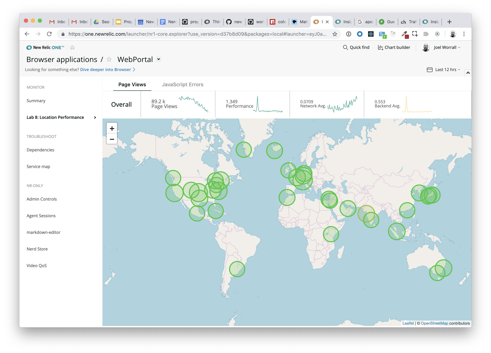
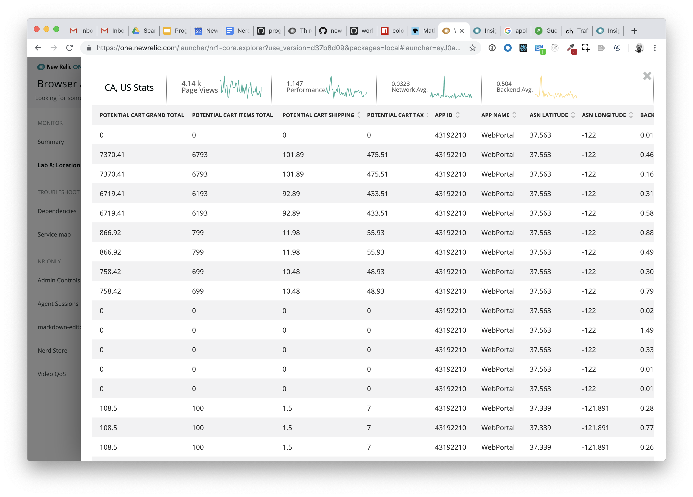
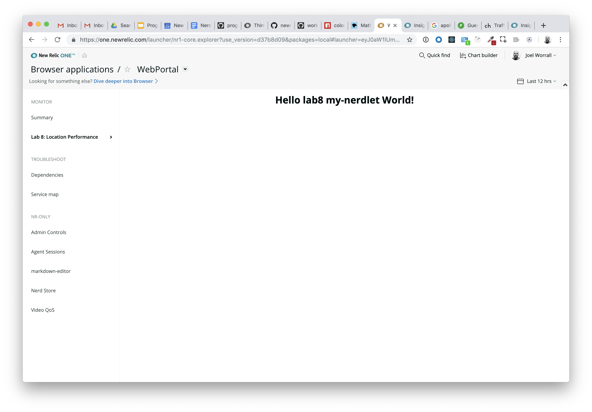
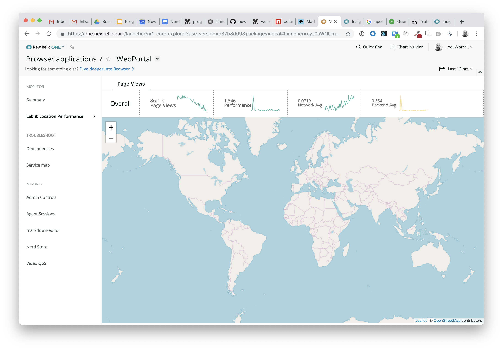
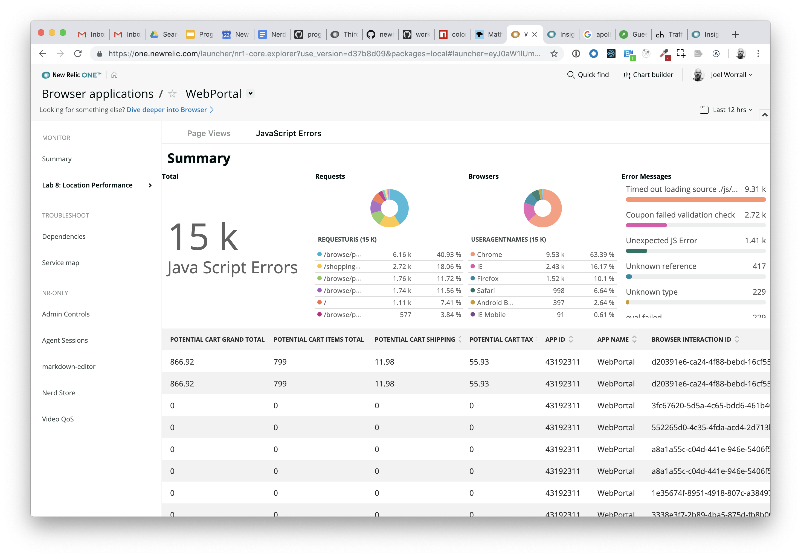

Lab 8: 3rd Party libraries and custom visualizations
===========================================================

### (i.e. the Leaflet mapping exercise)

The purpose of this lab is build a more full-featured experience that incorporates 3rd party libraries (explicitly the `Leaflet.js` library) into an NR1 package.

After completing this lab you should have a basic understanding of:

* Understand one repeatable pattern (_it should be obvious that there are many ways to accomplish this_) to leverage 3rd party visualizations in NR1
* Making use of the `Grid`, `Stack`, and `Tabs` components
* How to interact with the `navigation` object to launch a custom NR1 Nerdlet

## Step 0: Setup and Prerequisites

Load the prequisites and follow the setup instructions in [Setup](../SETUP.md).

**Reminder**: Make sure that you're ready to go with your `lab8` by ensuring you've run the following commands:

```bash
# from the nr1-workshop directory
cd lab8
npm install
nr1 nerdpack:uuid -gf
```

Because a picture is worth 1000 words (or more), this is what we're going to produce in this exercise.


...and on a map click


So let's get started!

## Step 1: Reviewing code

For the purposes of expediency, this lab provides a lot more working code than some of the previous exercises. Please take a moment to review the following files.

1. Open the file `lab8/nerdlets/my-nerdlet/nr1.json` and check out the contents. They look like the following. There are two attributes we want to pay attention to: `entities` and `actionCategory`.

Just like in [`lab7`](../lab7/INSTRUCTIONS.md), we're going to access this Nerdlet via the `Entity Explorer`.

```json
{
    "schemaType": "NERDLET",
    "id": "my-nerdlet",
    "description": "Describe me",
    "displayName": "Lab 8: Location Performance",
    "entities": [{"domain": "BROWSER", "type": "APPLICATION"}],
    "actionCategory": "monitor"
}
```

2. Open the file `lab8/.extended-webpackrc.js`. Notice that this file is allowing us to add custom rules to the `webpack` configuration that our local development server will need in order to incorporate the `CSS` from the `leaflet` and `react-leaflet` libraries.

3. Speaking of `css`, open the file `lab8/nerdlets/my-nerdlet/styles.scss` and notice that we've got quite a bit more code there than the previous exercises. For those that grock `css`, read and understand. For those that don't understand `css`, you're welcome. :)

4. Open the file `lab8/nerdlets/my-nerdlet/javascript-error-summary.js`. Note that we have references to / usage of several `NR1` components, including `Grid`, `GridItem`, and `PieChart`. These components are relatively self-explanatory based on their usage here, but take a moment to absorb them. We're going to make use of this file later.

5. Open the **files** `lab8/components/summary-bar/index.js` and `lab8/components/summary-bar/styles.css`. We're going to make use of this component and it's associated `css` in **two** Nerdlets in this exercise.

6. Open the file `lab8/components/my-nerdlet/styles.css` and pay attention to the import references to both the `leaflet` and the `summary-bar` stylesheets.

_Note: Take the time to review each of these files throughout the exercise to ensure you get the maximum benefit from the example code._

## Step 2: Accessing the Nerdlet

1. Open a web browser to `https://one.newrelic.com?nerdpacks=local`
2. Click on the `Entity Explorer`
3. Click on `Browswer Applications` category in the left-hand navigation
4. Click on any browser application from the list
5. You should **now** see a menu option in the left-hand navigation called `Lab 8: Location Performance`
6. Click on `Lab 8: Location Performance`

You should come to screen that looks like the following:



## Step 3: Tabs, Stacks, and imports

1. First, let's `import` the various components we're going to use in the `render` method. Add the following lines near the top of the file `lab8/nerdlets/my-nerdlet/index.js`:

```javascript
//import the appropriate NR1 components
import { Tabs, TabsItem, Spinner, Stack, StackItem, NrqlQuery, navigation, PlatformStateContext, NerdletStateContext, EntityByGuidQuery, AutoSizer } from 'nr1';
//import our 3rd party libraries for the geo mapping features
import { CircleMarker, Map, TileLayer } from 'react-leaflet';
//import utilities we're going to need
import SummaryBar from '../../components/summary-bar';
import JavaScriptErrorSummary from './javascript-error-summary';
```

Now, we're ready to create the skeleton of our `render` method.

2. Replace the `render` method with the following, taking note of the use of `Tabs`, `TabsItem`, `Spinner` and `SummaryBar` components we just imported:

```javascript
    render() {
        const { zoom, center } = this.state;
        return <PlatformStateContext.Consumer>
            {(platformUrlState) => (
              <NerdletStateContext.Consumer>
                {(nerdletUrlState) => (
                    <AutoSizer>
                    {({height, width}) => (<EntityByGuidQuery entityGuid={nerdletUrlState.entityGuid}>
                        {({data, loading, error}) => {
                            console.debug("EntityByGuidQuery", [loading, data, error]); //eslint-disable-line
                            if (loading) {
                                return <Spinner fillContainer />;
                            }
                            if (error) {
                                return <BlockText>{error.message}</BlockText>
                            }
                            const entity = data.entities[0];
                            const { accountId } = entity;
                            const { duration } = platformUrlState.timeRange;
                            const durationInMinutes =  duration/1000/60;
                            return (<Tabs>
                                <TabsItem label={`Page Views`} value={1}>
                                    <Stack
                                        fullWidth
                                        horizontalType={Stack.HORIZONTAL_TYPE.FILL}
                                        directionType={Stack.DIRECTION_TYPE.VERTICAL}
                                        gapType={Stack.GAP_TYPE.TIGHT}>
                                        <StackItem>
                                            <SummaryBar appName={entity.name} accountId={accountId} launcherUrlState={platformUrlState} />
                                        </StackItem>
                                        <StackItem>
                                        </StackItem>
                                    </Stack>
                                </TabsItem>
                            </Tabs>);
                        }}
                    </EntityByGuidQuery>)}
                    </AutoSizer>
                )}
              </NerdletStateContext.Consumer>
            )}
        </PlatformStateContext.Consumer>;
    }
```

4. Save the file and watch the reload in your browser. You should see a result that looks like the following:


## Step 4: Adding an empty Leaflet Map

Now, we're going to make use of the `Leaflet.js` library via a React implementation called `react-leaflet` using the components we imported earlier: `Map` and `TileLayer`.

1. Add the following code to the `render` method within the **second** `StackItem` within the file `lab8/nerdlets/my-nerdlet/index.js`:

```javascript
        <Map
        className="containerMap"
        style={{height: `${height-125}px`}}
        center={center}
        zoom={zoom}
        zoomControl={true}
        ref={(ref) => { this.mapRef = ref }}>
            <TileLayer
            attribution="&amp;copy <a href=&quot;http://osm.org/copyright&quot;>OpenStreetMap</a> contributors"
            url="https://{s}.tile.openstreetmap.org/{z}/{x}/{y}.png"
            />
        </Map>
```

2. Save the file and watch the reload in your browser. You should see a result that looks like the following:



At this point, the file `lab8/nerdlets/my-nerdlet/index.js` should look like the following:

```javascript
import React from 'react';
//import the appropriate NR1 components
import { Tabs, TabsItem, Spinner, Stack, StackItem, NrqlQuery, navigation, PlatformStateContext, NerdletStateContext, EntityByGuidQuery, AutoSizer } from 'nr1';
//import our 3rd party libraries for the geo mapping features
import { CircleMarker, Map, TileLayer } from 'react-leaflet';
//import utilities we're going to need
import SummaryBar from '../../components/summary-bar';
import JavaScriptErrorSummary from './javascript-error-summary';

const COLORS = [
    "#2dc937",
    "#99c140",
    "#e7b416",
    "#db7b2b",
    "#cc3232"
];

export default class MyNerdlet extends React.Component {

    constructor(props) {
        super(props);
        this.state = {
            center: [10.5731, -7.5898],
            zoom: 2
        }
    }

    render() {
        const { zoom, center } = this.state;
        return <PlatformStateContext.Consumer>
            {(platformUrlState) => (
              <NerdletStateContext.Consumer>
                {(nerdletUrlState) => (
                    <AutoSizer>
                    {({height, width}) => (<EntityByGuidQuery entityGuid={nerdletUrlState.entityGuid}>
                        {({data, loading, error}) => {
                            console.debug("EntityByGuidQuery", [loading, data, error]); //eslint-disable-line
                            if (loading) {
                                return <Spinner fillContainer />;
                            }
                            if (error) {
                                return <BlockText>{error.message}</BlockText>
                            }
                            const entity = data.entities[0];
                            const { accountId } = entity;
                            const { duration } = platformUrlState.timeRange;
                            const durationInMinutes =  duration/1000/60;
                            return (<Tabs>
                                <TabsItem label={`Page Views`} value={1}>
                                    <Stack
                                        fullWidth
                                        horizontalType={Stack.HORIZONTAL_TYPE.FILL}
                                        directionType={Stack.DIRECTION_TYPE.VERTICAL}
                                        gapType={Stack.GAP_TYPE.TIGHT}>
                                        <StackItem>
                                            <SummaryBar appName={entity.name} accountId={accountId} launcherUrlState={platformUrlState} />
                                        </StackItem>
                                        <StackItem>
                                            <Map
                                            className="containerMap"
                                            style={{height: `${height-125}px`}}
                                            center={center}
                                            zoom={zoom}
                                            zoomControl={true}
                                            ref={(ref) => { this.mapRef = ref }}>
                                                <TileLayer
                                                attribution="&amp;copy <a href=&quot;http://osm.org/copyright&quot;>OpenStreetMap</a> contributors"
                                                url="https://{s}.tile.openstreetmap.org/{z}/{x}/{y}.png"
                                                />
                                            </Map>
                                        </StackItem>
                                    </Stack>
                                </TabsItem>
                            </Tabs>);
                        }}
                    </EntityByGuidQuery>)}
                    </AutoSizer>
                )}
              </NerdletStateContext.Consumer>
            )}
        </PlatformStateContext.Consumer>;
    }
}
```

## Step 5: Populating the Map with data from a NrqlQuery component

Now, we're going to make use of both the `NrqlQuery` and `CircleMarker` components to populate the `Map` with details. If you're familiar with React and the Apollo GraphQL library, some of this code will look quite familiar, as NR1 leverages Apollo behind the scenes to pull data from New Relic's NerdGraph API.

1. **Replace** the following code to the `render` method within the **second** `StackItem` within the file `lab8/nerdlets/my-nerdlet/index.js`:

```javascript
        <NrqlQuery
            formatType={NrqlQuery.FORMAT_TYPE.RAW}
            accountId={accountId}
            query={`SELECT count(*) as x, average(duration) as y, sum(asnLatitude)/count(*) as lat, sum(asnLongitude)/count(*) as lng FROM PageView WHERE appName = '${entity.name}' facet regionCode, countryCode SINCE ${durationInMinutes} MINUTES AGO limit 2000`}>
            {results => {
                console.debug(results);
                if (results.loading) {
                   return <Spinner/>
                } else {
                    console.debug(results.data.facets);
                    return <Map
                    className="containerMap"
                    style={{height: `${height-125}px`}}
                    center={center}
                    zoom={zoom}
                    zoomControl={true}
                    ref={(ref) => { this.mapRef = ref }}>
                        <TileLayer
                        attribution="&amp;copy <a href=&quot;http://osm.org/copyright&quot;>OpenStreetMap</a> contributors"
                        url="https://{s}.tile.openstreetmap.org/{z}/{x}/{y}.png"
                        />
                        {results.data.facets.map((facet, i) => {
                            const pt = facet.results;
                            return <CircleMarker
                                key={`circle-${i}`}
                                center={[pt[2].result, pt[3].result]}
                                color={this._getColor(pt[1].average)}
                                radius={Math.log(pt[0].count)*3}
                                onClick={() => {this.openDetails(facet, entity);}}>
                            </CircleMarker>
                        })}
                    </Map>
                    }
                }}
        </NrqlQuery>
```

Notice that we're referencing (within the `CircleMarker` component) two methods that we haven't yet defined: `openDetails` and `_getColor`, so let's add those.

2. Add the following methods within the file `lab8/nerdlets/my-nerdlet/index.js`:

```javascript
    _getColor(value) {
        value = Math.round(value/3);
        value = value < 0 ? 0 : value >= 5 ? 4 : value;
        return COLORS[value];
    }

    openDetails(pt, entity) {
        navigation.openStackedNerdlet({
            id: 'details',
            urlState: {
                regionCode: pt.name[0],
                countryCode: pt.name[1],
                appName: entity.name,
                accountId: entity.accountId
            }
        });
    }
```

3. Finally, add the following line as a `constructor` method of the Nerdlet:

```javascript
    this.openDetails = this.openDetails.bind(this);
```

4. Save the file and watch the reload in your browser. You should see a result that looks like the following:


At this point, the file `lab8/nerdlets/my-nerdlet/index.js` should look like the following:

```javascript
import React from 'react';
import PropTypes from 'prop-types';
//import the appropriate NR1 components
import { Tabs, TabsItem, Spinner, Stack, StackItem, NrqlQuery, navigation, PlatformStateContext, NerdletStateContext, EntityByGuidQuery, AutoSizer } from 'nr1';
//import our 3rd party libraries for the geo mapping features
import { CircleMarker, Map, TileLayer } from 'react-leaflet';
import SummaryBar from '../../components/summary-bar';
import JavaScriptErrorSummary from './javascript-error-summary';

const COLORS = [
    "#2dc937",
    "#99c140",
    "#e7b416",
    "#db7b2b",
    "#cc3232"
];

export default class MyNerdlet extends React.Component {

    _getColor(value) {
        value = Math.round(value/3);
        value = value < 0 ? 0 : value >= 5 ? 4 : value;
        return COLORS[value];
    }

    openDetails(pt, entity) {
        navigation.openStackedNerdlet({
            id: 'details',
            urlState: {
                regionCode: pt.name[0],
                countryCode: pt.name[1],
                appName: entity.name,
                accountId: entity.accountId
            }
        });
    }

    constructor(props) {
        super(props);
        this.state = {
            center: [10.5731, -7.5898],
            zoom: 2
        }
        this.openDetails = this.openDetails.bind(this);
    }

    render() {
        const { zoom, center } = this.state;
        return <PlatformStateContext.Consumer>
            {(platformUrlState) => (
              <NerdletStateContext.Consumer>
                {(nerdletUrlState) => (
                    <AutoSizer>
                    {({height, width}) => (<EntityByGuidQuery entityGuid={nerdletUrlState.entityGuid}>
                        {({data, loading, error}) => {
                            console.debug("EntityByGuidQuery", [loading, data, error]); //eslint-disable-line
                            if (loading) {
                                return <Spinner fillContainer />;
                            }
                            if (error) {
                                return <BlockText>{error.message}</BlockText>
                            }
                            const entity = data.entities[0];
                            const { accountId } = entity;
                            const { duration } = platformUrlState.timeRange;
                            const durationInMinutes =  duration/1000/60;
                            return (<Tabs>
                                <TabsItem label={`Page Views`} value={1}>
                                    <Stack
                                        fullWidth
                                        horizontalType={Stack.HORIZONTAL_TYPE.FILL}
                                        directionType={Stack.DIRECTION_TYPE.VERTICAL}
                                        gapType={Stack.GAP_TYPE.TIGHT}>
                                        <StackItem>
                                            <SummaryBar appName={entity.name} accountId={accountId} launcherUrlState={platformUrlState} />
                                        </StackItem>
                                        <StackItem>
                                            <NrqlQuery
                                                formatType={NrqlQuery.FORMAT_TYPE.RAW}
                                                accountId={accountId}
                                                query={`SELECT count(*) as x, average(duration) as y, sum(asnLatitude)/count(*) as lat, sum(asnLongitude)/count(*) as lng FROM PageView WHERE appName = '${entity.name}' facet regionCode, countryCode SINCE ${durationInMinutes} MINUTES AGO limit 2000`}>
                                                {results => {
                                                    console.debug(results);
                                                    if (results.loading) {
                                                       return <Spinner/>
                                                    } else {
                                                        console.debug(results.data.facets);
                                                        return <Map
                                                        className="containerMap"
                                                        style={{height: `${height-125}px`}}
                                                        center={center}
                                                        zoom={zoom}
                                                        zoomControl={true}
                                                        ref={(ref) => { this.mapRef = ref }}>
                                                            <TileLayer
                                                            attribution="&amp;copy <a href=&quot;http://osm.org/copyright&quot;>OpenStreetMap</a> contributors"
                                                            url="https://{s}.tile.openstreetmap.org/{z}/{x}/{y}.png"
                                                            />
                                                            {results.data.facets.map((facet, i) => {
                                                                const pt = facet.results;
                                                                return <CircleMarker
                                                                    key={`circle-${i}`}
                                                                    center={[pt[2].result, pt[3].result]}
                                                                    color={this._getColor(pt[1].average)}
                                                                    radius={Math.log(pt[0].count)*3}
                                                                    onClick={() => {this.openDetails(facet, entity);}}>
                                                                </CircleMarker>
                                                            })}
                                                        </Map>
                                                        }
                                                }}
                                            </NrqlQuery>
                                        </StackItem>
                                    </Stack>
                                </TabsItem>
                            </Tabs>);
                        }}
                    </EntityByGuidQuery>)}
                    </AutoSizer>
                )}
              </NerdletStateContext.Consumer>
            )}
        </PlatformStateContext.Consumer>;
    }
}
```

5. Click on a circle somewhere on the map. You should see an error like the following:


Let's address that.

## Step 6: Adding the Detail Nerdlet

1. Open your terminal within the `lab8` directory and execute the following:

```bash
nr1 create
#select nerdlet and type the name details
```

Your output should look like the following:

```bash
nr1 create
? What kind of component do you want to create? nerdlet
? Name your component. details
Component created successfully!
nerdlet details is available at "./nerdlets/details"
```

2. Open the file `lab8/nerdlets/details/styles.scss` and add the following code:

```scss
@import '../../components/summary-bar/styles.css';
```

3. Save the file `lab8/nerdlets/details/styles.scss`.

4. Now, open the file `lab8/nerdlets/details/index.js` and replace the contents with the following:

```javascript
import React from 'react';
import PropTypes from 'prop-types';
//import the needed summary stats
import SummaryBar from '../../components/summary-bar';
//import the appropriate NR1 components
import { Grid, GridItem, TableChart, AutoSizer, Spinner, PlatformStateContext, NerdletStateContext, EntityByGuidQuery, BlockText } from 'nr1';

export default class DetailsNerdlet extends React.Component {

    render() {
        return <PlatformStateContext.Consumer>
            {(platformUrlState) => (
              <NerdletStateContext.Consumer>
                {(nerdletUrlState) => (
                    <AutoSizer>
                    {({height, width}) => (<EntityByGuidQuery entityGuid={nerdletUrlState.entityGuid}>
                        {({data, loading, error}) => {
                            console.debug("EntityByGuidQuery", [loading, data, error]); //eslint-disable-line
                            if (loading) {
                                return <Spinner fillContainer />;
                            }
                            if (error) {
                                return <BlockText>{error.message}</BlockText>
                            }
                            const { regionCode, countryCode, appName } =  nerdletUrlState;

                            const entity = data.entities[0];
                            const { accountId } = entity;
                            const { duration } = platformUrlState.timeRange;
                            const durationInMinutes =  duration/1000/60;
                            const nrqlWhere = countryCode ? ` WHERE countryCode  = '${countryCode}' ${regionCode ? ` AND regionCode = '${regionCode}' ` : '' }` : '';
                            return (<Grid>
                                <GridItem columnStart={1} columnEnd={12}>
                                    <SummaryBar {...nerdletUrlState} launcherUrlState={platformUrlState} />
                                </GridItem>
                                <GridItem columnStart={1} columnEnd={12}>
                                    <TableChart
                                        style={{height: height-75, width: '100%'}}
                                        accountId={accountId}
                                        query={`SELECT * from PageView WHERE appName = '${appName}' ${nrqlWhere} SINCE ${durationInMinutes} MINUTES AGO LIMIT 2000 `}
                                    />
                                </GridItem>
                            </Grid>);
                        }}
                    </EntityByGuidQuery>)}
                    </AutoSizer>
                )}
              </NerdletStateContext.Consumer>
            )}
        </PlatformStateContext.Consumer>;
    }
}
```

_Notice that we're making use of both `Grid`, `GridItem`, our custom `SummaryBar`, and the `TableChart`._

5. Save the file `lab8/nerdlets/details/index.js` and reload the browser window.

_Note: you may need to do a `Ctrl+C` and then rerun `npm start` within the `lab8` directory in your terminal window for the local server to recognize the `details` Nerdlet._

6. Now click on a `CircleMarker` in the `Map`. You should see a stacked nerdlet slide out that looks like the following:


## Step 7: Adding the JavaScriptErrorSummary for good measure

A tabbed interface that has only one tab is a waste, so let's resolve that.

1. In the file `lab8/nerdlets/my-nerdlet/index.js`, add the following code below the `TabsItem` that contains the `Map`:

```javascript
    <TabsItem label={`JavaScript Errors`} value={2}>
        <JavaScriptErrorSummary height={height} entity={entity} accountId={accountId} launcherUrlState={platformUrlState} />
    </TabsItem>
```

2. Save the file and watch the reload in the browser. Click of the `JavaScript Errors` tab. You should see output like the following:



The final code in `lab8/nerdlets/my-nerdlet/index.js` should look something like this:

```javascript
import React from 'react';
import PropTypes from 'prop-types';
//import the appropriate NR1 components
import { Tabs, TabsItem, Spinner, Stack, StackItem, NrqlQuery, navigation, AutoSizer, PlatformStateContext, NerdletStateContext, EntityByGuidQuery } from 'nr1';
//import our 3rd party libraries for the geo mapping features
import { CircleMarker, Map, TileLayer } from 'react-leaflet';
import SummaryBar from '../../components/summary-bar';
import JavaScriptErrorSummary from './javascript-error-summary';

const COLORS = [
    "#2dc937",
    "#99c140",
    "#e7b416",
    "#db7b2b",
    "#cc3232"
];

export default class MyNerdlet extends React.Component {
    constructor(props) {
        super(props);
        this.state = {
            center: [10.5731, -7.5898],
            zoom: 2
        }
        this.openDetails = this.openDetails.bind(this);
    }

    _getColor(value) {
        value = Math.round(value/3);
        value = value < 0 ? 0 : value >= 5 ? 4 : value;
        return COLORS[value];
    }

    openDetails(pt, accountId) {
        navigation.openStackedNerdlet({
            id: 'details',
            urlState: {
                regionCode: pt.name[0],
                countryCode: pt.name[1],
                appName: this.state.entity.name,
                accountId
            }
        });
    }

    render() {
        const { zoom, center } = this.state;
        return <PlatformStateContext.Consumer>
            {(platformUrlState) => (
              <NerdletStateContext.Consumer>
                {(nerdletUrlState) => (
                    <AutoSizer>
                    {({height, width}) => (<EntityByGuidQuery entityGuid={nerdletUrlState.entityGuid}>
                        {({data, loading, error}) => {
                            console.debug("EntityByGuidQuery", [loading, data, error]); //eslint-disable-line
                            if (loading) {
                                return <Spinner fillContainer />;
                            }
                            if (error) {
                                return <BlockText>{error.message}</BlockText>
                            }
                            const entity = data.entities[0];
                            const { accountId } = entity;
                            const { duration } = platformUrlState.timeRange;
                            const durationInMinutes =  duration/1000/60;
                            return (<Tabs>
                                <TabsItem label={`Page Views`} value={1}>
                                    <Stack
                                        fullWidth
                                        horizontalType={Stack.HORIZONTAL_TYPE.FILL}
                                        directionType={Stack.DIRECTION_TYPE.VERTICAL}
                                        gapType={Stack.GAP_TYPE.TIGHT}>
                                        <StackItem>
                                            <SummaryBar appName={entity.name} accountId={accountId} launcherUrlState={platformUrlState} />
                                        </StackItem>
                                        <StackItem>
                                            <NrqlQuery
                                                formatType={NrqlQuery.FORMAT_TYPE.RAW}
                                                accountId={accountId}
                                                query={`SELECT count(*) as x, average(duration) as y, sum(asnLatitude)/count(*) as lat, sum(asnLongitude)/count(*) as lng FROM PageView WHERE appName = '${entity.name}' facet regionCode, countryCode SINCE ${durationInMinutes} MINUTES AGO limit 2000`}>
                                                {results => {
                                                    console.debug(results);
                                                    if (results.loading) {
                                                       return <Spinner/>
                                                    } else {
                                                        console.debug(results.data.facets);
                                                        return <Map
                                                        className="containerMap"
                                                        style={{height: `${height-125}px`}}
                                                        center={center}
                                                        zoom={zoom}
                                                        zoomControl={true}
                                                        ref={(ref) => { this.mapRef = ref }}>
                                                            <TileLayer
                                                            attribution="&amp;copy <a href=&quot;http://osm.org/copyright&quot;>OpenStreetMap</a> contributors"
                                                            url="https://{s}.tile.openstreetmap.org/{z}/{x}/{y}.png"
                                                            />
                                                            {results.data.facets.map((facet, i) => {
                                                                const pt = facet.results;
                                                                return <CircleMarker
                                                                    key={`circle-${i}`}
                                                                    center={[pt[2].result, pt[3].result]}
                                                                    color={this._getColor(pt[1].average)}
                                                                    radius={Math.log(pt[0].count)*3}
                                                                    onClick={() => {this.openDetails(facet, entity); }}>
                                                                </CircleMarker>
                                                            })}
                                                        </Map>
                                                        }
                                                }}
                                            </NrqlQuery>
                                        </StackItem>
                                    </Stack>
                                </TabsItem>
                                <TabsItem label={`JavaScript Errors`} value={2}>
                                    <JavaScriptErrorSummary height={height} entity={entity} accountId={accountId} launcherUrlState={platformUrlState} />
                                </TabsItem>
                            </Tabs>);
                        }}
                    </EntityByGuidQuery>)}
                    </AutoSizer>
                )}
              </NerdletStateContext.Consumer>
            )}
        </PlatformStateContext.Consumer>;
    }
}
```

Congrats! Now, go impress your colleagues, friends, and supervisors with your mad React and modern observability skills!

# For Consideration / Discussion

* Why is this so cool? :) But seriously, a vizualization like this changes something about the way we think about the data. What is to be learned from this?
* As we approach modern monitoring and observability problems, how do they think about data, and how can a (reasonably) infinitely flexible telemetry ingestion and visualization platform help them process and take action on decisions that matter for users faster? What other information is important to visualize as we solve problems and make decisions? Can we blend that information with what's available in New Relic to accelerate problem resolution?
