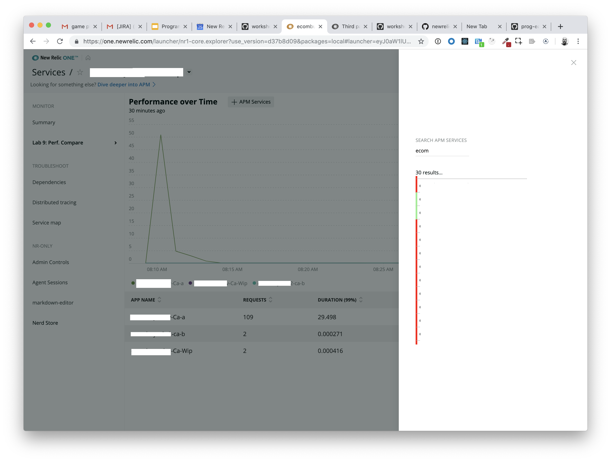
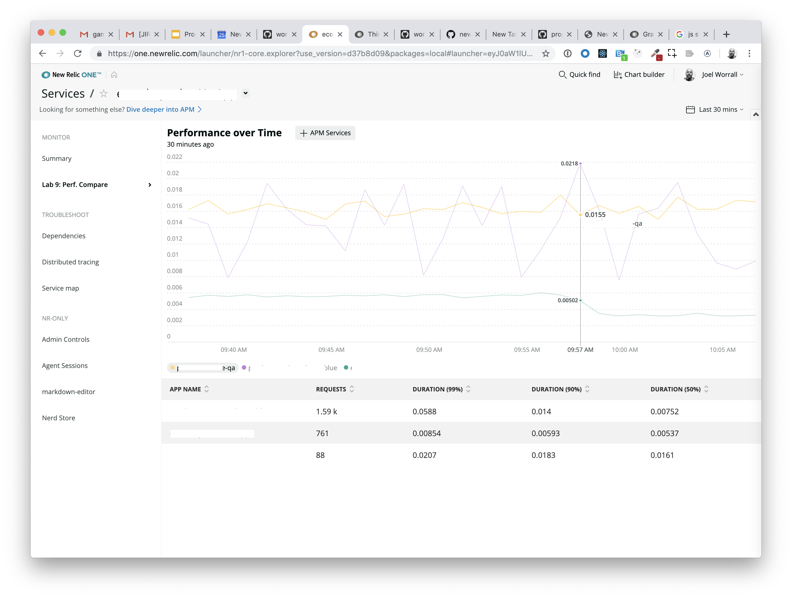

[DRAFT]
Lab 9: Leveraging NerdStorage to manage configuration data
===========================================================

*Note: There are a number of redacted screenshots in this lab due to the fact that I was exploring non-demo data. You screens will look different based on your data.*

The purpose of this lab is demonstrate the use of NerdStorage as a storage mechanism.

After completing this lab you should know:

- What `NerdStorage` is and isn't
How to save data in `NerdStorage` using the `UserStorageQuery`, `EntityStorageQuery`, and `AccountStorageQuery`
How to retrieve data from `NerdStorage` using the `UserStorageQuery`, `EntityStorageQuery`, and `AccountStorageQuery`

## Step 0: Setup and Prerequisites

Load the prequisites and follow the setup instructions in [Setup](../SETUP.md).

**Reminder**: Make sure that you're ready to go with your `lab9` by ensuring you've run the following commands:

```bash
# from the nr1-eap-workshop directory
cd lab9
npm install
```

Navigate to in your browser to `https://one.newrelic.com?nerdpacks=local`, choose `Entity Explorer` > `Browser applications` > choose an app > click on `Lab 9: Perf. Compare` > Click on the button `+ Browser Apps`.


So let's get started!

## Step 1: Reviewing code and exercising the demo

For the purposes of expediency, this lab provides a functional application that we're going to use to practice data storage. Please take a moment to review the following files.

1. Open the files `lab9/nerdlets/my-nerdlet/index.js`, `lab9/nerdlets/my-nerdlet/add-entity-modal.js`, and `lab9/nerdlets/my-nerdlet/utils.js`.In particular notice that between those three files, we're making use of **fourteen** different components from the `nr1` package.

Next, we're going to exercise the functionality of the `Perf. Comparison` nerdlet.

2. If it's not already open, navigate to the `Lab 9: Perf. Compare` nerdlet (_which is accessible, the `lab9/nerdlet/my-nerdlet/nr1.json` demonstrates, to both `BROWSER` and `APM` entities_) and click on the `+ <Entity Label>` button.

3. Search for and add several entities to the `Perf. Comparison` UI. Your screen will look similar to the following:


4. That's pretty cool, but if we navigate away from this screen, the *context* of the entities we've been comparing will be lost. That's less cool.

### It would be great to be able to:

- Save the state of this information
- for this `Entity`
- for this `User`
- for use and retrieval the next time *we* enter this `Nerdlet`

### Introducing NerdStorage

NerdStorage exists to address these problems.
- It's a simple document database provided by the NR1 interface.
- It's capable of storing data for an `Entity`, `Account`, or `User`.
- A single document must be less than 64k
- The document identifier/name must be less than 128 characters
Retrieval of documents is available through both `NerdGraph` and through the prebuilt components in `nr1` of `UserStorageQuery`, `EntityStorageQuery`, and `AccountStorageQuery`.
- Each of the predefined components has a `query` and `mutate` method that corresponds to expected, standard patterns that the [`Apollo GraphQL`](https://apollographql.com) library uses.
- `UserStorageQuery` takes a required `collection` prop and an optional `documentId` prop.
- `AccountStorageQuery` takes required `collection` and `accountId` props and an optional `documentId` prop.
- `EntityStorageQuery` takes required `collection` and `entityId` props and an optional `documentId` prop.

_Note: The `entityId` are the guids that are returned from components like `EntitySearchQuery` see `lab9/nerdlets/my-nerdlet/add-entity-modal.js` for an example._

Let's make use of this service to address our "save the state" feature in this Nerdlet. For the purposes of this exercise, we're going to use the `UserStorageQuery` component only. Hopefully, you can extrapolate the uses of the other components.

## Step 2: Save the set of entities for this Nerdlet using `NerdStorageUserCollectionMutation`


1. Open the file `lab9/nerdlets/my-nerdlet/index.js` and replace the `nr1` import statement with the following:

```javascript
import { LineChart, TableChart, Grid, GridItem, Spinner, DisplayText, Button, Icon, NerdStorageUserCollectionQuery, NerdStorageUserCollectionMutation, Toast } from 'nr1';
```

2. In `lab9/nerdlets/my-nerdlet/index.js` and look at the `onSearchSelect` method. Beyond saving the `state`, we're going to save this data to `NerdStorage`. Replace `onSearchSelect` with the following:

```javascript
    onSearchSelect(entity) {
        const { entities } = this.state;
        entities.push(entity);
        //after the state is saved (technically asynchronously), we're going to save the list of entities to NerdStorage
        this.setState({ entities }, () => {
            const { entity, entities } = this.state;
            UserStorageQuery.mutate({
                action: UserStorageQuery.ACTION_TYPE.WRITE_DOCUMENT,
                collection: 'entityList-v0',
                documentId: entity.id,
                document: entities.map(entity => {
                    //shrink the amount of data we're storing b/c we like efficiency.
                    return {
                        id: entity.id,
                        type: entity.type,
                        domain: entity.domain,
                        accountId: entity.accountId,
                        name: entity.name
                    }
                })
            });
        });
    }
```

3. Save the file and watch the `Nerdlet` reload the browser. Now, open the `+` modal in the `Lab 9: Perf. Compare` nerdlet and add several services to the current service. You should see no behavioral change at this point.



## Step 3: Retrieve the set of entities for this Nerdlet using `NerdStorageUserCollectionQuery`

Now, we're going to try to load the saved entity set for this `User` and `Entity` using `UserStorageQuery`.

1. Open the file `lab9/nerdlets/my-nerdlet/index.js`, and replace the `_loadState` method with the following:

```javascript
    /**
     * Load the entity using the loadEntity utils function, then look up if there's a entityList-v0 collection for this entity and user.
     * @param {string} entityId
     */
    _loadState(entityId) {
        loadEntity(entityId).then(entity => {
            UserStorageQuery.query({
                collection: 'entityList-v0',
                documentId: entity.id
            }).then(({data}) => {
                if (data.actor.nerdStorageDocument) {
                    const entities = JSON.parse(data.actor.nerdStorageDocument);
                    this.setState({ entityType: {domain: entity.domain, type: entity.type}, entity, entities });
                } else {
                    this.setState({ entityType: {domain: entity.domain, type: entity.type}, entity, entities: [ entity ] });
                }
            }).catch(error => {
                console.error(error);
                this.setState({ entityType: {domain: entity.domain, type: entity.type}, entity, entities: [ entity ] });
            });
        });
    }

```

2. Save the file and reload, we should see our associated entities loading in the UI.



## Step 4: Finishing touches with `Toast`

It would be nice if, either when there was an error loading the configurations or when we save the state, we received a notification. That's what a `Toast` is for, so let's do that.

1. Open the file `lab9/nerdlets/my-nerdlet/index.js` and add modify the `catch` statement in the `_loadEntity` method:

```javascript
    //leave the code above the same.
    }).catch(error => {
        console.error(error);
        this.setState({ entityType: {domain: entity.domain, type: entity.type}, entity, entities: [ entity ], errorToast: true });
    });
    //leave the code below the same.
```

2. At the end of the `UserStorageQuery.mutate` call in the `onSearchSelect` method, add the following `then` statement:

```javascript
    .then(() => {
        this.setState({ addToast: true });
    });
```

3. Add the following code at the `render` method, just above the `return` call:

```javascript
    if (this.state.addToast) {
        Toast.showToast({
            type: 'normal',
            title: 'Configs saved successfully.',
            onDestroy: () => {this.setState({addToast: false}); }
        });
    }
    if (this.state.errorToast) {
        Toast.showToast({
            type: 'critical',
            title: 'An error occurred loading configs.',
            onDestroy: () => {this.setState({errorToast: false}); }
        });
    }
```

4. Save the file and watch the reload happen. Add entities to your comparison.

The final code in `lab9/nerdlets/my-nerdlet/index.js` should look something like this:

```javascript
import React from 'react';
import PropTypes from 'prop-types';
import { LineChart, TableChart, Grid, GridItem, Spinner, DisplayText, Button, Icon, UserStorageQuery, Toast } from 'nr1';
import { loadEntity, decodeEntityFromEntityId, distanceOfTimeInWords } from './utils';
import AddEntityModal from './add-entity-modal';

export default class MyNerdlet extends React.Component {
    static propTypes = {
        width: PropTypes.number,
        height: PropTypes.number.isRequired,
        launcherUrlState: PropTypes.object.isRequired,
        nerdletUrlState: PropTypes.object.isRequired
    }

    constructor(props) {
        super(props);
        //console for learning purposes
        console.debug(props); //eslint-disable-line
        //initiate the state
        this.state = {
            entity: null,
            entities: [],
            entityType: { domain: 'APM', type: 'APPLICATION' },
            openModal: false,
            addToast: false,
            errorToast: false
        }
        this.onSearchSelect = this.onSearchSelect.bind(this);
    }

    componentDidMount() {
        if (this.props.nerdletUrlState && this.props.nerdletUrlState.entityId) {
            console.debug("Calling loadState with props"); //eslint-disable-line
            this._loadState(this.props.nerdletUrlState.entityId);
        }
    }

    componentWillUpdate(nextProps) {
        if (this.props && nextProps.nerdletUrlState && nextProps.nerdletUrlState.entityId && nextProps.nerdletUrlState.entityId != this.props.nerdletUrlState.entityId) {
            console.debug("Calling loadState with nextProps"); //eslint-disable-line
            this._loadState(nextProps.nerdletUrlState.entityId);
        }
        return true;
    }

    /**
     * Load the entity using the loadEntity utils function, then look up if there's a entityList-v0 collection for this entity and user.
     * @param {string} entityId
     */
    _loadState(entityId) {
        loadEntity(entityId).then(entity => {
            UserStorageQuery.query({
                collection: 'entityList-v0',
                documentId: entity.id
            }).then(({data}) => {
                console.debug(data); //eslint-disable-line
                if (data.actor.nerdStorageDocument) {
                    const entities = JSON.parse(data.actor.nerdStorageDocument);
                    this.setState({ entityType: {domain: entity.domain, type: entity.type}, entity, entities });
                } else {
                    this.setState({ entityType: {domain: entity.domain, type: entity.type}, entity, entities: [ entity ] });
                }
            }).catch(error => {
                console.error(error);
                this.setState({ entityType: {domain: entity.domain, type: entity.type}, entity, entities: [ entity ], errorToast: true });
            });
        });
    }

    /**
     * Receive an entity from the EntitySearch
     * @param {Object} entity
     */
    onSearchSelect(entity) {
        const { entities } = this.state;
        entities.push(entity);
        //after the state is saved (technically asynchronously), we're going to save the list of entities to NerdStorage
        this.setState({ entities }, () => {
            const { entity, entities } = this.state;
            UserStorageQuery.mutate({
                action: UserStorageQuery.ACTION_TYPE.WRITE_DOCUMENT,
                collection: 'entityList-v0',
                documentId: entity.id,
                document: entities.map(entity => {
                    //shrink the amount of data we're storing b/c we like efficiency.
                    return {
                        id: entity.id,
                        type: entity.type,
                        domain: entity.domain,
                        accountId: entity.accountId,
                        name: entity.name
                    }
                })
            }).then(() => {
                this.setState({ addToast: true });
            });
        });
    }

    _buildNrql(base) {
        const { entities } = this.state;
        const appNames = entities ? entities.map((entity, i) => `'${entity.name}'`) : null;
        let nrql = `${base} FACET appName ${appNames ? `WHERE appName in (${appNames.join(",")}) ` : ''}`;
        return nrql;
    }

    render() {
        const { height, launcherUrlState, nerdletUrlState } = this.props;
        if (!nerdletUrlState || !nerdletUrlState.entityId) {
            return <AddEntityModal
                     onSearchSelect={this.onSearchSelect}
                   />;
        } else {
            //entityId is four-item array of accountId|domain|type|id
            const { entities, openModal } = this.state;
            const entity = decodeEntityFromEntityId(nerdletUrlState.entityId);
            const { accountId } = entity;
            const eventType = entity ? entity.domain == 'BROWSER' ? 'PageView' : 'Transaction' : null;
            const { timeRange : { duration }} = launcherUrlState;
            const durationInMinutes = duration / 1000 / 60;
            const label = entity.domain == 'BROWSER' ? 'Browser Apps' : 'APM Services';
            if (this.state.addToast) {
                Toast.showToast({
                    type: 'normal',
                    title: 'Configs saved successfully.',
                    onDestroy: () => {this.setState({addToast: false}); }
                });
            }
            if (this.state.errorToast) {
                Toast.showToast({
                    type: 'critical',
                    title: 'An error occurred loading configs.',
                    onDestroy: () => {this.setState({errorToast: false}); }
                });
            }
            return (<React.Fragment><Grid>
                    {entities && entities.length > 0 ? <React.Fragment><GridItem columnStart={1} columnEnd={12} style={{padding: '10px'}}>
                        <HeadingText>Performance over Time<Button sizeType={Button.SIZE_TYPE.SLIM} style={{marginLeft: '25px'}} onClick={() => { this.setState({ openModal: true }) }}><Icon name="interface_sign_plus" /> {label}</Button></HeadingText>
                        <p style={{marginBottom: '10px'}}>{distanceOfTimeInWords(duration)}</p>
                        {this.state.addToast && <Toast
                            type={'normal'}
                            title={'Configs saved successfully'}
                            description={''}
                            onDestroy={() => {this.setState({addToast: false})}}
                        />}
                        {this.state.errorToast && <Toast
                            type={'critical'}
                            title={'An error occurred loading configs.'}
                            description={''}
                            onDestroy={() => {this.setState({errorToast: false})}}
                        />}
                        <LineChart
                            accountId={accountId}
                            query={this._buildNrql(`SELECT average(duration) from ${eventType} TIMESERIES SINCE ${durationInMinutes} MINUTES AGO `)}
                            style={{height: `${height*.5}px`}}
                        />
                    </GridItem>
                    <GridItem columnStart={1} columnEnd={12}>
                        <TableChart
                            accountId={accountId}
                            query={this._buildNrql(`SELECT count(*) as 'requests', percentile(duration, 99, 90, 50) FROM ${eventType} SINCE ${durationInMinutes} MINUTES AGO`)}
                            style={{height: `${height*.5}px`}}
                        />
                    </GridItem>
                    </React.Fragment> : <Spinner fillContainer />}
                    {openModal && <AddEntityModal
                        openModal={openModal}
                        entities={entities}
                        onClose={() => {
                            this.setState({ openModal: false });
                        }}
                        onSearchSelect={this.onSearchSelect}
                    />}
                </Grid>
            </React.Fragment>);
        }

    }
}
```

# Extra Credit

Just like the `NerdStorageUserCollectionMutation.mutate` has an `action` of `NerdStorageUserCollectionMutation.ACTION_TYPE.WRITE_DOCUMENT`, it also has a `NerdStorageUserCollectionMutation.ACTION_TYPE.DELETE_DOCUMENT`. Add a `Button` on the screen that allows the user to delete their configuration.

# For Consideration / Discussion

* Given that, behind the scenes, the `NerdStorage` uses the New Relic NerdGraph API to store and retrieve data, what ways could you make use of this utility in your projects?