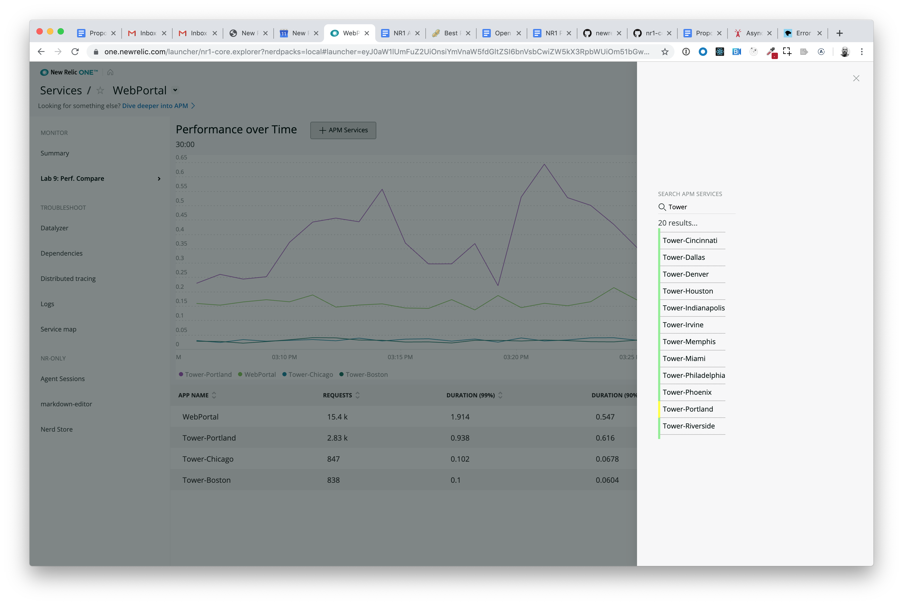
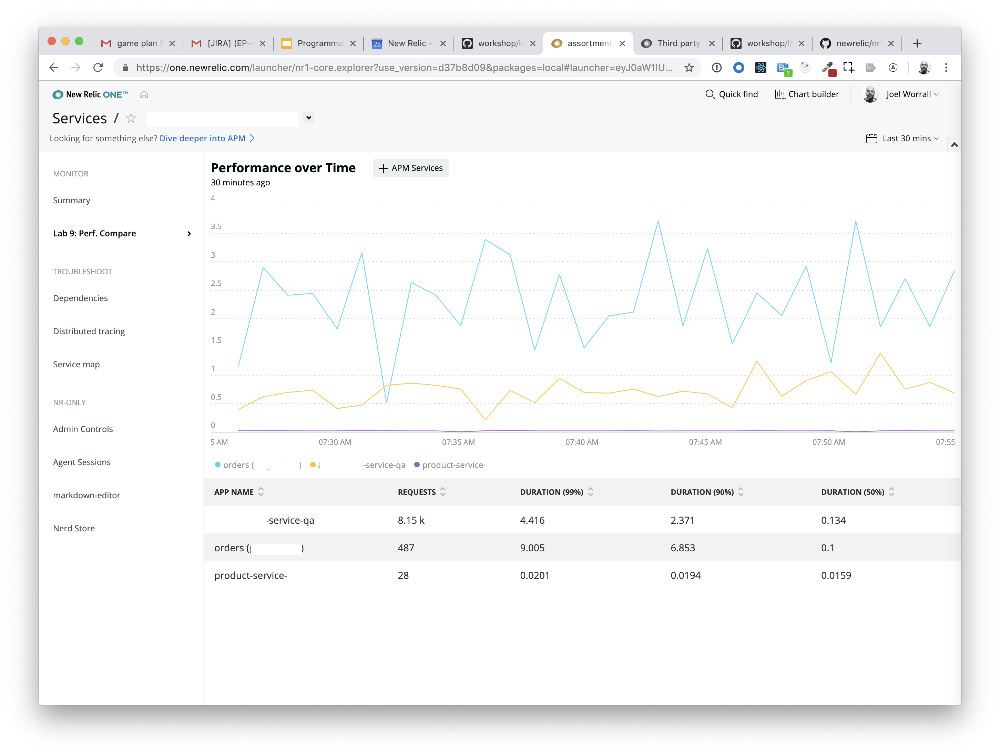

Lab 9: Leveraging NerdStorage to manage configuration data
===========================================================

*Note: There are a number of redacted screenshots in this lab due to the fact that I was exploring non-demo data. You screens will look different based on your data.*

The purpose of this lab is demonstrate the use of NerdStorage as a storage mechanism.

After completing this lab you should know:

- What `NerdStorage` is and isn't
How to save data in `NerdStorage` using the `UserStorageQuery`, `EntityStorageQuery`, and `AccountStorageQuery`
How to retrieve data from `NerdStorage` using the `UserStorageQuery`, `EntityStorageQuery`, and `AccountStorageQuery`

## Step 0: Setup and Prerequisites

Load the prequisites and follow the setup instructions in [Setup](../SETUP.md).

**Reminder**: Make sure that you're ready to go with your `lab9` by ensuring you've run the following commands:

```bash
# from the nr1-workshop directory
cd lab9
nr1 nerdpack:uuid -gf
npm install
```

Navigate to in your browser to `https://one.newrelic.com?nerdpacks=local`, choose `Entity Explorer` > `Browser applications` > choose an app > click on `Lab 9: Perf. Compare` > Click on the button `+ Browser Apps`.



So let's get started!

## Step 1: Reviewing code and exercising the demo

For the purposes of expediency, this lab provides a functional application that we're going to use to practice data storage. Please take a moment to review the following files.

1. Open the files `lab9/nerdlets/my-nerdlet/main.js`, `lab9/nerdlets/my-nerdlet/add-entity-modal.js`, and `lab9/nerdlets/my-nerdlet/utils.js`.In particular notice that between those three files, we're making use of **fourteen** different components from the `nr1` package.

Next, we're going to exercise the functionality of the `Perf. Comparison` nerdlet.

2. If it's not already open, navigate to the `Lab 9: Perf. Compare` nerdlet (_which is accessible, the `lab9/nerdlet/my-nerdlet/nr1.json` demonstrates, to both `BROWSER` and `APM` entities_) and click on the `+ <Entity Label>` button.

3. Search for and add several entities to the `Perf. Comparison` UI. Your screen will look similar to the following:



4. That's pretty cool, but if we navigate away from this screen, the *context* of the entities we've been comparing will be lost. That's less cool.

### It would be great to be able to:

- Save the state of this information
- for this `Entity`
- for this `User`
- for use and retrieval the next time *we* enter this `Nerdlet`

### Introducing NerdStorage

NerdStorage exists to address these problems.
- It's a simple document database provided by the NR1 interface.
- It's capable of storing data for an `Entity`, `Account`, or `User`.
- A single document must be less than 64k
- The document identifier/name must be less than 128 characters
Retrieval of documents is available through both `NerdGraph` and through the prebuilt components in `nr1` of `UserStorageQuery`, `UserStorageMutation`,  `EntityStorageQuery`, `EntityStorageMutation` `AccountStorageQuery`, and `AccountStorageMutation`.
- Each of the predefined components follows the standard patterns that the [`Apollo GraphQL`](https://apollographql.com) library uses as well as offers a static method (either `query` or `mutate`).
- `UserStorageQuery` takes a required `collection` prop and an optional `documentId` prop.
- `UserStorageMutation` takes an actionType, collection, documentId, and document (the data we're writing).
- `AccountStorageQuery` takes required `collection` and `accountId` props and an optional `documentId` prop.
- `AccountStorageMutation` takes an actionType, collection, documentId, accountId, and document (the data we're writing).
- `EntityStorageQuery` takes required `collection` and `entityGuid` props and an optional `documentId` prop.
- `EntityStorageMutation` takes an actionType, collection, documentId, entityGuid, and document (the data we're writing).

_Note: The `entityGuid` are the guids that are returned from components like `EntitySearchQuery` see `lab9/nerdlets/my-nerdlet/add-entity-modal.js` for an example._

Let's make use of this service to address our "save the state" feature in this Nerdlet. For the purposes of this exercise, we're going to use the `UserStorageMutation`. Hopefully, you can extrapolate the uses of the other components.

## Step 2: Save the set of entities for this Nerdlet using `UserStorageMutation`


1. In `lab9/nerdlets/my-nerdlet/main.js` and look at the `onSearchSelect` method. Beyond saving the `state`, we're going to save this data to `NerdStorage`. Replace `onSearchSelect` with the following:

```javascript
    /**
     * Receive an entity from the EntitySearch
     * @param {Object} entity
     */
    onSearchSelect(inEntity) {
        const { entities } = this.state;
        const { entity } = this.props;
        entities.push(inEntity);
        console.debug("saving entities array", entities);
        //after the state is saved (technically asynchronously), we're going to save the list of entities to NerdStorage
        this.setState({ entities, openModal: false }, () => {
            UserStorageMutation.mutate({
                actionType: UserStorageMutation.ACTION_TYPE.WRITE_DOCUMENT,
                collection: 'lab9-entityList-v0',
                documentId: entity.guid,
                document: { entities }
            });
        });
    }
```

2. Save the file and watch the `Nerdlet` reload the browser. Now, open the `+` modal in the `Lab 9: Perf. Compare` nerdlet and add several services to the current service. You should see no behavioral change at this point.


## Step 3: Retrieve the set of entities for this Nerdlet using `UserStorageQuery`

Now, we're going to try to load the saved entity set for this `User` and `Entity` using `UserStorageQuery`.

1. Open the file `lab9/nerdlets/my-nerdlet/main.js`, and replace the `_loadState` method with the following:

```javascript
    /**
     * Load the entity using the loadEntity utils function, then look up if there's a entityList-v0 collection for this entity and user.
     * @param {string} entityGuid
     */
    _loadState(entityGuid) {
        UserStorageQuery.query({
                collection: 'lab9-entityList-v0',
                documentId: entityGuid
        }).then(({data}) => {
            console.debug(data);
            this.setState({ entities: data.entities });
        }).catch(error => {
            console.error(error);
            this.setState({ entities: []});
            Toast.showToast({ title: error.message, type: Toast.TYPE.CRITICAL });
        });
    }
```

2. Now, we're going to leverage two of the React lifecycle methods to call `_loadState` when needed. Add the following methods to your code:

```javascript
    componentDidMount() {
        if (this.props.nerdletUrlState && this.props.nerdletUrlState.entityGuid) {
            console.debug("Calling loadState with props", this.props);
            this._loadState(this.props.nerdletUrlState.entityGuid);
        } else {
            this.setState({ openModal: true });
        }
    }

    componentWillUpdate(nextProps) {
        if (this.props && nextProps.nerdletUrlState && nextProps.nerdletUrlState.entityGuid && nextProps.nerdletUrlState.entityGuid != this.props.nerdletUrlState.entityGuid) {
            console.debug("Calling loadState with nextProps");
            this._loadState(nextProps.nerdletUrlState.entityGuid);
        }
        return true;
    }
```

3. Save the file and reload, we should see our associated entities loading in the UI.


## Step 4: Finishing touches with `Toast`

It would be nice if, either when there was an error loading the configurations or when we save the state, we received a notification. That's what a `Toast` is for, so let's do that.

1. At the end of the `UserStorageMutation.mutate` call in the `onSearchSelect` method, add the following `then` and `catch` statements:

```javascript
    }).then(() => {
        Toast.showToast({title: "Update Saved.", type: Toast.TYPE.NORMAL });
    }).catch(error => {
        console.error(error);
        Toast.showToast({ title: error.message, type: Toast.TYPE.CRITICAL });
    });
```

2. Save the file and watch the reload magic happen. Add entities to your comparison.

The final code in `lab9/nerdlets/my-nerdlet/main.js` should look something like this:

```javascript
import React from 'react';
import PropTypes from 'prop-types';
import { LineChart, TableChart, Grid, GridItem, HeadingText, Button, Icon, UserStorageMutation, UserStorageQuery, Toast } from 'nr1';
import { distanceOfTimeInWords } from './utils';
import AddEntityModal from './add-entity-modal';

export default class MyNerdlet extends React.Component {

    static propTypes = {
        nerdletUrlState: PropTypes.object.isRequired,
        launcherUrlState: PropTypes.object.isRequired,
        entity: PropTypes.object.isRequired
    };

    constructor(props) {
        super(props);
        //console for learning purposes
        console.debug(props); //eslint-disable-line
        //initiate the state
        this.state = {
            entities: [],
            openModal: false
        }
        this.onSearchSelect = this.onSearchSelect.bind(this);
    }

    componentDidMount() {
        if (this.props.nerdletUrlState && this.props.nerdletUrlState.entityGuid) {
            console.debug("Calling loadState with props", this.props);
            this._loadState(this.props.nerdletUrlState.entityGuid);
        } else {
            this.setState({ openModal: true });
        }
    }

    componentWillUpdate(nextProps) {
        if (this.props && nextProps.nerdletUrlState && nextProps.nerdletUrlState.entityGuid && nextProps.nerdletUrlState.entityGuid != this.props.nerdletUrlState.entityGuid) {
            console.debug("Calling loadState with nextProps");
            this._loadState(nextProps.nerdletUrlState.entityGuid);
        }
        return true;
    }

    /**
     * Load the entity using the loadEntity utils function, then look up if there's a entityList-v0 collection for this entity and user.
     * @param {string} entityGuid
     */
    _loadState(entityGuid) {
        UserStorageQuery.query({
                collection: 'lab9-entityList-v0',
                documentId: entityGuid
        }).then(({data}) => {
            console.debug(data);
            if (data.entities) {
                this.setState({ entities: data.entities });
            } else {
                this.setState({ entities: []});
            }
        }).catch(error => {
            console.error(error);
            this.setState({ entities: []});
            Toast.showToast({ title: error.message, type: Toast.TYPE.CRITICAL });
        });
    }

    /**
     * Receive an entity from the EntitySearch
     * @param {Object} entity
     */
    onSearchSelect(inEntity) {
        const { entities } = this.state;
        const { entity } = this.props;
        entities.push(inEntity);
        console.debug("saving entities array", entities);
        //after the state is saved (technically asynchronously), we're going to save the list of entities to NerdStorage
        this.setState({ entities, openModal: false }, () => {
            UserStorageMutation.mutate({
                actionType: UserStorageMutation.ACTION_TYPE.WRITE_DOCUMENT,
                collection: 'lab9-entityList-v0',
                documentId: entity.guid,
                document: { entities }
            }).then(() => {
                Toast.showToast({title: "Update Saved.", type: Toast.TYPE.NORMAL });
            }).catch(error => {
                console.error(error);
                Toast.showToast({ title: error.message, type: Toast.TYPE.CRITICAL });
            });
        });
    }

    _buildNrql(base) {
        const { entities } = this.state;
        const { entity } = this.props;
        const elist = [...entities, entity];
        const appNames = elist.map((entity, i) => `'${entity.name}'`);
        let nrql = `${base} FACET appName ${appNames ? `WHERE appName in (${appNames.join(",")}) ` : ''}`;
        return nrql;
    }

    render() {
        const { openModal } = this.state;
        const { entity, launcherUrlState: { timeRange: { duration }}} = this.props;
        const { accountId } = entity;
        const eventType = entity ? entity.domain == 'BROWSER' ? 'PageView' :    'Transaction' : null;
        const label = entity.domain == 'BROWSER' ? 'Browser Apps' : 'APM Services';
        const durationInMinutes =  duration/1000/60;
        return (<React.Fragment>
            <Grid style={{width:width}}>
                <GridItem columnStart={1} columnEnd={12} style={{padding: '10px'}}>
                <HeadingText>Performance over Time<Button sizeType={Button.SIZE_TYPE.SMALL} style={{marginLeft: '25px'}} onClick={() => { this.setState({ openModal: true }) }}><Icon type={Icon.TYPE.INTERFACE__SIGN__PLUS} /> {label}</Button></HeadingText>
                <p style={{marginBottom: '10px'}}>{distanceOfTimeInWords(duration)}</p>
                <LineChart
                    accountId={accountId}
                    query={this._buildNrql(`SELECT average(duration) from ${eventType} TIMESERIES SINCE ${durationInMinutes} MINUTES AGO `)}
                    style={{height: `200px`, width: '100%'}}
                />
                </GridItem>
                <GridItem columnStart={1} columnEnd={12}>
                    <TableChart
                        accountId={accountId}
                        query={this._buildNrql(`SELECT count(*) as 'requests', percentile(duration, 99, 90, 50) FROM ${eventType} SINCE ${durationInMinutes} MINUTES AGO`)}
                        style={{height: `200px`, width: '100%'}}
                    />
                </GridItem>
            </Grid>
            {openModal && <AddEntityModal
                {...this.state}
                entity={entity}
                entityType={{ type: entity.type, domain: entity.domain }}
                onClose={() => {
                    this.setState({ openModal: false });
                }}
                onSearchSelect={this.onSearchSelect}
            />}
        </React.Fragment>);
    }
}
```

# Extra Credit

Just like the `UserStorageMutation.mutate` has an `action` of `UserStorageMutation.ACTION_TYPE.WRITE_DOCUMENT`, it also has a `UserStorageMutation.ACTION_TYPE.DELETE_DOCUMENT`. Add a `Button` on the screen that allows the user to delete their configuration.

# For Consideration / Discussion

* Given that, behind the scenes, the `NerdStorage` uses the New Relic NerdGraph API to store and retrieve data, what ways could you make use of this utility in your projects?